# Agent Pre-Settings

## Configure the time synchronization service for the source host

::: tip
Ensure that the host time is synchronized with the network time.  
This example is for reference only; please configure according to the specific circumstances of the standby disaster recovery host.
:::

### Windows

::: tip
Example OS: Windows Server 2012 R2
:::

#### Configure using the Windows time tools.

Click on the Windows icon on the desktop > Open Control Panel > Select "Date and Time" for configuration.


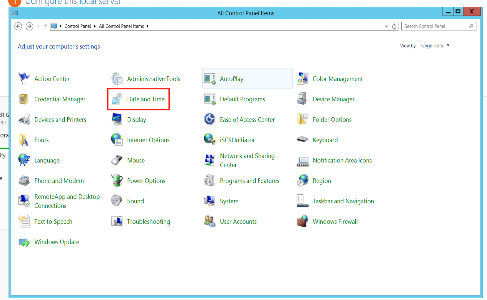

#### Configure time to synchronize automatically with Internet time synchronization servers.

In the "Date and Time" tab, click on "Internet Time",Click on "Change settings."

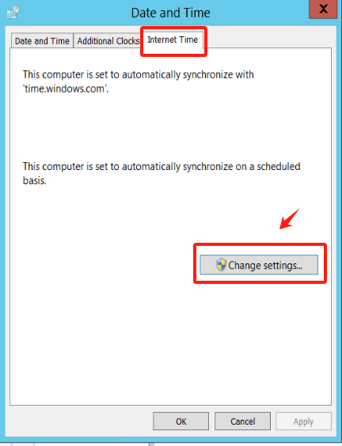

Check the "Synchronize with an Internet time server" option.From the "Server" dropdown menu, choose a time server (e.g., time.windows.com).

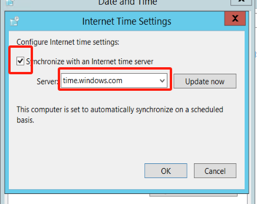

Click "Update now" to test the connection and wait for confirmation.Click "OK" to save the changes.

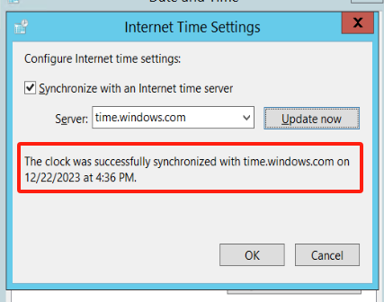

#### Configure automatic synchronization with the local time synchronization server.

 
If your host is in an intranet environment, you need to configure the address to be your local time synchronization server address.

::: tip

The **<ntp.server.ip.address>** is the IP address of your NTP server.

:::

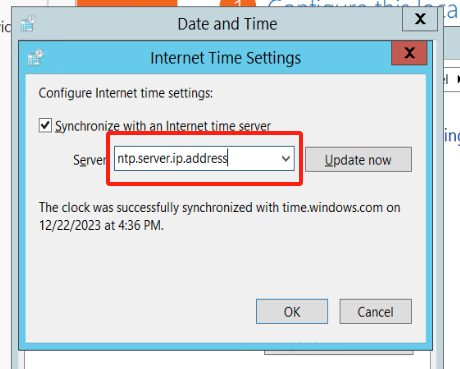


Click "Update now" to test the connection and wait for confirmation.Click "OK" to save the changes.

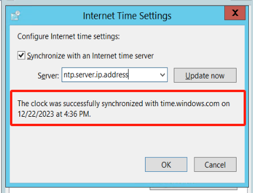

### Linux

::: tip
Example OS: CentOS Linux release 7.5
:::

#### Install NTP  

```shell

 [root@node ~]# yum install -y ntp

```

#### Start the NTP service

```shell

[root@node ~]# systemctl start  ntpd

[root@node ~]# systemctl enable  ntpd

Created symlink from /etc/systemd/system/multi-user.target.wants/ntpd.service to /usr/lib/systemd/system/ntpd.service.

```

#### View NTP service status

```shell

[root@node ~]# systemctl status ntpd

● ntpd.service - Network Time Service

   Loaded: loaded (/usr/lib/systemd/system/ntpd.service; enabled; vendor preset: disabled)

   Active: active (running) since Thu 2022-08-04 08:00:47 CST; 7h left

 Main PID: 20746 (ntpd)

    Tasks: 1

   Memory: 768.0K

   CGroup: /system.slice/ntpd.service

           └─20746 /usr/sbin/ntpd -u ntp:ntp -g


Aug 04 08:00:47 node ntpd[20746]: Listen normally on 6 lo ::1 UDP 123
Aug 04 08:00:47 node ntpd[20746]: Listen normally on 7 ens33 fe80::8a83:7297:7cb8:9934 UDP 123
Aug 04 08:00:47 node ntpd[20746]: Listening on routing socket on fd #24 for interface updates
Aug 04 08:00:47 node systemd[1]: Started Network Time Service.
Aug 04 08:00:47 node ntpd[20746]: 0.0.0.0 c016 06 restart
Aug 04 08:00:47 node ntpd[20746]: 0.0.0.0 c012 02 freq_set kernel 0.000 PPM
Aug 04 08:00:47 node ntpd[20746]: 0.0.0.0 c011 01 freq_not_set
Aug 04 08:00:56 node ntpd[20746]: 0.0.0.0 c61c 0c clock_step -28798.353463 s
Aug 04 00:00:57 node ntpd[20746]: 0.0.0.0 c614 04 freq_mode
Aug 04 00:00:58 node ntpd[20746]: 0.0.0.0 c618 08 no_sys_peer
```

#### Modify the ntp.conf file

::: tip
Please make sure to replace **time.example.com** with the actual NTP server address you want to use. This command will directly save the file after modification, so ensure that your configuration changes are error-free before executing.
:::

```shell
# Comment out lines starting with 'server'.
# Add new NTP server addresses at the end of the file.
[root@localhost ~]# sudo sed -i -e '/^server/ s/^server/#&/' -e '$ a server time.example.com iburst' /etc/ntp.conf

```

#### Restart the service

```shell

[root@node ~]# systemctl restart ntpd

```

#### Check synchronization status

```shell

[root@node ~]# ntpq -p

     remote           refid      st t when poll reach   delay   offset  jitter

==============================================================================

 203.107.6.88    100.107.25.114   2 u    2   64    1   30.975  149.499   0.393

```

## Verify Source Host time is synchronized with UTC 

::: tip
For security purposes, OBS verifies the time difference between the client and server. If the time difference is longer than 15 minutes, the OBS server will reject your requests and this error message is reported. To resolve this problem, adjust your local time (UTC) and try again. 
:::

### Viewing the time on Windows system

Click on the Windows icon on the desktop > Open Control Panel > Select "Date and Time"

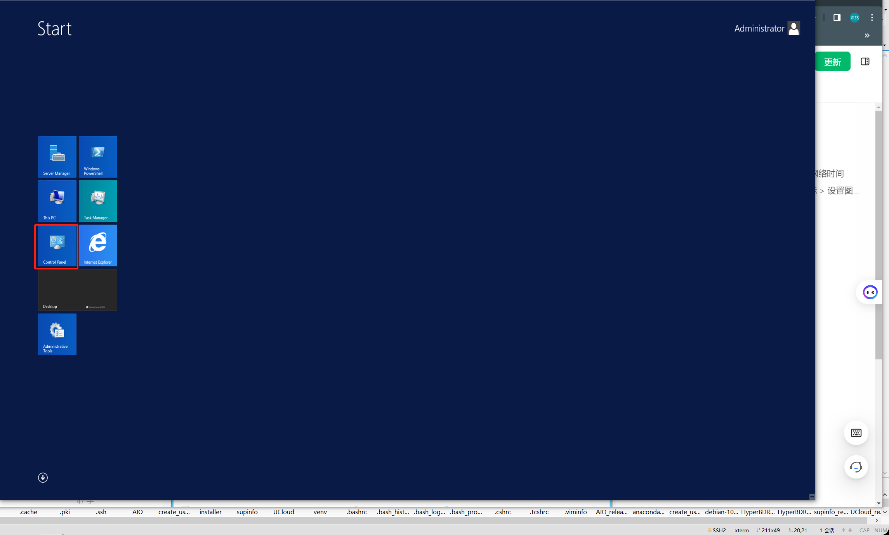


 
View the time and time zone.

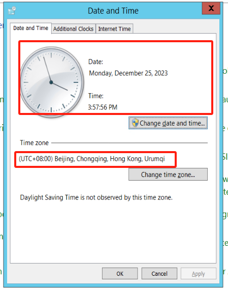


---

### Viewing the time on Linux system

1. **Open the terminal:**
   - Use a terminal application, such as Terminal.
2. **Execute the command to view the current system time:**
```
date
```


3. **Execute the command to view the current system time zone:**
```
timedatectl
```


### Viewing UTC Network Time:


1. **Confirm the time zone and time of the source host.**
2. **Network query for standard UTC time and compare it with the source host.**


## Preliminary Investigation
### Get the Windows operating system version

::: tip
Example OS：Microsoft Windows Server 2016 Datacenter
:::

#### Get the Windows OS version through the Control Panel
Open [Control Panel], go to [System and Security], and then select System to retrieve relevant information.
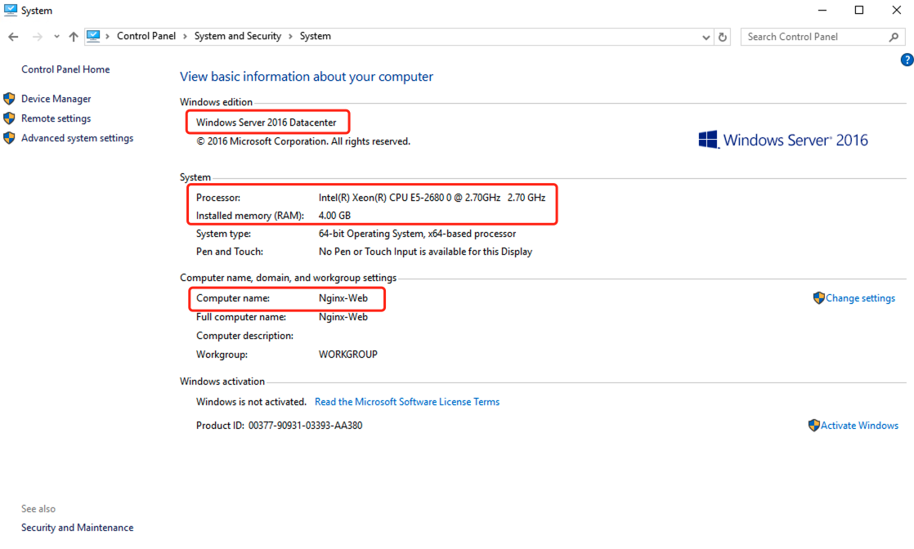

#### Get the Windows OS version through the CMD
Login to the Windows server, use the shortcut Win + R to open the CMD window, and execute the following command:
```powershell
systeminfo
```

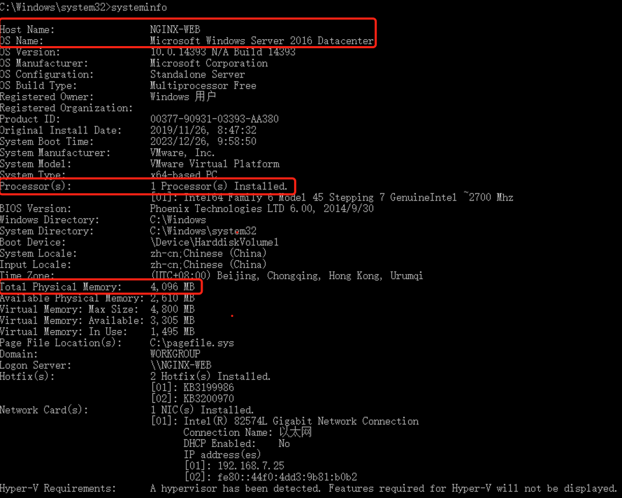

In the output, you can view the OS name.

> **Host Name:** NGINX-WEB  
> **OS Name:** Microsoft Windows Server 2016 Datacenter

### Get the Linux operating system version
> Example OS：CentOS 7.9

Run the following command to view the operating system version.
```shell
cat /etc/redhat-release
```

The output content represents information about the operating system version.  


### Check if the host supports Agent-based disaster recovery
Check the operating system and version of the source host, compare it with the Agent Support List, and determine whether the disaster recovery host supports Agent-based disaster recovery.

### Agent Support List

::: tip
【√】: Full support 
:::

| **OS**[Production Source] | **Version** | **Support Information** |
| :---: | :---: | :---: |
| **Windows Server** |  2003 SP2/R2 (64-bit) | √ |
| **Windows Server** |  2008(64-bit) | √ |
| **Windows Server** |  2008 R2(64-bit) | √ |
| **Windows Server** |  2012(64-bit) | √ |
| **Windows Server** |  2012 R2(64-bit) | √ |
| **Windows Server** |  2016(64-bit) | √ |
| **Windows Server** |  2019(64-bit) | √ |
| **Linux** | CentOS 6.5+(64-bit) | √ |
| **Linux** | CentOS 7.x(64-bit) | √ |
| **Linux** | CentOS 8.x(64-bit) | √ |
| **Linux** | Red Hat Enterprise Linux (RHEL) 6.x(64-bit) | √ |
| **Linux** | Red Hat Enterprise Linux (RHEL) 7.x(64-bit) | √ |
| **Linux** | Red Hat Enterprise Linux (RHEL) 8.x(64-bit) | √ |
| **Linux** | SUSE Linux Enterprise Server 11 SP1 (SLES)(64-bit) | √ |
| **Linux** | SUSE Linux Enterprise Server 11 SP1 (SLES)(64-bit) | √ |
| **Linux** | SUSE Linux Enterprise Server 11 SP3 (SLES)(64-bit) | √ |
| **Linux** | SUSE Linux Enterprise Server 11 SP4 (SLES)(64-bit) | √ |
| **Linux** | Ubuntu Server 12.04(64-bit) | √ |
| **Linux** | Ubuntu Server 14.04(64-bit) | √ |
| **Linux** | Ubuntu Server 16.04(64-bit) | √ |
| **Linux** | Ubuntu Server 18.04(64-bit) | √ |
| **Linux** | Ubuntu Server 20.04(64-bit) | √ |


## Install Agent on the source Linux host
### Log in to the HyperBDR disaster recovery platform
Log in to the disaster recovery platform using the username and password for the platform, and perform disaster recovery operations.


### Copy the Agent installation command
Click on 'Configuration' at the top, then on the left, click on 'Production Site'. Choose the Agent mode and click.


In the 'Linux' section, click on 'Copy Command'.
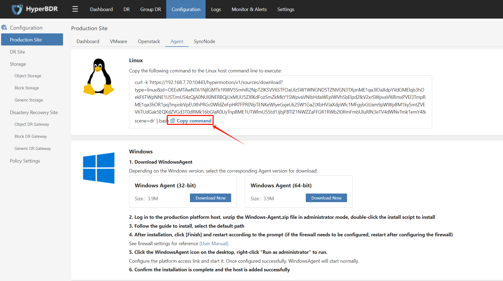

### Execute the installation command on the source-side host
Log in to the source-side host，Execute the command，Then will successfully install the Agent program


## Install Agent on the source Windows Host

::: tip
The HyperBDR disaster recovery platform is installed by default.  
If there is antivirus software installed locally, it is necessary to add the Windows Agent software to the antivirus software's whitelist in advance, allowing the Agent program to run smoothly.  
It is required that there is at least 1GB of available memory on the host to ensure the normal operation of the Windows Agent.
:::

Open the Performance tab of Task Manager and view the available memory of the system
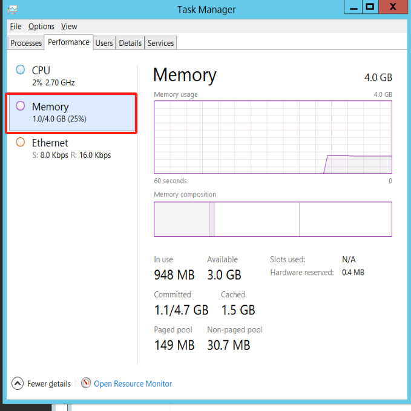

### Download the installation package to the host system.
 
Login to the HyperBDR platform, navigate to **[Configuration]** -> **[Production Site]** -> **[Agent]**, and download the ZIP file：


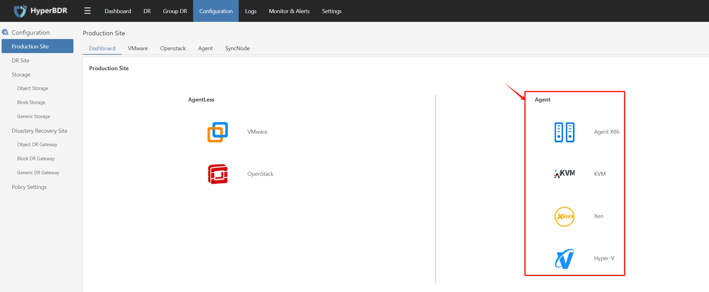

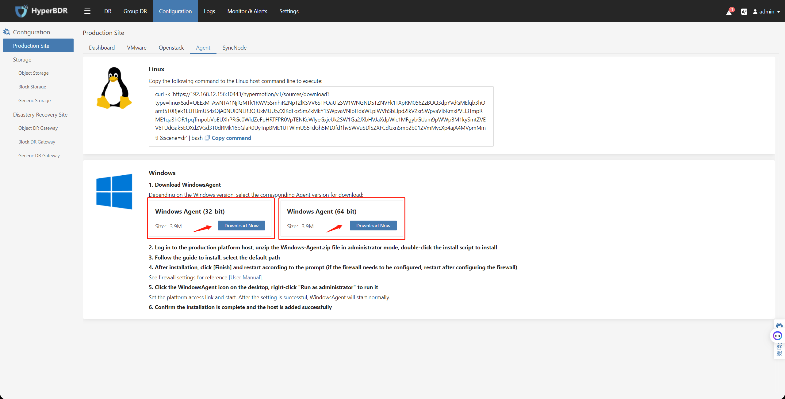

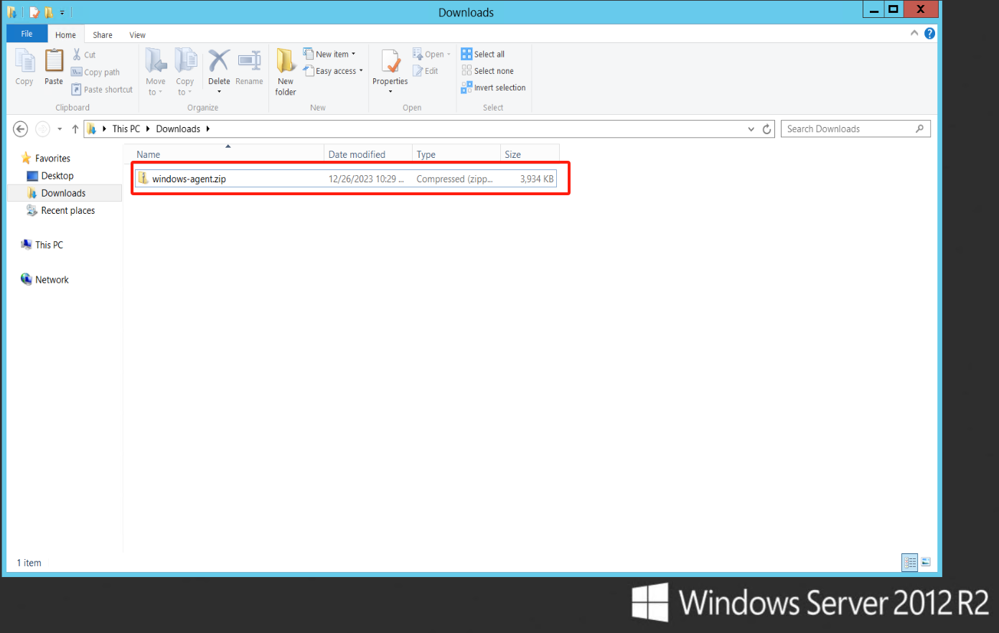

### Unzip the installation package and proceed with the installation.
Extract the installation package to the current directory.
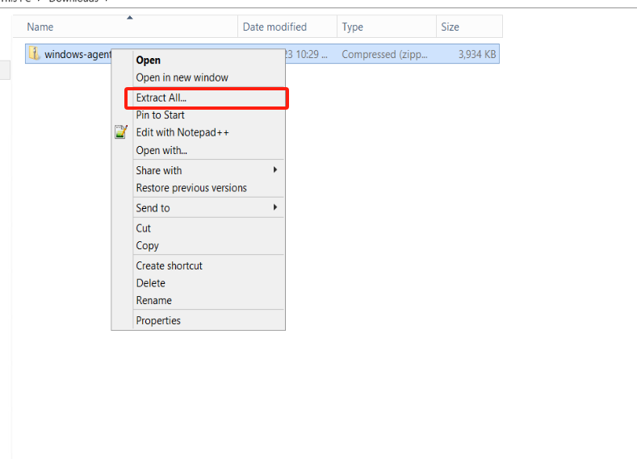

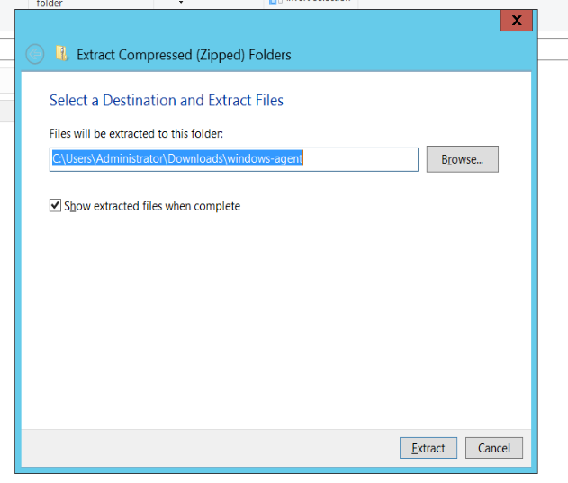

Open the folder of the extracted directory, right-click on the Install.exe file, and run this program as administrator to install the Windows Agent.
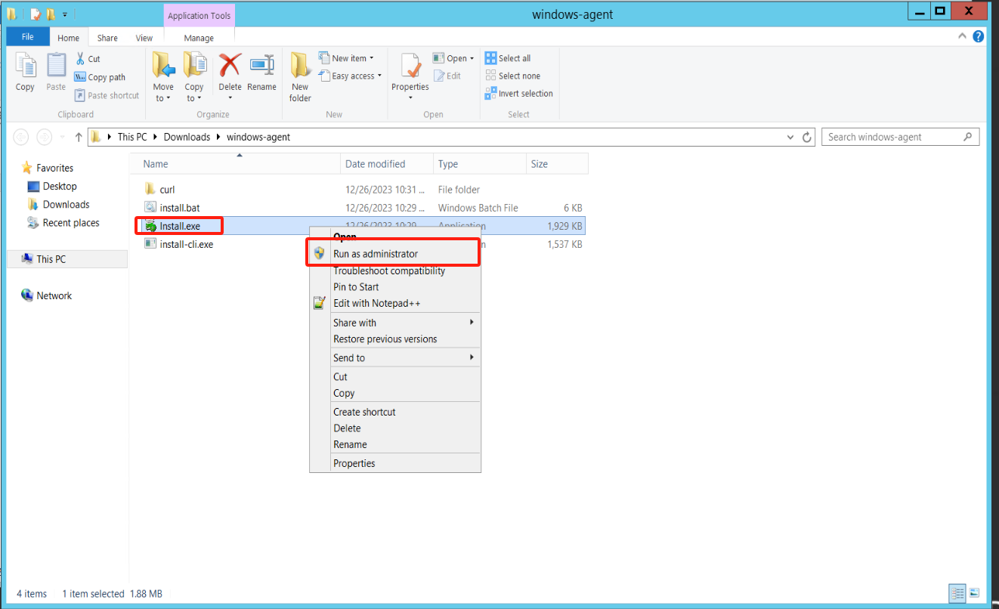


 
Installation of Windows Agent is complete.  


### Start the Windows Agent service
Right-click on the Windows Agent shortcut on the desktop and run it with administrator privileges.  

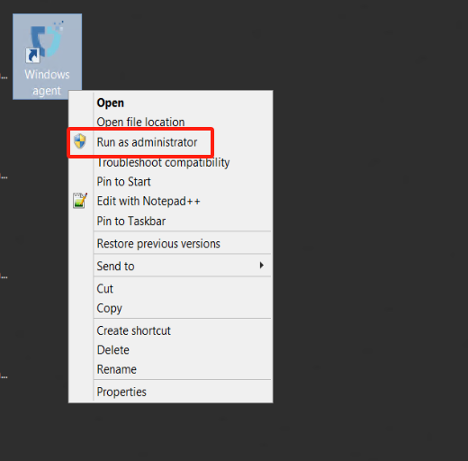

Start Service  


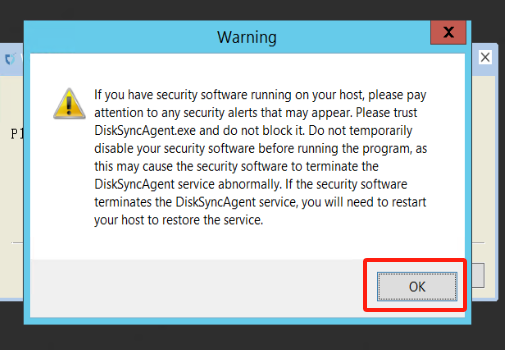


Service started normally  

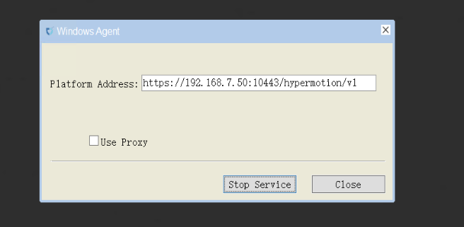


## Verify the Agent registration of the source host

::: tip
After installing the Agent on the source-side Linux host, it will automatically register with the disaster recovery platform.  
After installing and launching the Agent on the source-side Windows host, it will automatically register with the disaster recovery platform.
:::

### Log in to the disaster recovery platform
Log in to the disaster recovery platform using the username and password for the platform, and perform disaster recovery operations.


### View hosts on the disaster recovery main interface
After logging in to the HyperBDR disaster recovery platform, click on the 'DR' in the top menu bar, then on the left menu bar, select 'Host DR' to check whether the hosts are registered on the platform,Ensure Host Status is "Registered"，Availability is "Online"


## (Option 1: Public Network Access)Test The Connectivity Between The Agent Host And Huawei Cloud OBS

::: tip
Ensure your source hosts can access internet before testing.
:::

### Windows

::: tip
Perform testing operations using the Windows Command Prompt (CMD).
:::

#### Public DNS Connectivity Testing
```shell

ping 2 8.8.8.8

```

Success Response:


#### Huawei Object Storage Connectivity

```shell

ping https://obs.ap-southeast-3.myhuaweicloud.com

```

Success Response:


### Linux

#### Public DNS Connectivity Testing

```shell

ping -c 4 -t 2 8.8.8.8

```

Success Response:

```

ping -c 4 -t 2 8.8.8.8

PING 8.8.8.8 (8.8.8.8): 56 data bytes

64 bytes from 8.8.8.8: icmp_seq=0 ttl=111 time=43.362 ms

64 bytes from 8.8.8.8: icmp_seq=1 ttl=111 time=49.807 ms


--- 8.8.8.8 ping statistics ---
2 packets transmitted, 2 packets received, 0.0% packet loss
round-trip min/avg/max/stddev = 43.362/46.585/49.807/3.222 ms
```

#### Huawei Object Storage Connectivity

```shell

curl https://obs.ap-southeast-3.myhuaweicloud.com

```

Success Response:

```

<?xml version="1.0" encoding="UTF-8" standalone="yes"?><Error><Code>AccessDenied</Code><Message>Anonymous access is forbidden for this operation</Message><RequestId>0000018C1F508F2F9012234EA17641CE</RequestId><HostId>Z9v+cC1sRnaWw6x0vi8pxxYA0YVnKxbYHUPAFpnxkX8sLV44u5b02Z+ailn2wCnR</HostId></Error>#

```

::: tip
This command is primarily used to test the accessibility of Huawei Cloud Object Storage buckets. Currently, the tested OBS domain is for the Huawei Cloud Singapore region. If you need to test in a different region, please refer to the official Huawei Cloud documentation to find the corresponding Endpoint domain address.  
Reference Link: [https://developer.huaweicloud.com/intl/en-us/endpoint?OBS](https://developer.huaweicloud.com/intl/en-us/endpoint?OBS)
:::


## (Option 2: Internal VPN Access)Test The Connectivity Between The Agent Host And Huawei Cloud OBS

### Windows Host

::: tip
Perform testing operations using the Windows Command Prompt (CMD).
:::

#### Huawei Cloud Private DNS Connectivity Testing

::: tip
Refer to the following document to find the private NDS (Network Domain Service) address based on the used object storage region.  
Reference documents：[https://support.huaweicloud.com/intl/en-us/dns_faq/dns_faq_002.html](https://support.huaweicloud.com/intl/en-us/dns_faq/dns_faq_002.html)
:::

```shell
ping 100.125.1.250
```

Success Response:


#### Huawei Object Storage Connectivity

```shell

ping https://obs.ap-southeast-3.myhuaweicloud.com

```

Success Response:


### Linux Host

#### Check Object Storage Service Endpoint

Make sure object storage service endpoint address return internal ip address.


```
ping obs.ap-southeast-3.myhuaweicloud.com
```

Success Response:

```

PING obs.lz01.ap-southeast-3.myhuaweicloud.com (100.125.36.29) 56(84) bytes of data.

```

::: tip
Huawei Cloud Object Storage Service internal IP Range: 100.125.xx. If there is no ICMP response, it is considered normal.
:::

#### Huawei Object Storage Connectivity

```

curl https://obs.ap-southeast-3.myhuaweicloud.com

```

Success Response:

```

<?xml version="1.0" encoding="UTF-8" standalone="yes"?><Error><Code>AccessDenied</Code><Message>Anonymous access is forbidden for this operation</Message><RequestId>0000018C1F508F2F9012234EA17641CE</RequestId><HostId>Z9v+cC1sRnaWw6x0vi8pxxYA0YVnKxbYHUPAFpnxkX8sLV44u5b02Z+ailn2wCnR</HostId></Error>#

```

::: tip
This command is primarily used to test the accessibility of Huawei Cloud Object Storage buckets. Currently, the tested OBS domain is for the Huawei Cloud Singapore region. If you need to test in a different region, please refer to the official Huawei Cloud documentation to find the corresponding Endpoint domain address.  
Reference Link: [https://developer.huaweicloud.com/intl/en-us/endpoint?OBS](https://developer.huaweicloud.com/intl/en-us/endpoint?OBS)
:::


## (Option 1: Public Network Access)Test Network Connectivity from Source Host to HyperBDR

::: tip
This step needs to be tested after the installation of HyperBDR is completed.  
Test Access to HyperBDR Port 10443 and Port 30080.
:::

### Windows Host

::: tip
Perform testing operations using the Windows Command Prompt (CMD).
:::

Test Access to HyperBDR Port 10443 and Port 30080

Execute Command：

```shell

ssh -v -p 10443 <HyperBDR Public IP>

```

Test Result: If the input results include the information "[debug1: Connection established.]" it indicates that there are no issues with network connectivity.


Execute Command：

```shell

ssh -v -p 30080 <HyperBDR Public IP>

```


Test Result: If the input results include the information "[debug1: Connection established.]" it indicates that there are no issues with network connectivity.

### Linux Host

Test Access to HyperBDR Port 10443 and Port 30080

Execute Command：

```shell

ssh -v -p 10443 <HyperBDR Public IP>

```

Test Result: If the input results include the information "[debug1: Connection established.]" it indicates that there are no issues with network connectivity.

```

OpenSSH_7.4p1, OpenSSL 1.0.2k-fips 26 Jan 2017

debug1: Reading configuration data /etc/ssh/ssh_config

debug1: /etc/ssh/ssh_config line 58: Applying options for *

debug1: Connecting to <HyperBDR Public IP> [<HyperBDR Public IP>] port 10443.

debug1: Connection established.

```

Execute Command：

```shell

ssh -v -p 30080 <HyperBDR Public IP>

```

Test Result: If the input results include the information "[debug1: Connection established.]" it indicates that there are no issues with network connectivity.

```

OpenSSH_7.4p1, OpenSSL 1.0.2k-fips 26 Jan 2017

debug1: Reading configuration data /etc/ssh/ssh_config

debug1: /etc/ssh/ssh_config line 58: Applying options for *

debug1: Connecting to <HyperBDR Public IP> [<HyperBDR Public IP>] port 30080.

debug1: Connection established.

```

## (Option 2: Internal VPN Access)Test Network Connectivity from Source Host to HyperBDR

::: tip
This step needs to be tested after the installation of HyperBDR is completed.  
Test Access to HyperBDR Port 10443 and Port 30080
:::

### Windows Host

::: tip
Perform testing operations using the Windows Command Prompt (CMD).
:::

Execute Command：

```shell

ssh -v -p 10443 <HyperBDR Internal IP>

```

Test Result: If the input results include the information "[debug1: Connection established.]" it indicates that there are no issues with network connectivity.


Execute Command：

```shell

ssh -v -p 30080 <HyperBDR Internal IP>

```


Test Result: If the input results include the information "[debug1: Connection established.]" it indicates that there are no issues with network connectivity.

### Linux Host

Execute Command:

```

ssh -v -p 10443 <HyperBDR Internal IP>

```

Test Result: If the input results include the information "[debug1: Connection established.]" it indicates that there are no issues with network connectivity.

```

OpenSSH_7.4p1, OpenSSL 1.0.2k-fips  26 Jan 2017

debug1: Reading configuration data /etc/ssh/ssh_config

debug1: /etc/ssh/ssh_config line 58: Applying options for *

debug1: Connecting to <HyperBDR Internal IP> [<HyperBDR Internal IP>] port 10443.

debug1: Connection established.

```

Execute Command：

```

ssh -v -p 30080 <HyperBDR Internal IP>

```

Test Result: If the input results include the information "[debug1: Connection established.]" it indicates that there are no issues with network connectivity.

```

OpenSSH_7.4p1, OpenSSL 1.0.2k-fips  26 Jan 2017

debug1: Reading configuration data /etc/ssh/ssh_config

debug1: /etc/ssh/ssh_config line 58: Applying options for *

debug1: Connecting to <HyperBDR Internal IP> [<HyperBDR Internal IP>] port 30080.

debug1: Connection established.

```

