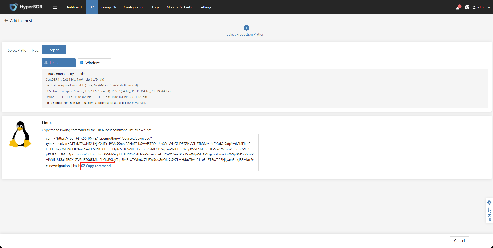
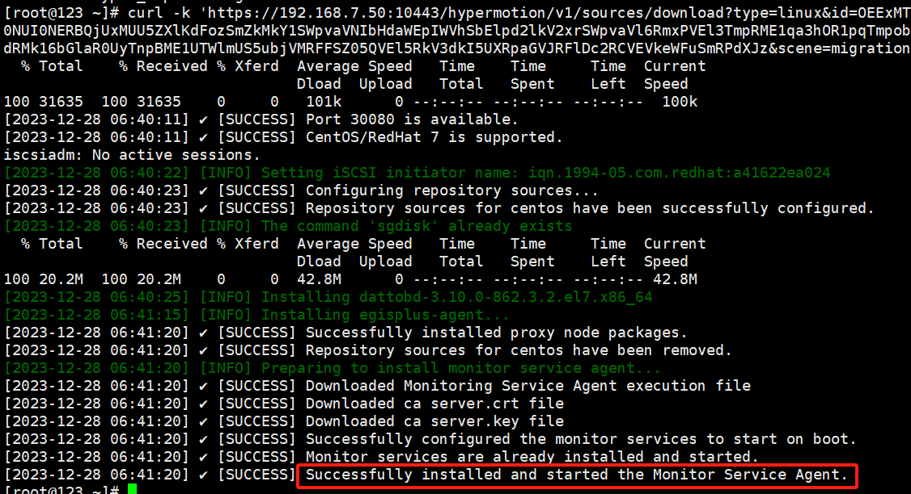
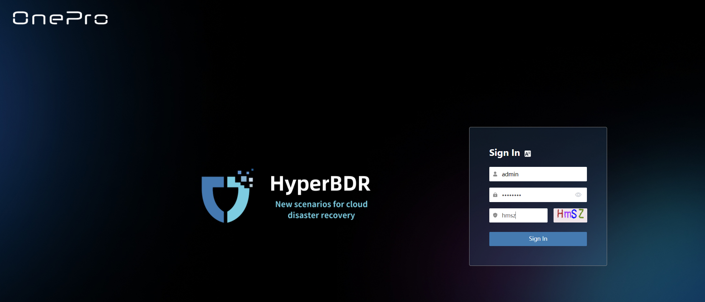
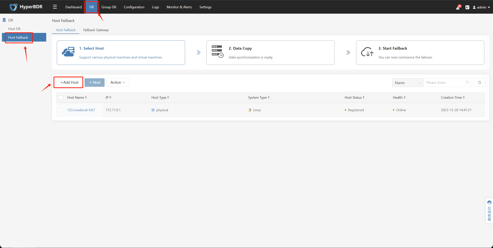
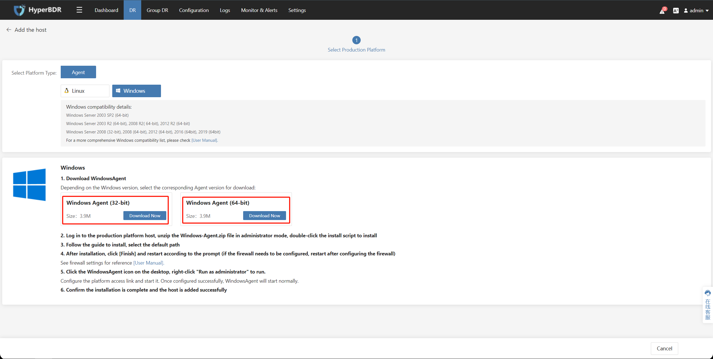

# Agent Pre-Settings

[[toc]]

## (Intranet VPN Access) Test the network connectivity between the Failback Host and the HyperBDR

::: tip
The VPN service has been configured on the DR side, and the DR side has connected to the production site through the VPN. You can perform the following tests.
:::

### Verification test procedure

Log in to the Failback Host.

#### The Failback Host is Linux 

Ensure that the ssh command is running on the Failback Host

#### The HyperBDR is accessed on port 10443

Test command:

```
ssh -v -p 10443 <HyperBDR Intranet IP>
```

Test result: If the following input result contains the information [debug1: Connection established.], the network connectivity is OK.

```
OpenSSH_7.4p1, OpenSSL 1.0.2k-fips  26 Jan 2017
debug1: Reading configuration data /etc/ssh/ssh_config
debug1: /etc/ssh/ssh_config line 58: Applying options for *
debug1: Connecting to <HyperBDR Intranet IP\> [<HyperBDR Intranet IP\>] port 10443.
debug1: Connection established.
#### The HyperBDR is accessed on port 30080
```

Test command:

```
ssh -v -p 30080 <HyperBDR Intranet IP>
```

Test result: If the following input result contains the information [debug1: Connection established.], the network connectivity is OK.

```
OpenSSH_7.4p1, OpenSSL 1.0.2k-fips  26 Jan 2017
debug1: Reading configuration data /etc/ssh/ssh_config
debug1: /etc/ssh/ssh_config line 58: Applying options for *
debug1: Connecting to <HyperBDR Intranet IP> [<HyperBDR Intranet IP>] port 30080.
debug1: Connection established.
```

#### The HyperBDR is accessed on port 10081

Test command:

```
ssh -v -p 10081 <HyperBDR Intranet IP>
```

Test result: If the following input result contains the information [debug1: Connection established.], the network connectivity is OK.

```
OpenSSH_7.4p1, OpenSSL 1.0.2k-fips  26 Jan 2017
debug1: Reading configuration data /etc/ssh/ssh_config
debug1: /etc/ssh/ssh_config line 58: Applying options for *
debug1: Connecting to <HyperBDR Intranet IP> [<HyperBDR Intranet IP>] port 10081.
debug1: Connection established.
```

### The Failback Host is Windows

Ensure that the ssh command exists on the Failback Host, and open the CMD command line

#### The HyperBDR is accessed on port 10443

Test command:

```
ssh -v -p 10443 <HyperBDR Intranet IP>
```

Test result: If the following input result contains the information [debug1: Connection established.], the network connectivity is OK.

```
OpenSSH_7.4p1, OpenSSL 1.0.2k-fips  26 Jan 2017
debug1: Reading configuration data /etc/ssh/ssh_config
debug1: /etc/ssh/ssh_config line 58: Applying options for *
debug1: Connecting to <HyperBDR Intranet IP> [<HyperBDR Intranet IP>] port 10443.
debug1: Connection established.
```

#### The HyperBDR is accessed on port 30080

Test command:

```
ssh -v -p 30080 <HyperBDR Intranet IP>
```

Test result: If the following input result contains the information [debug1: Connection established.], the network connectivity is OK.

```
OpenSSH_7.4p1, OpenSSL 1.0.2k-fips  26 Jan 2017
debug1: Reading configuration data /etc/ssh/ssh_config
debug1: /etc/ssh/ssh_config line 58: Applying options for *
debug1: Connecting to <HyperBDR Intranet IP> [<HyperBDR Intranet IP>] port 30080.
debug1: Connection established.
```

#### The HyperBDR is accessed on port 10081

Test command:

```
ssh -v -p 10081 <HyperBDR Intranet IP>
```

Test result: If the following input result contains the information [debug1: Connection established.], the network connectivity is OK.

```
OpenSSH_7.4p1, OpenSSL 1.0.2k-fips  26 Jan 2017
debug1: Reading configuration data /etc/ssh/ssh_config
debug1: /etc/ssh/ssh_config line 58: Applying options for *
debug1: Connecting to <HyperBDR Intranet IP> [<HyperBDR Intranet IP>] port 10081.
debug1: Connection established.
```

## Install Agent on the Failback Host and register with HyperBDR

### Linux Failback Host

#### Log in to the HyperBDR Console


#### Copy the Agent installation command

Click on the **'DR'** tab above, then select **'Host Failback'** on the left. Click on **'Add Host'**, choose the Agent mode.


In the **'Linux'** section, click **'Copy Command'**.



#### Run the installation command on the Failback Host

Log in to the Failback Host, and then run the Agent installation command. Wait for the installation to complete.



### Windows Failback Host

#### Log in to the HyperBDR Console



#### Download the Agent installation package to the local of the Failback Host.

Click on the **'DR'** tab above, then select **'Host Failback'** on the left. Click on **'Add Host'**, choose the Agent mode.



In the **'Windows'** section, select the installation package corresponding to your version for download.




#### **Antivirus Software Inspection and Measures on Source Windows Host**

Refer to the following documentation and perform the operations on the Windows Failback Host.

Documentation Link：[https://docs.oneprocloud.com/userguide/poc/agent-pre-settings.html#antivirus-software-inspection-and-measures-on-source-windows-host](https://docs.oneprocloud.com/userguide/poc/agent-pre-settings.html#antivirus-software-inspection-and-measures-on-source-windows-host)

#### **Install Agent on the Windows Failback Host**

Refer to the following documentation and perform the operations on the Windows Failback Host.

Documentation Link：[https://docs.oneprocloud.com/userguide/poc/agent-pre-settings.html#install-agent-on-the-source-windows-host](https://docs.oneprocloud.com/userguide/poc/agent-pre-settings.html#install-agent-on-the-source-windows-host)

## (Intranet VPN Access) Test the network connectivity between the Failback Host and Huawei Cloud OBS

::: tip
The VPN service has been configured on the Huawei cloud side, and the Huawei cloud side has connected to the production site through the VPN. You can perform the following tests.
:::

### The Failback Host is Linux 

#### Log in to the Failback Host .

::: tip
Ensure that the ssh command is running on the Failback Host.
:::

#### Huawei Cloud Private DNS Connectivity Testing

::: tip
Refer to the following document to find the Private DNS server addresses based on the used object storage region.  
Reference documents：[https://support.huaweicloud.com/intl/en-us/dns_faq/dns_faq_002.html](https://support.huaweicloud.com/intl/en-us/dns_faq/dns_faq_002.html)
:::

```shell
ping 100.125.1.250
```

Success Response:


#### Huawei Cloud Object Storage Connectivity  Testing

```shell
ping https://obs.ap-southeast-3.myhuaweicloud.com
```

Success Response:


::: tip
This command is primarily used to test the accessibility of Huawei Cloud Object Storage buckets. Currently, the tested OBS domain is for the Huawei Cloud Singapore region. If you need to test in a different region, please refer to the official Huawei Cloud documentation to find the corresponding Endpoint domain address.  
Reference Link:  [https://developer.huaweicloud.com/intl/en-us/endpoint?OBS](https://developer.huaweicloud.com/intl/en-us/endpoint?OBS)
:::


### The Failback Host is Windows

#### Log in to the Failback Host .

::: tip
Ensure that the ssh command exists on the Failback Host, and open the CMD command line.
:::

#### Huawei Cloud Private DNS Connectivity Testing

::: tip
Refer to the following document to find the Private DNS server addresses based on the used object storage region.  
Reference documents：[https://support.huaweicloud.com/intl/en-us/dns_faq/dns_faq_002.html](https://support.huaweicloud.com/intl/en-us/dns_faq/dns_faq_002.html)
:::

```shell
ping 100.125.1.250
```

Success Response:


#### Huawei Cloud Object Storage Connectivity  Testing

```shell
ping https://obs.ap-southeast-3.myhuaweicloud.com
```

Success Response:


::: tip
This command is primarily used to test the accessibility of Huawei Cloud Object Storage buckets. Currently, the tested OBS domain is for the Huawei Cloud Singapore region. If you need to test in a different region, please refer to the official Huawei Cloud documentation to find the corresponding Endpoint domain address.  
Reference Link:  [https://developer.huaweicloud.com/intl/en-us/endpoint?OBS](https://developer.huaweicloud.com/intl/en-us/endpoint?OBS)
:::

## (Intranet VPN Access) Tests the network connectivity between the Failback Host and the Failback Transition Host

::: tip
If the switchback test environment is connected to the Intranet of the production site through VPN, you can perform this operation to test the network connectivity between the Failback Host and the Failback Transition Host.
:::

### The Failback Host is a Linux

#### Verification test procedure

Log in to the Failback Host.

#### Test access to port 10729 of the Failback Transition Host

::: tip
Ensure that the ssh command is running on the Failback Host
:::

Test command:
```bash
ssh -p 10729 root@<Failback Transition Host Intranet IP>
```

Verification results:
If the password can be accessed normally, the access is normal.

### The Failback Host is a Windows

#### Verification test procedure

Log in to the Failback Host

#### Test access to port 10729 of the Failback Transition Host

::: tip
Ensure that the ssh command exists on the Failback Host, and open the CMD command line
:::

Test command:
```bash
ssh -p 10729 root@<Failback Transition Host Intranet IP>
```

Verification results:
If the password can be accessed normally, the access is normal.