# HyperBDR For Host Failback Pre-Settings

[[toc]]

## (Intranet VPN Access) Create and configure the VPN service

::: tip
The VPC network of the Huawei cloud failback host connects to the local vCenter/ESXi VM service network.  
If the VPC network where the HyperBDR resides has been connected to the vCenter/ESXi service network through the VPN service when the Dr Is deployed to Huawei cloud, you do not need to connect the network again.
:::

### Configuration document

Configure VPN. For details, see Huawei Cloud official documentation.

Document Link：[https://support.huaweicloud.com/intl/en-us/qs-vpn/vpn_03_0001.html](https://support.huaweicloud.com/intl/en-us/qs-vpn/vpn_03_0001.html)

## （Internal VPN Access) - Create VPC Endpoint service

::: tip
If your disaster recovery environment is interconnected with the production site's intranet through Huawei Cloud VPN, and the production site needs to access Huawei Cloud HyperBDR and OBS services through VPN during a disaster, then you need to purchase and configure VPC Endpoint services in Huawei Cloud.  
You need to purchase two VPC Endpoint services, one for OBS and the other for DNS.
:::

::: tip
If you have purchased and configured the Endpoint service in the VPC when the disaster recovery system is deployed to Huawei cloud, you do not need to repeat this configuration.
:::

### Configure VPC Endpoint

 
Huawei Cloud official definition: If you want to access OBS services from a local data center via VPN or Cloud Connect using an intranet method, you can achieve this by connecting through terminal endpoints to access terminal endpoint services. Document Link：[https://support.huaweicloud.com/intl/en-us/qs-vpcep/vpcep_02_0301.html](https://support.huaweicloud.com/intl/en-us/qs-vpcep/vpcep_02_0301.html)

#### Configure DNS Interface Type for Terminal Endpoints

| Project | Configuration |
| --- | --- |
| Region | Choose the Region to activate |
| Billing Mode | Pay-per-use |
| Service Category | Choose the default "Cloud server," check com.myhuaweicloud.<region\>.dns, and set the type as Interface. |
| VPC | Choose the VPC interconnecting with the local IDC VPN |
| Subnet | Select the subnet for VPN interconnection. |


#### Selection of OBS Gateway-type Terminal Endpoint

| Project | Configuration |
| --- | --- |
| Region | Choose the Region to activate |
| Billing Mode | Pay-per-use |
| Service Category |  Choose the default "Cloud server," check com.myhuaweicloud.<region\>.obs, and set the type as Gateway |
| VPC | Choose the VPC interconnecting with the local IDC VPN |
| Route Table | default |
| Policy | default |

::: tip
In the Service Category section, it may not be possible to directly find the corresponding OBS service for the default Cloud service type. In such cases, you will need to use "Find a service by name" to search. You must enter the complete name of the specific OBS service. Please confirm with Huawei Cloud as the target OBS service terminal endpoints on the Huawei side may have distinctions between v1 and v2 versions. Additionally, the names of each region and the association between v1/v2 versions and the resource pool of the object storage bucket need clarification. If you have purchased v1 OBS terminal endpoints but your object storage bucket is in a v2 cluster, it must be aligned accordingly. Confirm with Huawei in advance regarding the specific version of the object storage bucket's cluster and OBS terminal endpoints

Example: v2 version OBS terminal endpoint name: sa-brazil-1.com.myhuaweicloud.v4.obsv2.lz002
:::


#### Configure VPN local-end OBS gateway

Add the internal subnet range of the local (Huawei Cloud) OBS service at the VPN connection point. The subnet address for all internal Huawei Cloud OBS services is 100.125.0.0/16.


## (Intranet VPN access)Test the network connectivity between the HyperBDR and the Failback Gateway Host

::: tip
If the failback test environment is connected to the Intranet of the production site through Huawei Cloud VPN, perform this step to test the network connectivity between the HyperBDR and the universal storage failback gateway.
:::

### Verification test procedure

Log in to the HyperBDR host

#### Test access to port 10729 of the Failback Gateway Host

Test command:

```
ssh -v -p 10729 <Failback Gateway Host Intranet IP>
```

If the input result includes the information '[debug1: Connection established.],' it indicates that the network connection is successful.

```
OpenSSH_7.4p1, OpenSSL 1.0.2k-fips  26 Jan 2017
debug1: Reading configuration data /etc/ssh/ssh_config
debug1: /etc/ssh/ssh_config line 58: Applying options for *
debug1: Connecting to 192.168.10.2 [ESXi IP Address] port 443.
debug1: Connection established.
```

## Test the connectivity from HyperBDR to the management network of vCenter/ESXi

::: tip
If your fallback testing environment is interconnected with the on-premises network through Huawei Cloud VPN, you can test the network connectivity from HyperBDR to the Common Storage Fallback Gateway using the following steps.
:::

### Log in to the HyperBDR host

### Test access to the vCenter address port

::: tip
Replace the IP address of vCenter in the command with the actual IP address from the production environment.
:::

Test command:

```
ssh -v -p 443 <vCenter IP Address>
```

If the input result includes the information '[debug1: Connection established.],' it indicates that the network connection is successful.

```
OpenSSH_7.4p1, OpenSSL 1.0.2k-fips  26 Jan 2017
debug1: Reading configuration data /etc/ssh/ssh_config
debug1: /etc/ssh/ssh_config line 58: Applying options for *
debug1: Connecting to 192.168.10.2 [vCenter IP Address] port 443.
debug1: Connection established.
```

### Test access to the ESXi address port

::: tip
Replace the IP address of ESXi in the command with the actual IP address from the production environment.
:::

```
ssh -v -p 443 <ESXi IP Address>
```

Test command:

If the input result includes the information '[debug1: Connection established.],' it indicates that the network connection is successful.

```
OpenSSH_7.4p1, OpenSSL 1.0.2k-fips  26 Jan 2017
debug1: Reading configuration data /etc/ssh/ssh_config
debug1: /etc/ssh/ssh_config line 58: Applying options for *
debug1: Connecting to 192.168.10.2 [ESXi IP Address] port 443.
debug1: Connection established.
```

## Add the Generic Failback Gateway Host to HyperBDR

::: tip
The deployment of the HyperBDR has been completed by default.
:::

### Log in to the HyperBDR console

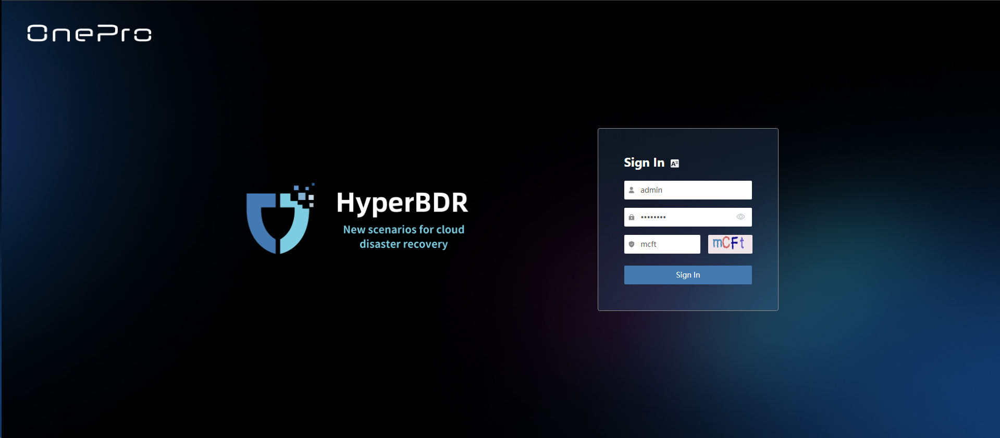

### Add the Generic Failback Gateway Host

**Step 1.** On the top navigation bar, select "Configuration", choose "Generic Storage" in the left menu, and click "Add" on the "Failback" - "Failback Storage Gateway" tab.

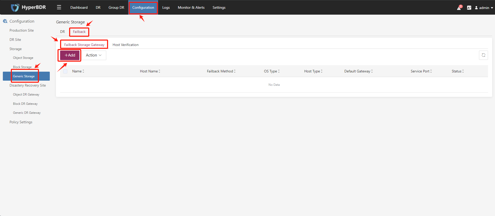

**Step 2.** Follow the instructions in the form to create the Generic Storage "Failback Gateway". Choose "Block Storage" or "Object Storage" as the Failback Method, fill in the information for the generic storage failback gateway, and after confirming, click "Next".

::: tip
Choose "Object Storage" or "Block Storage" based on your storage type to configure the "Failback Method".
:::

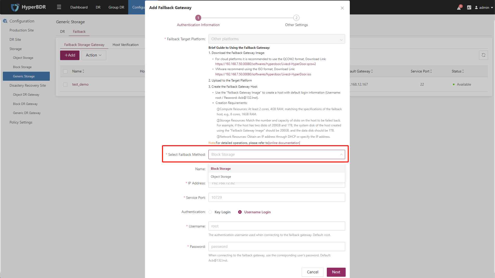

**Step 3.** The "Driver Adaption" option can remain at its default setting.

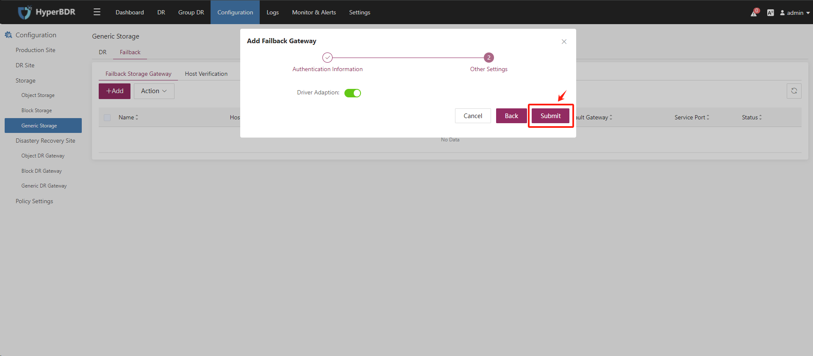

**Step 4.** The status of the general storage failback gateway should be "Available".

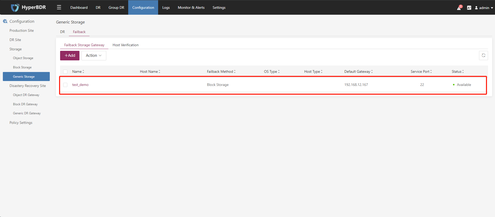

## Verify the status of the Failback Gateway Host

::: tip
The deployment of the HyperBDR has been completed by default.
:::

### Log in to the HyperBDR console

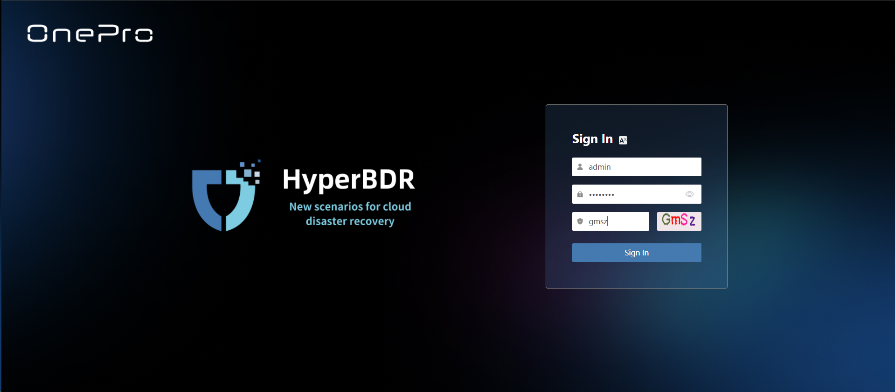

### Check the status of the Failback Gateway

On the top navigation bar, select "Configuration", choose "Generic Storage" in the left menu, and click on the [Failback Gateway] you want to confirm.


Confirm that the status of this Failback Gateway is [**available**].

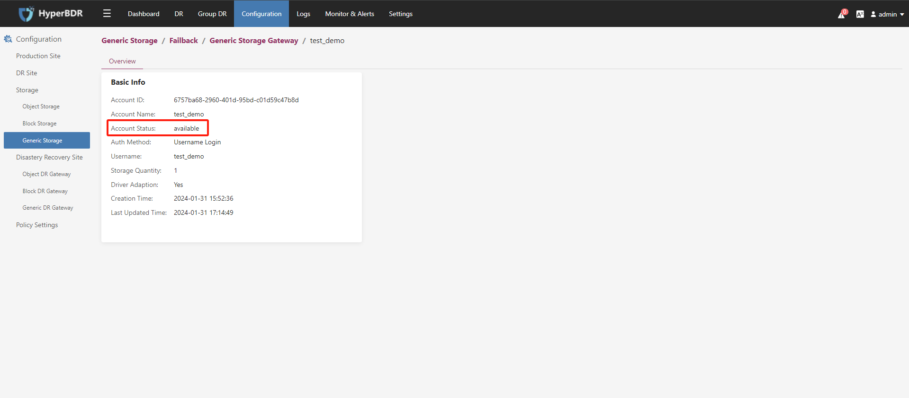


## Apply for HyperBDR Failback License

::: tip
The deployment of the HyperBDR has been completed by default.
:::

### Log in the HyperBDR console


### Activate a Failback License

Select [**Settings**] > [**License Management**] > [**Failback License**], and click [**Add**].

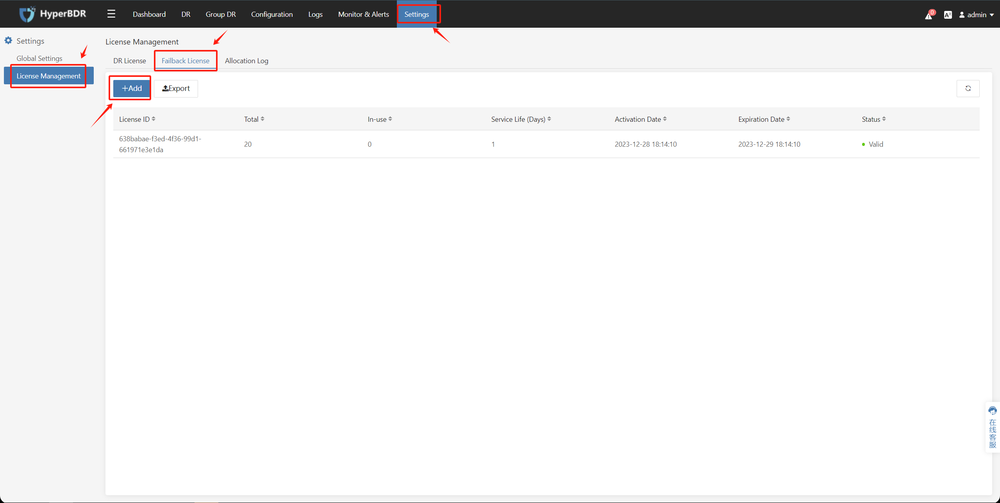

### Retrieve the Failback License activation code

::: tip
There are two methods to obtain the Failback License activation code.
:::

#### Activate using the QR code

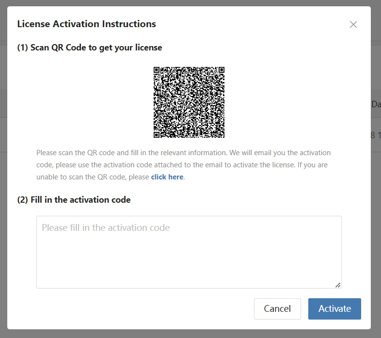

Scan the QR code and fill out the application form. Customer service will send the activation code to the user via email (as an attachment) after reviewing the application. 

::: tip
Please ensure that the email address provided on the application form is accurate; otherwise, you will not receive the activation code.
:::

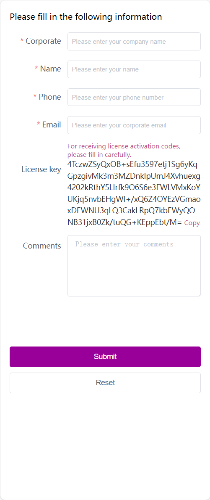

After filling in the received activation code, click [**Activate**].


#### Activate using the **registration code**

[**click here**] to obtain the registration code, and [**Click copy the registration code**].

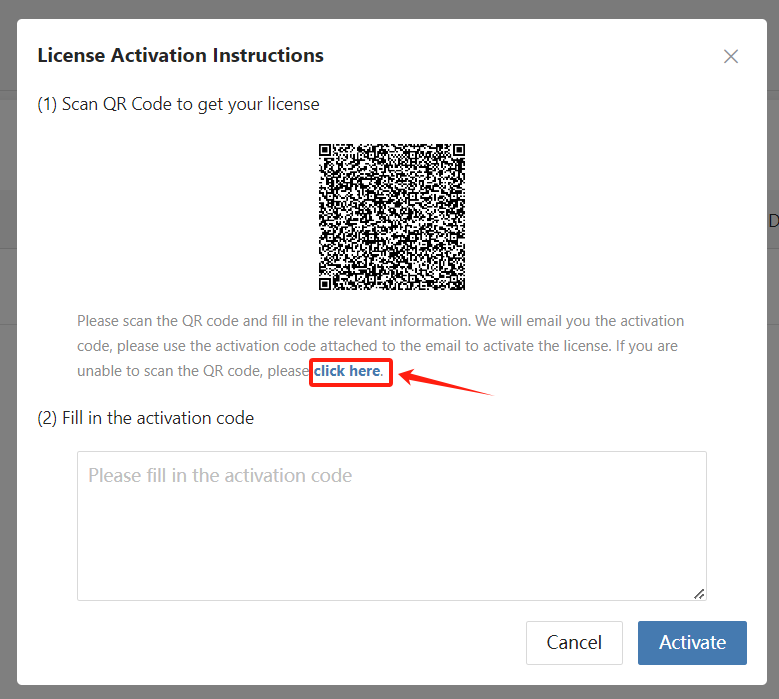

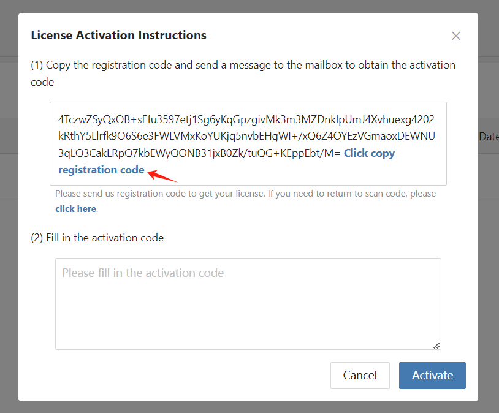


You can send the registration code to the sales representative or email it to **enquiry@oneprocloud.com**. After receiving the activation code, fill it in and click [**Activate**].


## Download the hyperdoor image for the Failback Gateway

::: tip
Choose the available image file according to the production environment on the source. You will need to use the hyperdoor image to create a virtual machine/physical machine in the source production environment.
:::

### Download ISO Format Image
hyperdoor image download link：[https://hyperbdr-system-image-do-not-delete.obs.ap-southeast-3.myhuaweicloud.com/Livecd-HyperDoor.iso](https://hyperbdr-system-image-do-not-delete.obs.ap-southeast-3.myhuaweicloud.com/Livecd-HyperDoor.iso) 
hyperdoor image MD5 file download link：[https://hyperbdr-system-image-do-not-delete.obs.ap-southeast-3.myhuaweicloud.com/Livecd-HyperDoor.iso.md5](https://hyperbdr-system-image-do-not-delete.obs.ap-southeast-3.myhuaweicloud.com/Livecd-HyperDoor.iso.md5)

### Download QCOW2 Format Image
hyperdoor image download link：[https://hyperbdr-system-image-do-not-delete.obs.ap-southeast-3.myhuaweicloud.com/Livecd-HyperDoor.qcow2](https://hyperbdr-system-image-do-not-delete.obs.ap-southeast-3.myhuaweicloud.com/Livecd-HyperDoor.qcow2)
hyperdoor image MD5 file download link：[https://hyperbdr-system-image-do-not-delete.obs.ap-southeast-3.myhuaweicloud.com/Livecd-HyperDoor.qcow2](https://hyperbdr-system-image-do-not-delete.obs.ap-southeast-3.myhuaweicloud.com/Livecd-HyperDoor.qcow2)

## (Intranet VPN Access) Create and configure the VPN service-Agent

::: tip
The VPC network of the Huawei cloud failback host connects to the source production environment network.  
Note: If the VPC network where the HyperBDR resides has been connected to the source production environment network through the VPN service when the Dr Is deployed to Huawei cloud, you do not need to connect the network again.
:::

### Configuration document
Configure VPN. For details, see Huawei Cloud official documentation.
Document Link：[https://support.huaweicloud.com/intl/en-us/qs-vpn/vpn_03_0001.html](https://support.huaweicloud.com/intl/en-us/qs-vpn/vpn_03_0001.html)
