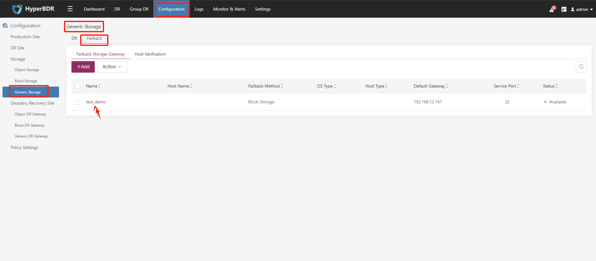
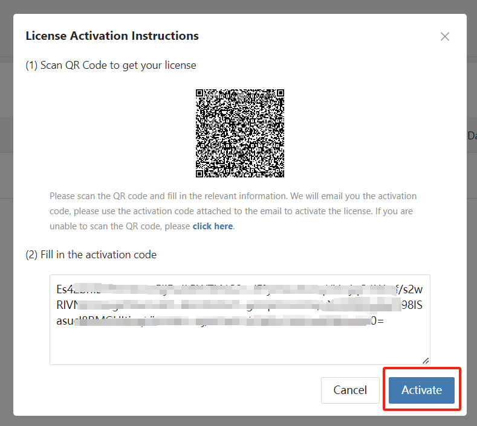
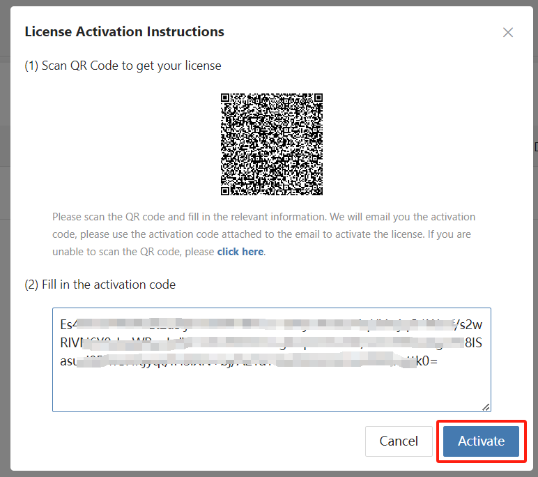
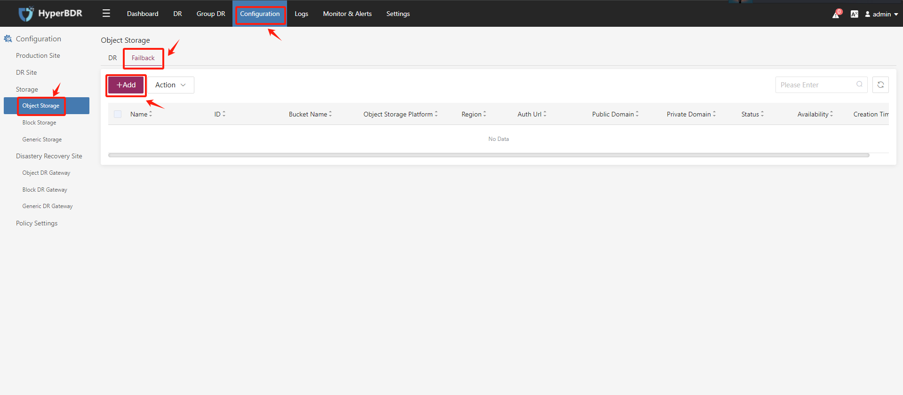
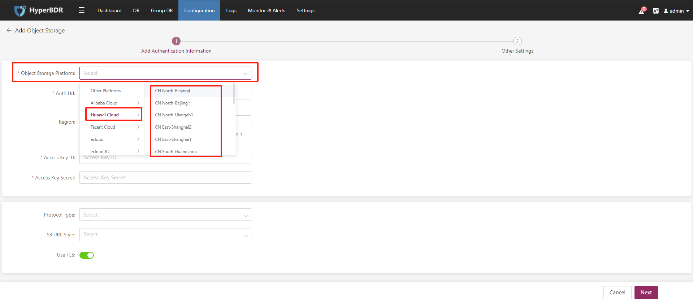
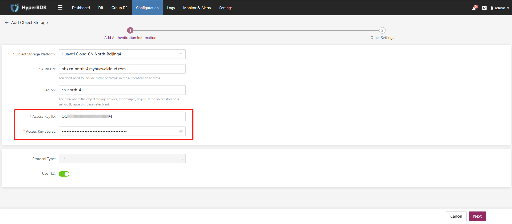
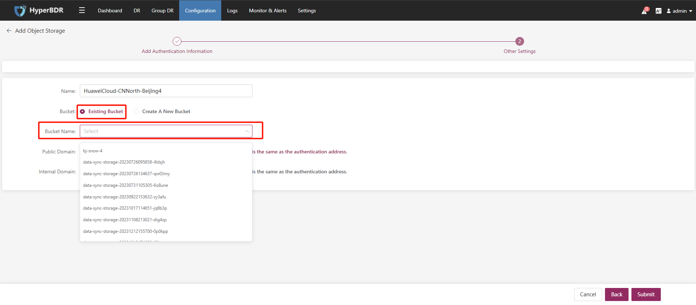
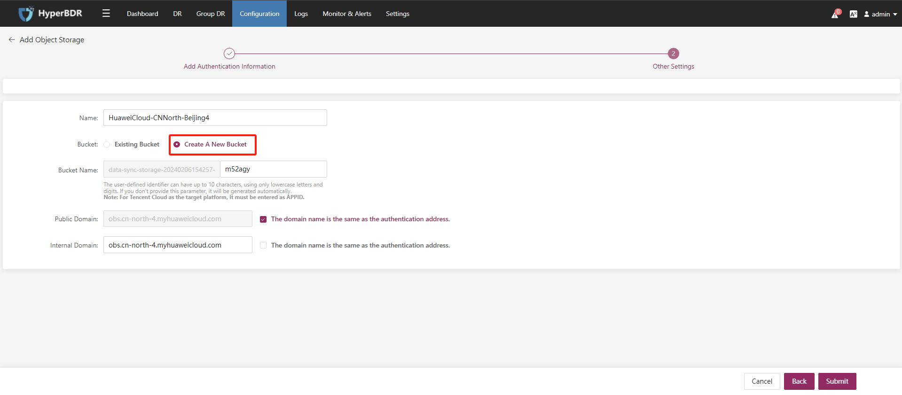
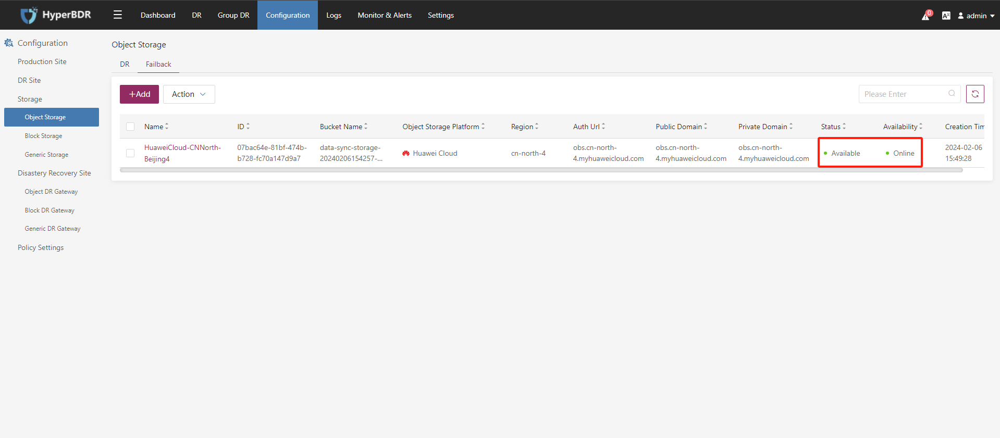

# HyperBDR Setup

[[toc]]

## (Intranet VPN access)Test the network connectivity between the HyperBDR and the Failback Transition Host

::: tip
If the failback environment is connected to the Intranet of the production site through VPN, perform this step to test the network connectivity between the HyperBDR and the universal storage failback Transition Host.
:::

### Verification test procedure

Log in to the HyperBDR host

#### Test access to port 10729 of the Failback Transition Host

Test command:

```
ssh -v -p 10729 <Failback Transition Host Intranet IP>
```

If the input result includes the information '[debug1: Connection established.],' it indicates that the network connection is successful.

```
OpenSSH_7.4p1, OpenSSL 1.0.2k-fips  26 Jan 2017
debug1: Reading configuration data /etc/ssh/ssh_config
debug1: /etc/ssh/ssh_config line 58: Applying options for *
debug1: Connecting to 192.168.10.2 [ESXi IP Address] port 443.
debug1: Connection established.
```

## Test the connectivity from HyperBDR to the management network of vCenter/ESXi

::: tip
If your fallback environment is interconnected with the on-premises network through VPN, you can test the network connectivity from HyperBDR to the Common Storage Fallback Transition Host using the following steps.
:::

### Log in to the HyperBDR host

### Test access to the vCenter address port

::: tip
Replace the IP address of vCenter in the command with the actual IP address from the production environment.
:::

Test command:

```
ssh -v -p 443 <vCenter IP Address>
```

If the input result includes the information '[debug1: Connection established.],' it indicates that the network connection is successful.

```
OpenSSH_7.4p1, OpenSSL 1.0.2k-fips  26 Jan 2017
debug1: Reading configuration data /etc/ssh/ssh_config
debug1: /etc/ssh/ssh_config line 58: Applying options for *
debug1: Connecting to 192.168.10.2 [vCenter IP Address] port 443.
debug1: Connection established.
```

### Test access to the ESXi address port

::: tip
Replace the IP address of ESXi in the command with the actual IP address from the production environment.
:::

```
ssh -v -p 443 <ESXi IP Address>
```

Test command:

If the input result includes the information '[debug1: Connection established.],' it indicates that the network connection is successful.

```
OpenSSH_7.4p1, OpenSSL 1.0.2k-fips  26 Jan 2017
debug1: Reading configuration data /etc/ssh/ssh_config
debug1: /etc/ssh/ssh_config line 58: Applying options for *
debug1: Connecting to 192.168.10.2 [ESXi IP Address] port 443.
debug1: Connection established.
```

## Add the Failback Transition Host to HyperBDR

::: tip
The deployment of the HyperBDR has been completed by default.
:::

### Log in to the HyperBDR console


### Add the Failback Transition Host

**Step 1.** On the top navigation bar, select "Configuration", choose "Generic Storage" in the left menu, and click "Add" on the "Failback" - "Failback Storage Gateway" tab.


**Step 2.** Follow the instructions in the form to create the Generic Storage "Failback Transition Host". Choose "Block Storage" or "Object Storage" as the Failback Method, fill in the information for the generic storage failback Transition Host, and after confirming, click "Next".

::: tip
Choose "Object Storage" or "Block Storage" based on your storage type to configure the "Failback Method".
:::


**Step 3.** The "Driver Adaption" option can remain at its default setting.


**Step 4.** The status of the general storage failback Transition Host should be "Available".


## Verify the status of the Failback Transition Host

::: tip
The deployment of the HyperBDR has been completed by default.
:::

### Log in to the HyperBDR console


### Check the status of the Failback Transition Host

On the top navigation bar, select "Configuration", choose "Generic Storage" in the left menu, and click on the [Failback Gateway] you want to confirm.



Confirm that the status of this Failback Transition Host is [**available**].


## Apply for HyperBDR Failback License

::: tip
The deployment of the HyperBDR has been completed by default.
:::

### Log in the HyperBDR console


### Activate a Failback License

Select [**Settings**] > [**License Management**] > [**Failback License**], and click [**Add**].


### Retrieve the Failback License activation code

::: tip
There are two methods to obtain the Failback License activation code.
:::

#### Activate using the QR code


Scan the QR code and fill out the application form. Customer service will send the activation code to the user via email (as an attachment) after reviewing the application. 

::: tip
Please ensure that the email address provided on the application form is accurate; otherwise, you will not receive the activation code.
:::


After filling in the received activation code, click [**Activate**].



#### Activate using the **registration code**

[**click here**] to obtain the registration code, and [**Click copy the registration code**].


You can send the registration code to the sales representative or email it to **enquiry@oneprocloud.com**. After receiving the activation code, fill it in and click [**Activate**].




## Download the Failback Transition Image for the Failback Transition Host

::: tip
Choose the available Failback Transition Image file according to the production environment on the source. You will need to use the Failback Transition Image to create a virtual machine/physical machine in the source production environment.
:::

### Download ISO Format Image
Failback Transition Image download link：[https://downloads.oneprocloud.com/Livecd-HyperDoor.iso](https://downloads.oneprocloud.com/Livecd-HyperDoor.iso)  

### Download QCOW2 Format Image
Failback Transition Image download link：[https://downloads.oneprocloud.com/Livecd-HyperDoor.qcow2](https://downloads.oneprocloud.com/Livecd-HyperDoor.qcow2)  

### Download VMDK Format Image
Failback Transition Image download link：[https://downloads.oneprocloud.com/Livecd-HyperDoor.vmdk](https://downloads.oneprocloud.com/Livecd-HyperDoor.vmdk)  

## Add Huawei Cloud Object Storage (Failback)

::: tip
Already logged in to the HyperBDR console by default.  
Using the provided IAM account AK/SK information, configure and add Huawei Cloud Object Storage bucket in the HyperBDR console.
:::

::: tip
The following operations use Huawei Cloud Object Storage as an example. Please choose the corresponding object storage based on your actual disaster recovery scenario.
:::

### Configure Step

- Step 1. Click on the top menu bar 'Configuration,' 'Storage,' 'Object Storage.' Select 'fallback' tab, Click the 'Add' button.



- Step 2. On the object storage platform, select the Huawei Cloud object storage region.



- Step 3. Using the provided IAM account AK/SK information，After confirmation, click 'Next'.



- Step 4. After setting the name of the object storage bucket, click 'Submit'.

::: tip
You can use existing object buckets within the region, or create new object buckets and customize their names.
:::





- Step 5. Object storage(Failback) addition completed.



