# HuaweiCloud Pre-Settings

[[toc]]

## Create Huawei Cloud IAM account for DR purpose

Create a Huawei Cloud IAM account with correspinding permissions, detail requirement please refer to below document. And create Access Key ID & Access Secret Key of IAM account for setup.

### Create IAM User

#### Huawei Cloud official documentation link:

- [https://support.huaweicloud.com/intl/en-us/usermanual-iam/iam_02_0001.html](https://support.huaweicloud.com/intl/en-us/usermanual-iam/iam_02_0001.html)

### Granting Authorization to IAM User

#### Huawei Cloud official documentation link:

- [https://support.huaweicloud.com/intl/en-us/usermanual-iam/iam_01_0652.html](https://support.huaweicloud.com/intl/en-us/usermanual-iam/iam_01_0652.html)

### Managing IAM User Access Keys

#### Huawei Cloud official documentation link:

- [https://support.huaweicloud.com/intl/en-us/usermanual-iam/iam_02_0003.html](https://support.huaweicloud.com/intl/en-us/usermanual-iam/iam_02_0003.html)

### Huawei Cloud IAM Permission Requirements

#### ecs/vpc/evs/ims

```
{
    "Version": "1.1",
    "Statement": [
        {
            "Effect": "Allow",
            "Action": [
                "ecs:serverPasswords:manage",
                "ecs:serverKeypairs:delete",
                "ecs:cloudServers:reboot",
                "ecs:diskConfigs:use",
                "ecs:cloudServers:start",
                "ecs:cloudServers:vnc",
                "ecs:servers:lock",
                "ecs:servers:rebuild",
                "ecs:cloudServers:attach",
                "ecs:serverInterfaces:get",
                "ecs:cloudServers:detachVolume",
                "ecs:servers:unlock",
                "ecs:cloudServers:delete",
                "ecs:serverKeypairs:get",
                "ecs:cloudServers:updateMetadata",
                "ecs:cloudServers:stop",
                "ecs:servers:setMetadata",
                "ecs:serverVolumes:use",
                "ecs:cloudServers:create",
                "ecs:serverKeypairs:create",
                "ecs:servers:get",
                "ecs:serverInterfaces:use",
                "ecs:serverGroups:manage",
                "ecs:securityGroups:use",
                "ecs:*:get*",
                "ecs:*:list*"
            ]
        },
        {
            "Effect": "Allow",
            "Action": [
                "evs:snapshots:rollback",
                "evs:volumes:use",
                "evs:snapshots:delete",
                "evs:volumes:create",
                "evs:snapshots:create",
                "evs:volumes:update",
                "evs:backups:get",
                "evs:volumes:get",
                "evs:snapshots:get",
                "evs:volumes:delete",
                "evs:*:get*",
                "evs:*:list*"
            ]
        },
        {
            "Effect": "Allow",
            "Action": [
                "vpc:securityGroups:create",
                "vpc:vpcs:delete",
                "vpc:subnets:update",
                "vpc:routers:update",
                "vpc:subnets:delete",
                "vpc:vpcs:create",
                "vpc:networks:get",
                "vpc:publicIps:create",
                "vpc:ports:get",
                "vpc:ports:update",
                "vpc:ports:create",
                "vpc:securityGroupRules:get",
                "vpc:securityGroupRules:update",
                "vpc:subnets:create",
                "vpc:securityGroups:delete",
                "vpc:publicIps:delete",
                "vpc:subnets:get",
                "vpc:securityGroups:update",
                "vpc:routers:get",
                "vpc:securityGroups:get",
                "vpc:networks:create",
                "vpc:networks:update",
                "vpc:*:list*",
                "vpc:*:get*"
            ]
        },
        {
            "Effect": "Allow",
            "Action": [
                "IMS:*:*"
            ]
        }
    ]
}
```

#### iam

```
{
    "Version": "1.1",
    "Statement": [
        {
            "Effect": "Allow",
            "Action": [
                "iam:securitypolicies:updateApiAclPolicy",
                "iam:roles:listRoles",
                "iam:securitypolicies:updateConsoleAclPolicy",
                "iam:securitypolicies:updateLoginPolicy",
                "iam:credentials:getCredential",
                "iam:credentials:listCredentials",
                "iam:roles:createRole",
                "iam:credentials:deleteCredential",
                "iam:credentials:updateCredential",
                "iam:credentials:createCredential"
            ]
        }
    ]
}
```

#### obs

```
{
    "Version": "1.1",
    "Statement": [
        {
            "Effect": "Allow",
            "Action": [
                "OBS:*:*"
            ]
        }
    ]
}
```

## Configure VPC & Subnet

Create VPC Network and Subnet According to Huawei Cloud Documentation. Explanation: Establish your network based on the following disaster recovery network scenarios.

1. Intranet VPN Access:

If accessing through an intranet VPN, create a DR VPC network and place HyperBDR ECS instances in this network.

2. Disaster Recovery VPC:

Dedicated VPC network and subnet for HyperBDR disaster recovery and backup, interconnected with the on-premises IDC through VPN.

3. Business VPC:

Business VPC network and subnet used for disaster takeover and drills.

## Create HyperBDR Security Group

::: tip
HyperBDR Security Group Name: SG-HyperBDR
:::

### Create Security Group Rules

> NOTE: For Source IP range, we recommend use safe range to replace 0.0.0.0/0.
> For example, if your external ip address is 110.242.68.66, source can be configurated as 110.242.68.66/32.

| No. | Action | Type | Protocol & Port | Source | Description |
| --- | --- | --- | --- | --- | --- |
| 1 | Allow | IPv4 | TCP:22 | 0.0.0.0/0 | Permit default Linux SSH port |
| 2 | Allow | IPv4 | TCP:10443 | 0.0.0.0/0 | Permit HyperBDR web console |
| 3 | Allow | IPv4 | TCP:30443 | 0.0.0.0/0 | Permit HyperBDR Operation and maintenance management platform web console port |
| 4 | Allow | IPv4 | TCP:30080 | 0.0.0.0/0 | Permit HyperBDR https services port |

## Create ECS for HyperBDR

### Log in to the Huawei Cloud Console

### Create ECS Cloud Instance based on Configuration Information

> Huawei Cloud documentation ：[https://support.huaweicloud.com/intl/en-us/qs-ecs/ecs_02_0009.html](https://support.huaweicloud.com/intl/en-us/qs-ecs/ecs_02_0009.html)  
> The resource configuration for HyperBDR servers is as follows:

| Configuration items | Parameters                                                      |
| :------------------ | :-------------------------------------------------------------- |
| Region              | <Your Region\>                                                  |
| Billing Mode        | Yearly/Monthly                                                  |
| AZ                  | AZ1                                                             |
| Flavor              | s6.2xlarge.2                                                    |
| Image               | CentOS 7.9 64bit(40 GiB)(d580586a-1761-4f06-bb11-5f358ee29e40)  |
| System Disk         | High IO 200GB                                                   |
| Network             | <VPC-HyperBDR-172.16.0.0\>                                      |
| Subnet              | <Subnet-HyperBDR-172.16.0.0\> (Automatically assign IP address) |
| Security Group      | SG-HyperBDR                                                     |
| EIP                 | Auto assign                                                     |
| EIP Type            | Dynamic BGP                                                     |
| Billed By           | Traffic                                                         |
| Bandwidth Size      | 100Mbps                                                         |
| ECS Name            | HyperBDR-Prod                                                   |
| Login Mode          | Password                                                        |
| Username            | root                                                            |
| Password            | ec1@OneProCloud#!                                               |

## Image Download & Upload

### Image Download

::: tip
Overseas Huawei Cloud does not have Windows images. Windows images are primarily used for disaster recovery, while Linux images are used in block storage mode and serve as the base image for cloud sync gateway creation. 
:::

::: tip
Download Windows/Linux images to your local machine through the provided image links. 
:::

### Image Info

#### Linux Image

* Version：CentOS 8.4 64bit
* Size： 1.22 GB
* Download Link：[https://hyperbdr-system-image-do-not-delete.obs.ap-southeast-3.myhuaweicloud.com/CentOS-8-GenericCloud-8.4.2105-20210603.0.x86_64.qcow2](https://hyperbdr-system-image-do-not-delete.obs.ap-southeast-3.myhuaweicloud.com/CentOS-8-GenericCloud-8.4.2105-20210603.0.x86_64.qcow2) 
* MD5 Value of the Image：fe9f21a75a80d12159030fff76e1c8a5

#### Windows Image

* Version：Windows Server 2016 Datacenter 64bit English
* Size：12.11 GB
* Download Link：[https://hyperbdr-system-image-do-not-delete.obs.ap-southeast-3.myhuaweicloud.com/Windows_Server_2016_Datacenter_64bit_English_40G.qcow2](https://hyperbdr-system-image-do-not-delete.obs.ap-southeast-3.myhuaweicloud.com/Windows_Server_2016_Datacenter_64bit_English_40G.qcow2) 
* MD5 Value of the Image：

### Upload Image to Huawei Cloud Object Storage

::: tip
Huawei Cloud official documentation link:
[https://support.huaweicloud.com/intl/en-us/usermanual-ims/ims_01_0205.html](https://support.huaweicloud.com/intl/en-us/usermanual-ims/ims_01_0205.html) 
:::

### Import Image

::: tip
Huawei Cloud official documentation link:
[https://support.huaweicloud.com/intl/en-us/usermanual-ims/ims_01_0206.html](https://support.huaweicloud.com/intl/en-us/usermanual-ims/ims_01_0206.html)
[https://support.huaweicloud.com/intl/en-us/usermanual-ims/ims_01_0211.html](https://support.huaweicloud.com/intl/en-us/usermanual-ims/ims_01_0211.html)
:::

#### Step1: Access the IMS console.

- Log in to the management console.
- Under Compute, click Image Management Service.The IMS console is displayed.Register an external image file as a private image.
  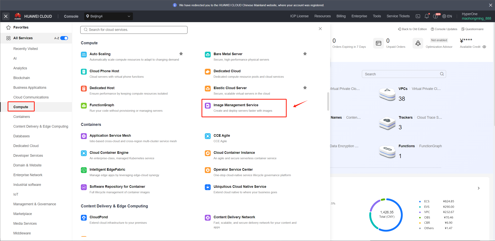

#### Step2: Register an external image file as a private image

- Click Create Image in the upper right corner
  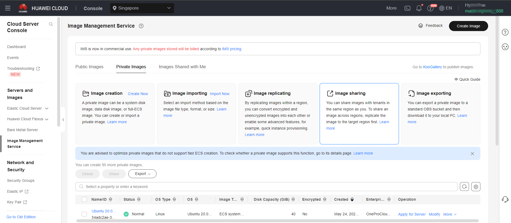

::: warning 
1.The name must be one of the following and cannot have additional characters.  
2.Due to the diverse versions of Windows on the source hosts, select the generic option for the operating system.  
3.Linux image is primarily used for creating an HD. The recommended version for the current release is CentOS 8+  
:::
Supported Windows image names

> Windows Server 2012 R2 Standard 64bit  
> Windows Server 2012 R2 Datacenter 64bit  
> Windows Server 2016 Standard 64bit  
> Windows Server 2016 Standard 64bit English  
> Windows Server 2016 Datacenter 64bit  
> Windows Server 2016 Datacenter 64bit English  
> Windows Server 2019 Datacenter 64bit  
> Windows Server 2019 Datacenter 64bit English

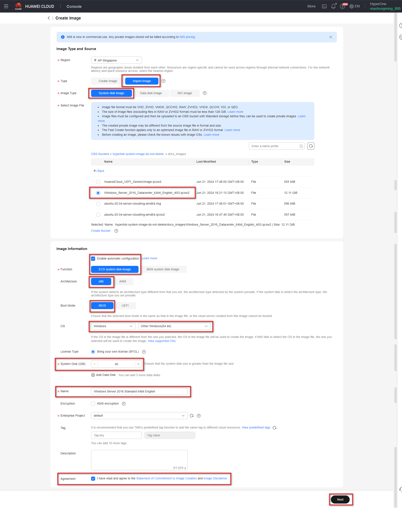

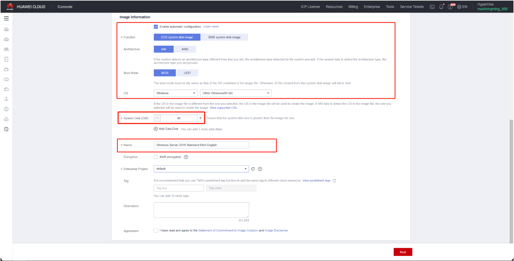

Supported Linux image names

> CentOS 8.4 64bit  
> CentOS 8.3 64bit  
> CentOS 8.2 64bit  
> CentOS 8.1 64bit  
> CentOS 8.5 64bit

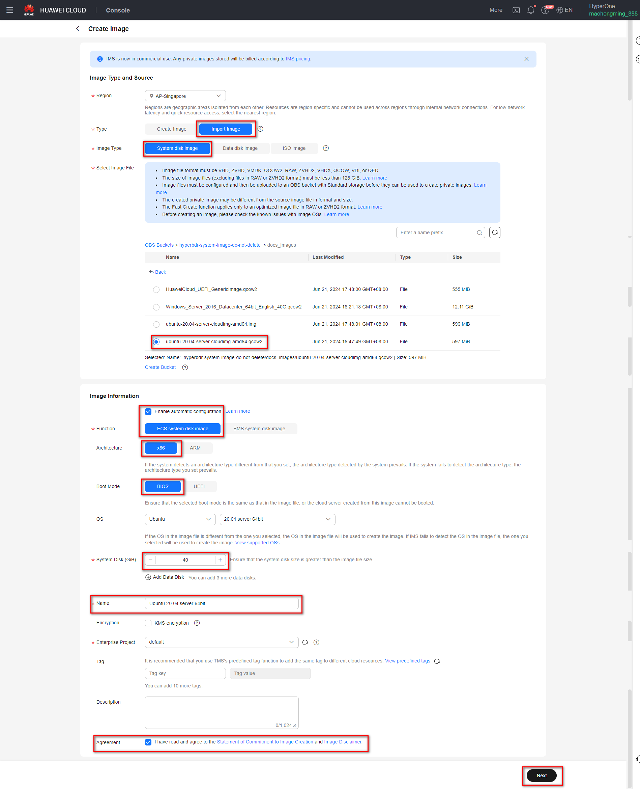

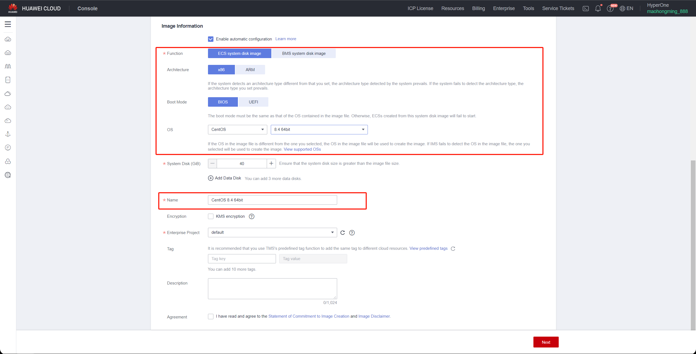

#### Step3: Confirm and submit

- Click Next and confirm the image specifications. Select Statement of Commitment to Image Creation and Huawei Image Disclaimer. Click Submit.

- Go back to the Private Images page. The image is successfully registered when its status becomes Normal.

## VPN Setup

## Create Huawei VPC Endpoint

> If your disaster recovery environment is interconnected with the production site's intranet through Huawei Cloud VPN, and the production site needs to access Huawei Cloud HyperBDR and OBS services through VPN during a disaster, then you need to purchase and configure VPC Endpoint services in Huawei Cloud.

> You need to purchase two VPC Endpoint services, one for OBS and the other for DNS.

> Huawei Cloud official definition: If you want to access OBS services from a local data center via VPN or Cloud Connect using an intranet method, you can achieve this by connecting through terminal endpoints to access terminal endpoint services.  
> Document Link：[https://support.huaweicloud.com/intl/en-us/qs-vpcep/vpcep_02_0301.html](https://support.huaweicloud.com/intl/en-us/qs-vpcep/vpcep_02_0301.html)

### Configure DNS Interface Type for Terminal Endpoints

| Project | Configuration |
| --- | --- |
| Region | Choose the Region to activate |
| Billing Mode | Pay-per-use |
| Service Category | Choose the default "Cloud server," check com.myhuaweicloud.<region\>.dns, and set the type as Interface. |
| VPC | Choose the VPC interconnecting with the local IDC VPN |
| Subnet | Select the subnet for VPN interconnection |

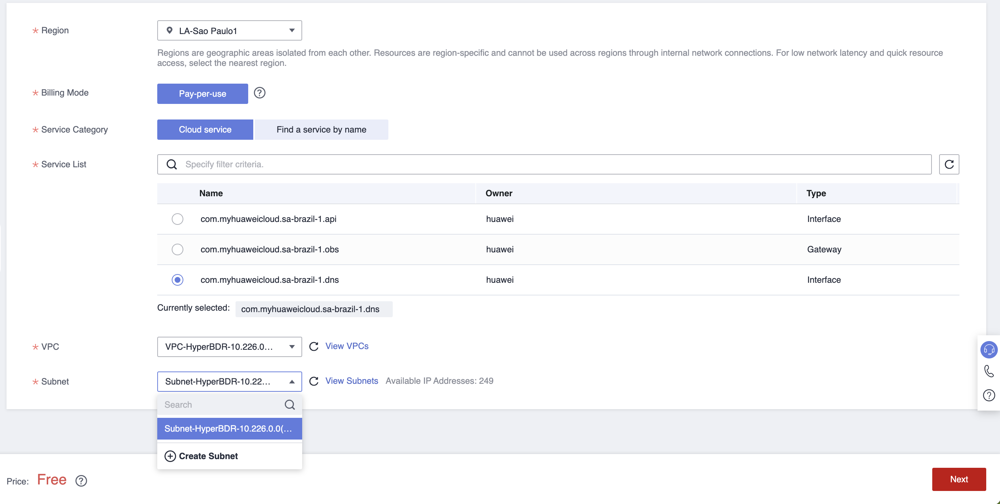

### Selection of OBS Gateway-type Terminal Endpoint

| Project | Configuration |
| --- | --- |
| Region | Choose the Region to activate |
| Billing Mode | Pay-per-use |
| Service Category | Choose the default "Cloud server," check com.myhuaweicloud.<region/>.obs, and set the type as Gateway |
| VPC | Choose the VPC interconnecting with the local IDC VPN |
| Route Table | default |
| Policy | default |

::: warning 
Note: In the Service Category section, it may not be possible to directly find the corresponding OBS service for the default Cloud service type. In such cases, you will need to use "Find a service by name" to search. You must enter the complete name of the specific OBS service. Please confirm with Huawei Cloud as the target OBS service terminal endpoints on the Huawei side may have distinctions between v1 and v2 versions. Additionally, the names of each region and the association between v1/v2 versions and the resource pool of the object storage bucket need clarification. If you have purchased v1 OBS terminal endpoints but your object storage bucket is in a v2 cluster, it must be aligned accordingly. Confirm with Huawei in advance regarding the specific version of the object storage bucket's cluster and OBS terminal endpoints

Example: v2 version OBS terminal endpoint name: sa-brazil-1.com.myhuaweicloud.v4.obsv2.lz002 
:::

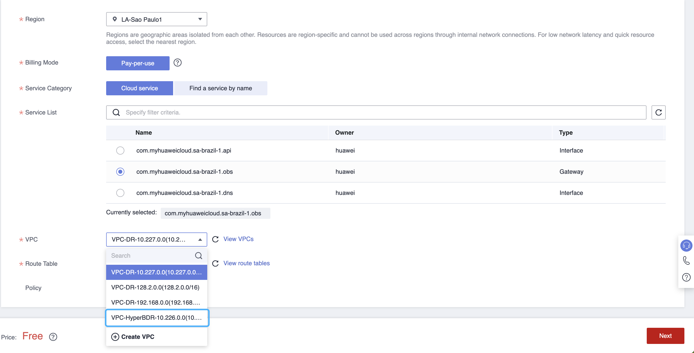

### Configure VPN local-end OBS gateway

Add the internal subnet range of the local (Huawei Cloud) OBS service at the VPN connection point. The subnet address for all internal Huawei Cloud OBS services is 100.125.0.0/16.  
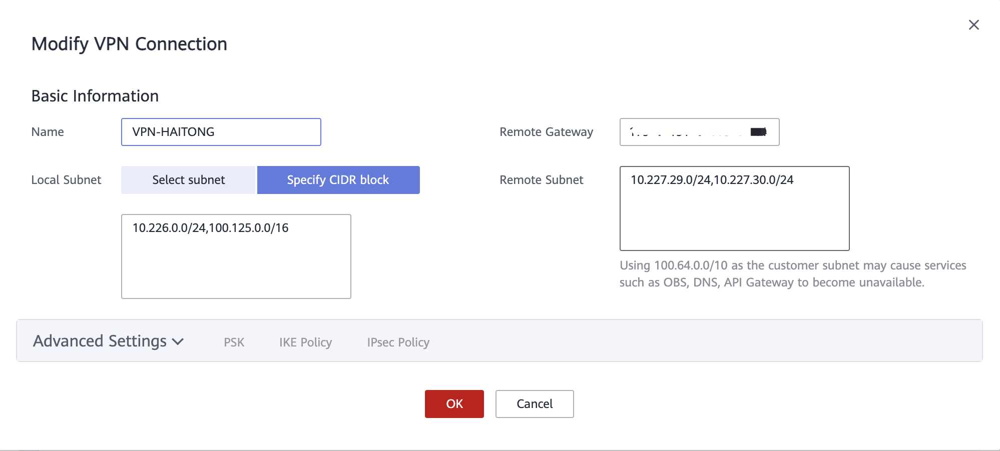  


## Create Huawei VPC Peering

::: tip
Based on business requirements, choose different VPC peering configurations:  
- If there is no need for mutual access between multiple business VPCs, you only need to configure the peering connection according to the [Disaster recovery VPC connected via peering with multiple business VPC](https://docs.oneprocloud.com/userguide/poc/huaweicloud-pre-settings.html#disaster-recovery-vpc-connected-via-peering-with-multiple-business-vpc) setup.  
- If there is a requirement for mutual access between multiple business VPCs, then you need to configure according to the [Disaster recovery VPC peering with multiple business VPCs, as well as peering connections between multiple business VPC](https://docs.oneprocloud.com/userguide/poc/huaweicloud-pre-settings.html#disaster-recovery-vpc-peering-with-multiple-business-vpcs-as-well-as-peering-connections-between-multiple-business-vpc) setup.
:::

### Disaster recovery VPC connected via peering with multiple business VPC

In Huawei Cloud Disaster Recovery, the disaster recovery host needs to be restored to the planned production business VPC. Therefore, it is necessary to configure cross VPC peer-to-peer connections in Huawei Cloud, configure the disaster recovery VPC with the business VPC, and add peer-to-peer connection routing. Mainly used for disaster recovery, the disaster recovery VPC where HyperBDR is located can access the business VPC through the intranet to recover virtual machines for data recovery.

> Huawei Cloud Document Link:  
> [https://support.huaweicloud.com/intl/en-us/usermanual-vpc/en-us_topic_0046809840.html#section1](https://support.huaweicloud.com/intl/en-us/usermanual-vpc/en-us_topic_0046809840.html#section1)

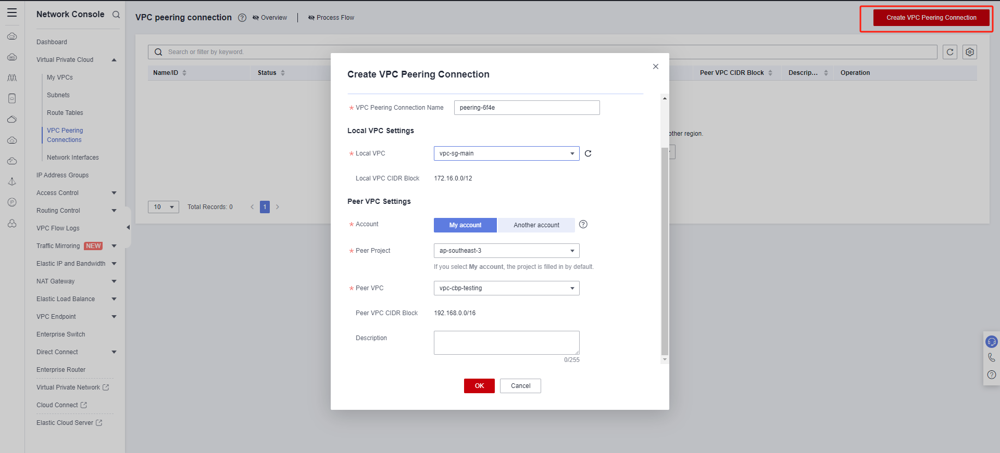

### Disaster recovery VPC peering with multiple business VPCs, as well as peering connections between multiple business VPC

When all disaster recovery hosts of the customer need to be placed in different business VPCs planned by Huawei Cloud, and there is a need for cross VPC access in the business, then it is necessary to configure peer-to-peer connections between business VPCs to ensure normal cross VPC business interaction after subsequent business recovery.

> Huawei Cloud Document Link:  
> [https://support.huaweicloud.com/intl/en-us/usermanual-vpc/en-us_topic_0046809840.html#section0](https://support.huaweicloud.com/intl/en-us/usermanual-vpc/en-us_topic_0046809840.html#section0)

## Test Network Access between VPCs

::: tip
[Create huawei VPC Peering](https://docs.oneprocloud.com/userguide/poc/huaweicloud-pre-settings.html#create-huawei-vpc-peering) configuration has been successfully completed, and routing entries have been added correctly.
:::

### Test the network connectivity between the disaster recovery VPC and the business VPC

- Step1: Login to Huawei Cloud and create an ECS test cloud server  
Create an ECS test cloud server (CentOS 7.6 operating system) on Huawei Cloud. When configuring the network, choose the business VPC and subnet. Ensure that the security group of this newly created ECS test virtual machine has an inbound access policy allowing port 22.

- Step2: Network testing access from the disaster recovery VPC to the business VPC

Log in to the Huawei Cloud console, access the HyperBDR ECS cloud server, and use the intranet IP to connect to the ECS host within the business VPC.


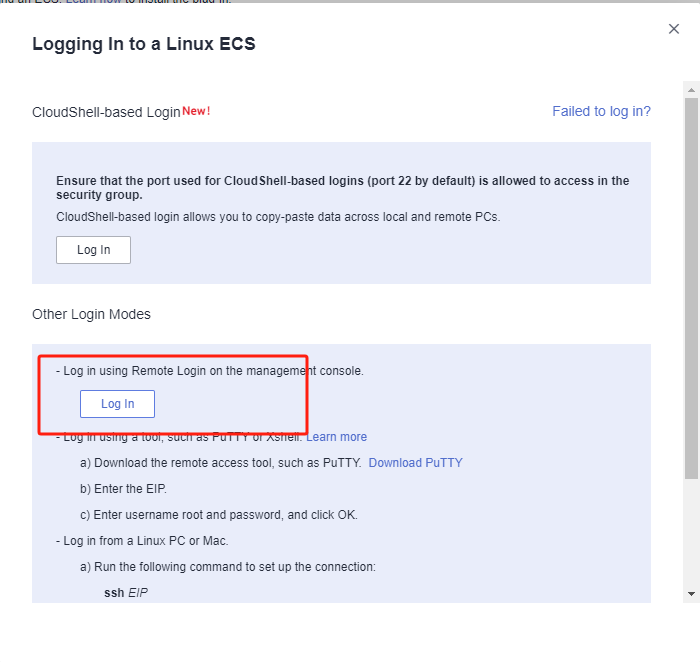

Execute command:

```sh
ssh root@<The intranet IP address of the test ECS> 22
```

Test results:  
If you can successfully access and enter the password, it indicates normal access.

### Test the network connectivity between business VPC

- Setp1: Create a new ECS test cloud server with CentOS 7.6 operating system. When configuring the network, choose a different business VPC and subnet. Ensure that the security group of this newly created ECS test virtual machine has an inbound access policy allowing port 22

- Sep2: Log in to different test cloud servers through the console and perform bidirectional command tests with the following commands

Execute command:

```sh
ssh root@<The intranet IP of the test ECS> 22
```

Test results:  
If you can successfully access and enter the password, it indicates normal access.
