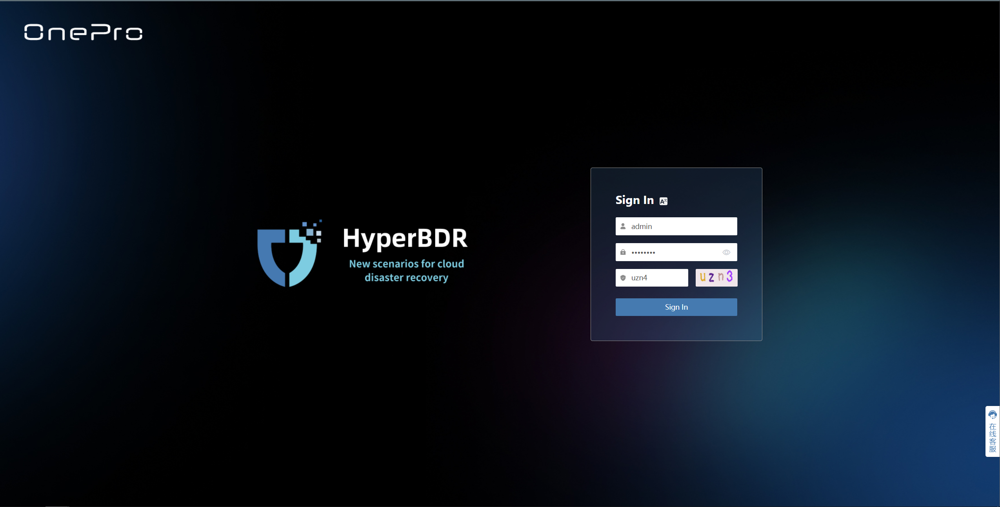
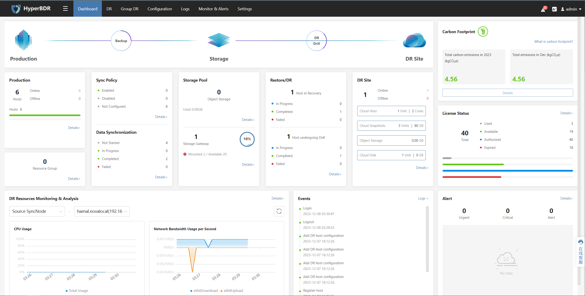
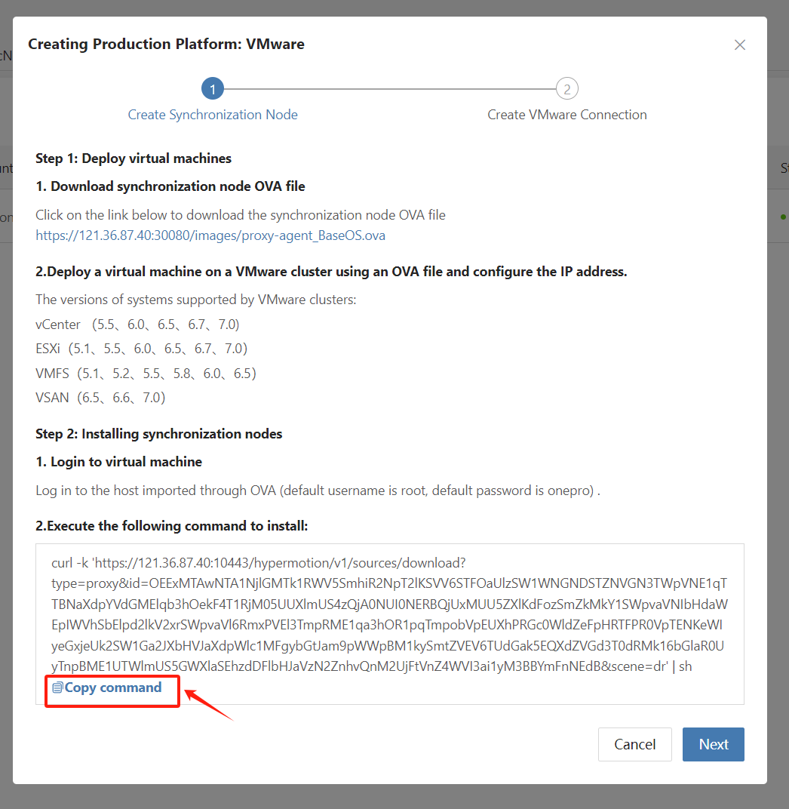
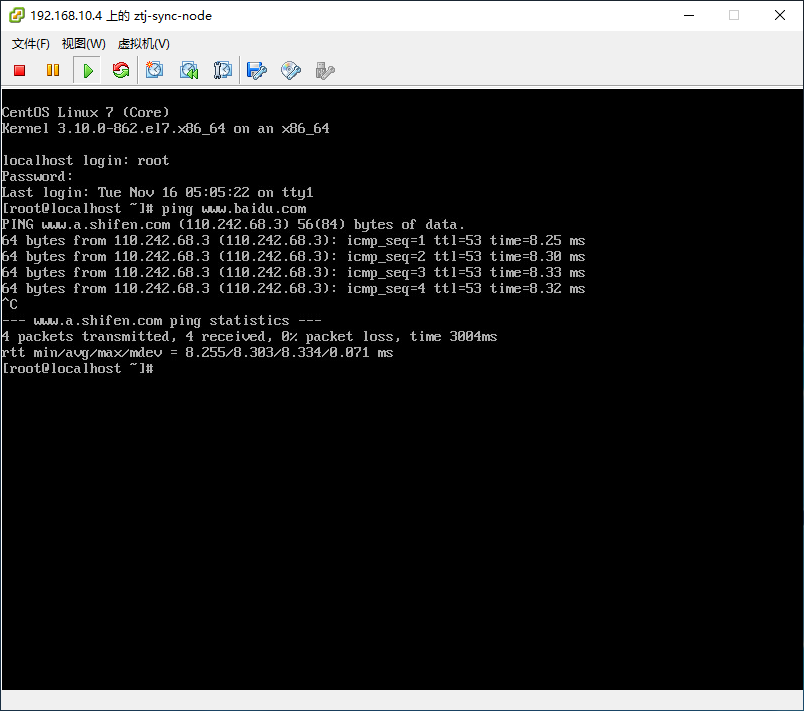

# HyperBDR Proxy Pre-Settings

[[toc]]

::: tip
Default username and password for Proxy ova:

* Username: root
* Password: onepro

If you don't know how to use SSH on a Windows system, please refer to the following link:

[How do I connect to SSH on Windows?](../faq.md)
:::

## Configure Proxy IP Address

### Login Proxy VM

Use your terminal to Login Proxy VM using default credentials.

### Modify network interface configuration file

NOTE: Before you run this command, make sure replace following variables:

* ipaddress: Assign IPv4 network according to real network
* netmask
* gateway
* dns1
* dns2

```
cat <<EOF >> /etc/sysconfig/network-scripts/ifcfg-ens160
TYPE=Ethernet

BOOTPROTO=static
DEFROUTE=yes
NAME=ens160
DEVICE=ens160
ONBOOT=yes
IPADDR=<ipaddress>
PREFIX=<netmask>
GATEWAY=<gateway>
DNS1=<dns1>
DNS2=<dns2>
EOF
```

### Restart Network

```
systemctl restart network
```

### Testing

Try to ping VMware vCenter IP or ESXi IP, check if you can get correct response.

```
ping <vcenter ip or esxi ip>
```

## Configure NTP Server

### Download and Upload to Proxy

Download these packages and upload to proxy, save in /root/ntp-packages/

* [ntp-4.2.6p5-28.el7.centos.x86_64.rpm](https://vault.centos.org/7.5.1804/os/x86_64/Packages/ntp-4.2.6p5-28.el7.centos.x86_64.rpm)
* [autogen-libopts-5.18-5.el7.x86_64.rpm](https://vault.centos.org/7.5.1804/os/x86_64/Packages/autogen-libopts-5.18-5.el7.x86_64.rpm)
* [ntpdate-4.2.6p5-28.el7.centos.x86_64.rpm](https://vault.centos.org/7.5.1804/os/x86_64/Packages/ntpdate-4.2.6p5-28.el7.centos.x86_64.rpm)

### Installation

```bash
cd /root/ntp-packages/
yum install -y *.rpm
```

### NTP Configuration

To edit the /etc/ntp.conf file, you can use the vi editor.

- Find the following lines in the file:

```bash
#server 0.centos.pool.ntp.org iburst
#server 1.centos.pool.ntp.org iburst
#server 2.centos.pool.ntp.org iburst
#server 3.centos.pool.ntp.org iburst
```
- uncomment and add the following to the file.

```bash
server ntp.server.ip.address
```

There ==ntp.server.ip.address== is your ntp server ip address.

### Start Service

```bash
systemctl enable ntpd && systemctl start ntpd
```

## Enable Access Policy for Proxy

Open the network access policy in your firewall for synchronizing Proxy nodes to vCenter and all ESXi hosts managed by vCenter.

1. Proxy nodes need to have normal access to vCenter on port 443.
2. Proxy nodes need to have normal access to all ESXi hosts managed by vCenter on port 902.

::: tip
Proxy synchronization nodes access the vCenter API interface for authentication, and they retrieve data by calling the S host where the disaster recovery production site hosts are located. Therefore, it is necessary to open network access policies for all ESXi hosts managed by vCenter.
:::


## Test Access Policy for Proxy

Test if Proxy can connect to vCenter 443 port and ESXis 902 port which is management by vCenter.

### Test vCenter/ESXi Connectivity

NOTE: Repeat this steps if you have multiple vCenter or ESXis to be protected.

```
ssh -v -p 443 <vCenter/ESXi IP/Domain>
```

Success Retruns:

```
OpenSSH_7.4p1, OpenSSL 1.0.2k-fips  26 Jan 2017
debug1: Reading configuration data /etc/ssh/ssh_config
debug1: /etc/ssh/ssh_config line 58: Applying options for *
debug1: Connecting to <vCenter/ESXi IP/Domain> [<vCenter/ESXi IP/Domain>] port 443.
debug1: Connection established.
```
## Test Network Connectivity from Proxy to Object Storage

::: tip
Make sure you already login to Proxy VM
:::

### Internet

Ensure your proxy can access internet before testing.

#### Public DNS Connectivity Testing

```
ping -c 4 -t 2 8.8.8.8
```

Success Response:

```
ping -c 4 -t 2 8.8.8.8
PING 8.8.8.8 (8.8.8.8): 56 data bytes
64 bytes from 8.8.8.8: icmp_seq=0 ttl=111 time=43.362 ms
64 bytes from 8.8.8.8: icmp_seq=1 ttl=111 time=49.807 ms

--- 8.8.8.8 ping statistics ---
2 packets transmitted, 2 packets received, 0.0% packet loss
round-trip min/avg/max/stddev = 43.362/46.585/49.807/3.222 ms
```

#### Huawei Object Storage Bucket Connectivity

```
curl https://obs.ap-southeast-3.myhuaweicloud.com
```

Success Response:

```
<?xml version="1.0" encoding="UTF-8" standalone="yes"?><Error><Code>AccessDenied</Code><Message>Anonymous access is forbidden for this operation</Message><RequestId>0000018C1F508F2F9012234EA17641CE</RequestId><HostId>Z9v+cC1sRnaWw6x0vi8pxxYA0YVnKxbYHUPAFpnxkX8sLV44u5b02Z+ailn2wCnR</HostId></Error>#
```

Note: This command is primarily used to test the accessibility of Huawei Cloud Object Storage buckets. Currently, the tested OBS domain is for the Huawei Cloud Singapore region. If you need to test in a different region, please refer to the official Huawei Cloud documentation to find the corresponding Endpoint domain address.

Reference Link: https://developer.huaweicloud.com/endpoint?OBS

### VPN

#### Check Object Storage Service Endpoint

Make sure object storage service endpoint address return internal ip address.

```
ping obs.ap-southeast-3.myhuaweicloud.com
```

Success Response:

```
PING obs.lz01.ap-southeast-3.myhuaweicloud.com (100.125.36.29) 56(84) bytes of data.
```

NOTE: Huawei Cloud Object Storage Service internal IP Range: 100.125.xx. If there is no ICMP response, it is considered normal.

#### Huawei Object Storage Bucket Connectivity

```
curl https://obs.ap-southeast-3.myhuaweicloud.com
```

Success Response:

```
<?xml version="1.0" encoding="UTF-8" standalone="yes"?><Error><Code>AccessDenied</Code><Message>Anonymous access is forbidden for this operation</Message><RequestId>0000018C1F508F2F9012234EA17641CE</RequestId><HostId>Z9v+cC1sRnaWw6x0vi8pxxYA0YVnKxbYHUPAFpnxkX8sLV44u5b02Z+ailn2wCnR</HostId></Error>#
```

Note: This command is primarily used to test the accessibility of Huawei Cloud Object Storage buckets. Currently, the tested OBS domain is for the Huawei Cloud Singapore region. If you need to test in a different region, please refer to the official Huawei Cloud documentation to find the corresponding Endpoint domain address.

Reference Link: https://developer.huaweicloud.com/endpoint?OBS

## Test Network Connectivity from Proxy to HyperBDR

::: tip
This step needs to be tested after the installation of HyperBDR is completed.
:::
> Huawei Cloud side has already configured VPN service, and it has successfully connected to the production site VPN through VPN. You can test it using the following methods.  

> Proxy synchronizes node login information:  
> User：root  
> Password：onepro  
### Test Step
- Step1: Log in to the Proxy Synchronization Node  
- Step2: Test Access to HyperBDR Port 10443 and Port 30080  

Execute Command:  
```sh
ssh -v -p 10443 <HyperBDR Internal IP>
```
Test Result: If the input results include the information "[debug1: Connection established.]" it indicates that there are no issues with network connectivity.

```sh
OpenSSH_7.4p1, OpenSSL 1.0.2k-fips  26 Jan 2017
debug1: Reading configuration data /etc/ssh/ssh_config
debug1: /etc/ssh/ssh_config line 58: Applying options for *
debug1: Connecting to <HyperBDR Internal IP> [<HyperBDR Internal IP>] port 10443.
debug1: Connection established.
```

Execute Command：

```sh
ssh -v -p 30080 <HyperBDR Internal IP>
```

Test Result: If the input results include the information "[debug1: Connection established.]" it indicates that there are no issues with network connectivity.

```sh
OpenSSH_7.4p1, OpenSSL 1.0.2k-fips  26 Jan 2017
debug1: Reading configuration data /etc/ssh/ssh_config
debug1: /etc/ssh/ssh_config line 58: Applying options for *
debug1: Connecting to <HyperBDR Internal IP> [<HyperBDR Internal IP>] port 30080.
debug1: Connection established.
```

## Proxy DNS Settings

::: tip
This step is only used when connecting to the cloud platform via VPN.
:::
### Configure proxy synchronization node DNS domain name
#### Login to the production site Proxy synchronization node  

Windows machines  

```sh
win+R  
cmd  
ssh root@ip  
```
  

::: tip
Note: IP is the proxy synchronization node IP address  
Proxy synchronization node login information:  
User: root  
Password: onepro  
:::

### Configure DNS domain name

```sh
cat <<EOF >> /etc/resolv.conf
nameserver <Huawei OBS Endpoint Service IPaddress>
EOF
```
::: tip
Note:<Huawei OBS Endpoint Service IPaddress\>is the IP address of the OBS endpoint service after creating the VPC Endpoint service.   
:::
  

## Install Proxy

::: tip
Proxy should be installation after the completion of the HyperBDR installation process.
:::

> Proxy synchronization node login information:  
> User：root  
> Password：onepro  

## Log in to the HyperBDR console

 

 

### Retrieve the installation command

Click on the top menu bar "Configuration," "Production Site," "VMware," then click the "Add" button. 

 

In the popped-up page, in the "Step 2: Installing synchronization nodes" section, under "2. Execute the following command to install," click on "Copy command" to obtain the installation command for the Proxy node. 

 

### Log in to the Proxy synchronization node

 

### Execute the installation command on the Proxy node

Paste the copied installation command into the command line and execute it. Wait for the command to execute successfully; this indicates that the Proxy synchronization node program is running normally. 


