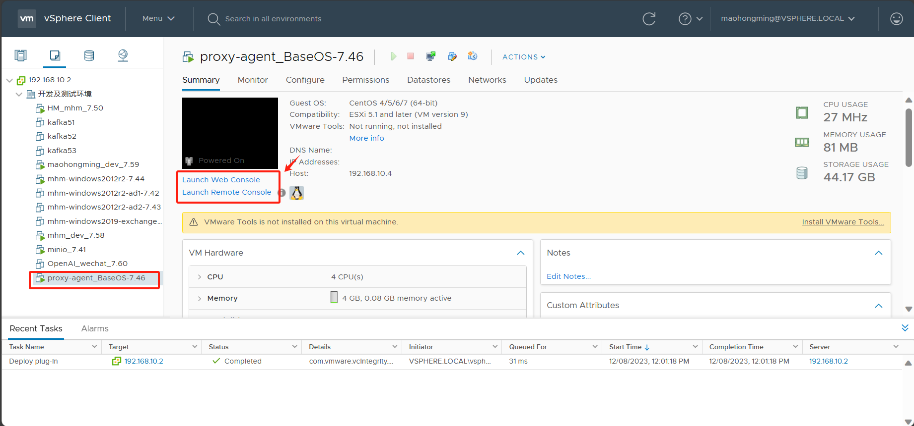
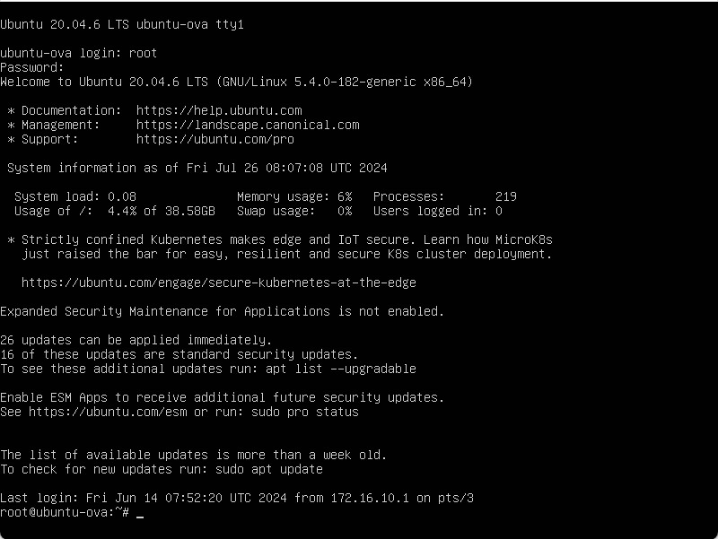
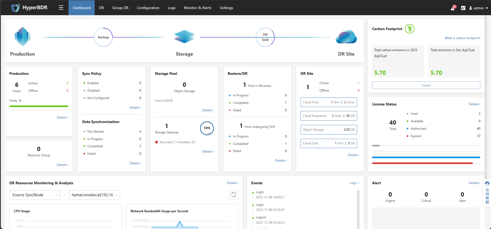
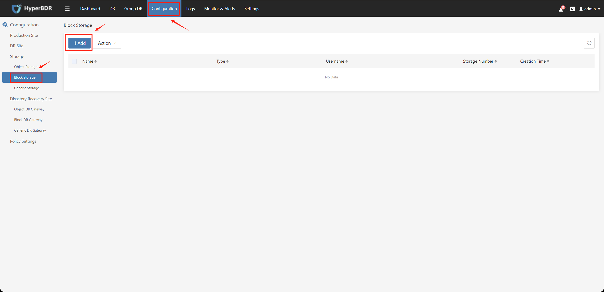
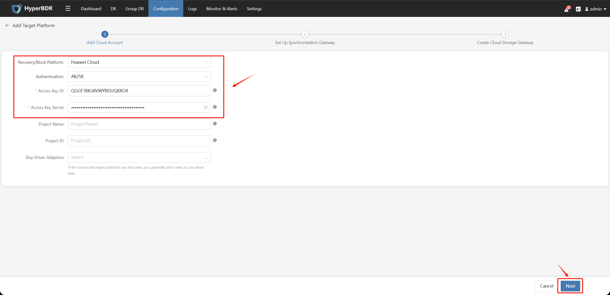
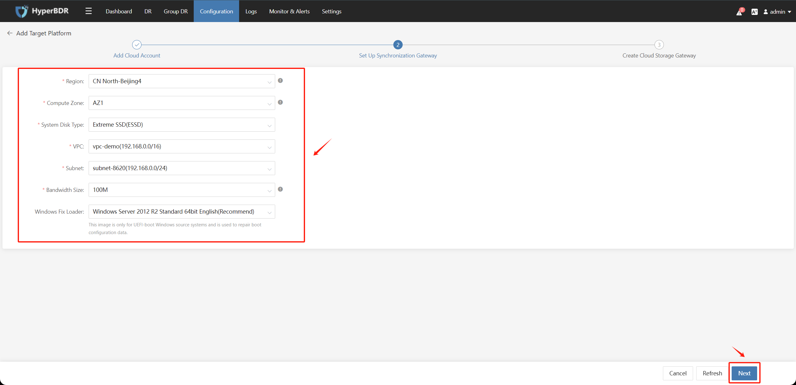
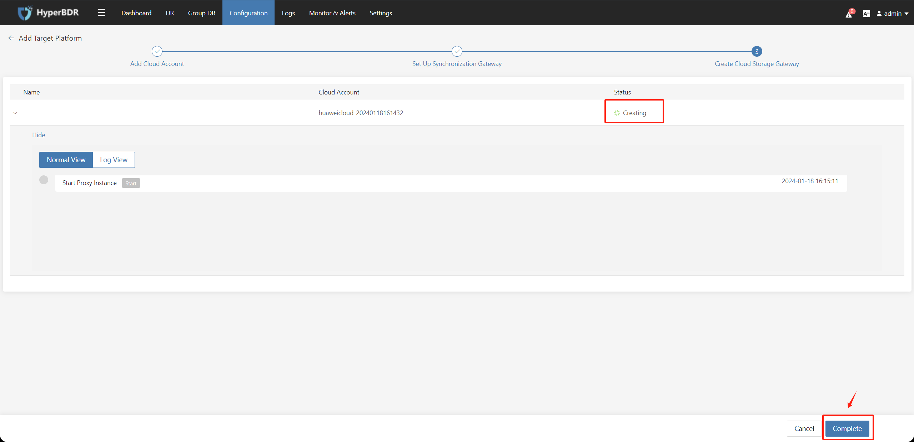
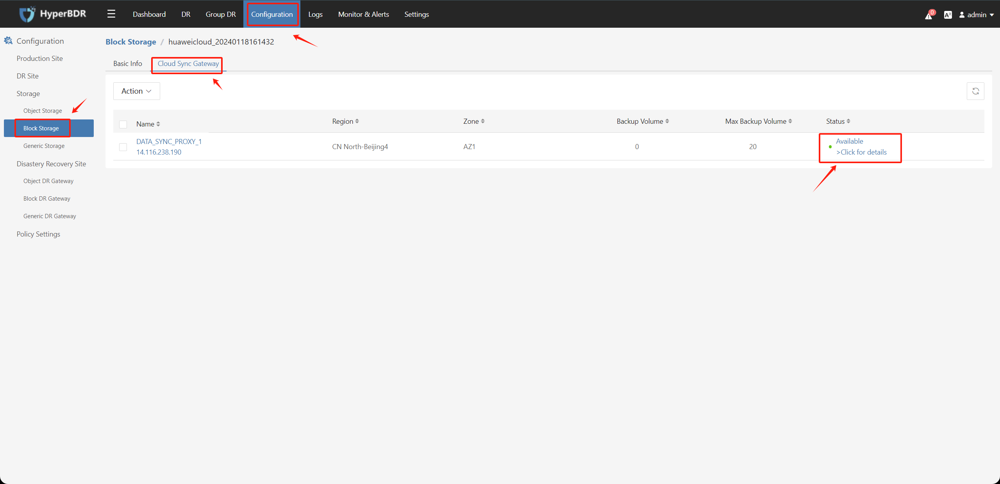

# Sync Proxy Setup

[[toc]]

## Configure Sync Proxy IP Address

### Login Sync Proxy VM

::: tip
Default username and password for Sync Proxy ova:

* Username: root
* Password: onepro
:::

Use vCenter Web Console to login the Sync Proxy VM and to the following configurations.
  
  

### Modify network interface configuration file

NOTE: Before you run this command, make sure replace following variables:

* ipaddress: Assign IPv4 network according to real network
* netmask
* gateway
* dns1
* dns2

```
cat <<EOF >> /etc/sysconfig/network-scripts/ifcfg-ens160
TYPE=Ethernet

BOOTPROTO=static
DEFROUTE=yes
NAME=ens160
DEVICE=ens160
ONBOOT=yes
IPADDR=<ipaddress>
PREFIX=<netmask>
GATEWAY=<gateway>
DNS1=<dns1>
DNS2=<dns2>
EOF
```

### Restart Network

```
systemctl restart network
```

### Testing

Try to ping VMware vCenter IP or ESXi IP, check if you can get correct response.

```
ping <vcenter ip or esxi ip>
```

## Configure NTP Server

### Download and Upload to Sync Proxy

Download these packages and upload to Sync Proxy, save in /root/ntp-packages/

* [ntp-4.2.6p5-28.el7.centos.x86_64.rpm](https://vault.centos.org/7.5.1804/os/x86_64/Packages/ntp-4.2.6p5-28.el7.centos.x86_64.rpm)
* [autogen-libopts-5.18-5.el7.x86_64.rpm](https://vault.centos.org/7.5.1804/os/x86_64/Packages/autogen-libopts-5.18-5.el7.x86_64.rpm)
* [ntpdate-4.2.6p5-28.el7.centos.x86_64.rpm](https://vault.centos.org/7.5.1804/os/x86_64/Packages/ntpdate-4.2.6p5-28.el7.centos.x86_64.rpm)

In Sync Proxy Terminal, you can use these commands to download these packages:

```sh
mkdir /root/ntp-packages && cd /root/ntp-packages  
curl -O https://vault.centos.org/7.5.1804/os/x86_64/Packages/ntp-4.2.6p5-28.el7.centos.x86_64.rpm
curl -O https://vault.centos.org/7.5.1804/os/x86_64/Packages/autogen-libopts-5.18-5.el7.x86_64.rpm  
curl -O https://vault.centos.org/7.5.1804/os/x86_64/Packages/ntpdate-4.2.6p5-28.el7.centos.x86_64.rpm  
```

### Installation

```bash
cd /root/ntp-packages/
yum install -y *.rpm
```

### NTP Configuration

To edit the /etc/ntp.conf file, you can use the vi editor.

- Find the following lines in the file:

```bash
#server 0.centos.pool.ntp.org iburst
#server 1.centos.pool.ntp.org iburst
#server 2.centos.pool.ntp.org iburst
#server 3.centos.pool.ntp.org iburst
```
- uncomment and add the following to the file.

```bash
server ntp.server.ip.address
```

There **<ntp.server.ip.address>** is your ntp server ip address.

### Start Service

```bash
systemctl enable ntpd && systemctl start ntpd
```

## Enable Access Policy for Sync Proxy

Open the network access policy in your firewall for synchronizing Sync Proxy nodes to vCenter and all ESXi hosts managed by vCenter.

1. Sync Proxy nodes need to have normal access to vCenter on port 443.
2. Sync Proxy nodes need to have normal access to all ESXi hosts managed by vCenter on port 902.

::: tip
Sync Proxy nodes access the vCenter API interface for authentication, and they retrieve data by calling the ESXi host where the disaster recovery production site VM are located. Therefore, it is necessary to open network access policies for all ESXi hosts managed by vCenter.
:::

::: tip
In VMware production environment, maybe use domain name to access EXSi. You need to configure domain name mapping or DNS service address for Sync Proxy to resolve the domain name.
Reference Documentation: [How does Sync Proxy access EXSi using a domain name?](https://docs.oneprocloud.com/userguide/faq.html#how-does-sync-proxy-access-exsi-using-a-domain-name)
:::


## Test Access Policy for Sync Proxy

Test if Sync Proxy can connect to vCenter 443 port and ESXis 902 port which is management by vCenter.

### Test vCenter/ESXi Connectivity

NOTE: Repeat this steps if you have multiple vCenter or ESXis to be protected.

Test Port 443

```
ssh -v -p 443 <vCenter/ESXi IP/Domain>
```

Success Response:
::: tip
If it displays 'Connection established', it means the link port is normal.
:::

```
OpenSSH_7.4p1, OpenSSL 1.0.2k-fips  26 Jan 2017
debug1: Reading configuration data /etc/ssh/ssh_config
debug1: /etc/ssh/ssh_config line 58: Applying options for *
debug1: Connecting to <vCenter/ESXi IP/Domain> [<vCenter/ESXi IP/Domain>] port 443.
debug1: Connection established.
```

Test Port 902

```
ssh -v -p 902 <ESXi IP/Domain>
```

Success Response:
::: tip
If it displays 'Connection established', it means the link port is normal.
:::

```
OpenSSH_7.4p1, OpenSSL 1.0.2k-fips  26 Jan 2017
debug1: Reading configuration data /etc/ssh/ssh_config
debug1: /etc/ssh/ssh_config line 58: Applying options for *
debug1: Connecting to <vCenter/ESXi IP/Domain> [<vCenter/ESXi IP/Domain>] port 902.
debug1: Connection established.
```

## Test Network Connectivity from Sync Proxy to Object Storage

::: tip
Make sure you already login to Sync Proxy VM
:::

### Internet

Ensure your Sync Proxy can access internet before testing.

#### Public DNS Connectivity Testing

```
ping -c 4 -t 2 8.8.8.8
```

Success Response:

```
ping -c 4 -t 2 8.8.8.8
PING 8.8.8.8 (8.8.8.8): 56 data bytes
64 bytes from 8.8.8.8: icmp_seq=0 ttl=111 time=43.362 ms
64 bytes from 8.8.8.8: icmp_seq=1 ttl=111 time=49.807 ms

--- 8.8.8.8 ping statistics ---
2 packets transmitted, 2 packets received, 0.0% packet loss
round-trip min/avg/max/stddev = 43.362/46.585/49.807/3.222 ms
```

#### Huawei Object Storage Bucket Connectivity

```
curl -I https://obs.ap-southeast-3.myhuaweicloud.com
```

Success Response:

```
HTTP/1.1 405 Method Not Allowed
Server: OBS
Date: Thu, 29 Feb 2024 08:29:51 GMT
Content-Type: application/xml
Content-Length: 380
Connection: close
x-reserved: amazon, aws and amazon web services are trademarks or registered trademarks of Amazon Technologies, Inc
x-amz-request-id: 0000018DF3FBF121900FFB988BE0FC8D
Allow: HEAD, GET, OPTIONS
x-amz-id-2: 32AAAQAAEAABAAAQAAEAABAAAQAAEAABCRjxc+HEW3ehsrcsKS60jUgz7XhG8uyS
```

Note: This command is primarily used to test the accessibility of Huawei Cloud Object Storage buckets. Currently, the tested OBS domain is for the Huawei Cloud Singapore region. If you need to test in a different region, please refer to the official Huawei Cloud documentation to find the corresponding Endpoint domain address.

Reference Link: [https://developer.huaweicloud.com/intl/en-us/endpoint?OBS](https://developer.huaweicloud.com/intl/en-us/endpoint?OBS)

### VPN

#### Check Object Storage Service Endpoint

Make sure object storage service endpoint address return internal ip address.

```sh
ping obs.ap-southeast-3.myhuaweicloud.com
```

Success Response:

```
[root@data-sync-proxy-2024-0229-145824 ~]# ping obs.ap-southeast-3.myhuaweicloud.com  
PING obs.lz01.ap-southeast-3.myhuaweicloud.com (100.125.80.30) 56(84) bytes of data.  
64 bytes from ecs-159-138-80-62.compute.hwclouds-dns.com (100.125.80.30): icmp_seq=1 ttl=53 time=1.24 ms  
64 bytes from ecs-159-138-80-62.compute.hwclouds-dns.com (100.125.80.30): icmp_seq=2 ttl=53 time=0.971 ms  
64 bytes from ecs-159-138-80-62.compute.hwclouds-dns.com (100.125.80.30): icmp_seq=3 ttl=53 time=0.972 ms
```

::: tip
Huawei Cloud Object Storage Service internal IP Range: 100.125.xx. If there is no ICMP response, it is considered normal.
:::

#### Huawei Object Storage Bucket Connectivity

```sh
curl -I https://obs.ap-southeast-3.myhuaweicloud.com
```

Success Response:

```
HTTP/1.1 405 Method Not Allowed
Server: OBS
Date: Thu, 29 Feb 2024 08:29:51 GMT
Content-Type: application/xml
Content-Length: 380
Connection: close
x-reserved: amazon, aws and amazon web services are trademarks or registered trademarks of Amazon Technologies, Inc
x-amz-request-id: 0000018DF3FBF121900FFB988BE0FC8D
Allow: HEAD, GET, OPTIONS
x-amz-id-2: 32AAAQAAEAABAAAQAAEAABAAAQAAEAABCRjxc+HEW3ehsrcsKS60jUgz7XhG8uyS
```

::: tip
This command is primarily used to test the accessibility of Huawei Cloud Object Storage buckets. Currently, the tested OBS domain is for the Huawei Cloud Singapore region. If you need to test in a different region, please refer to the official Huawei Cloud documentation to find the corresponding Endpoint domain address.
:::

Reference Link: [https://developer.huaweicloud.com/intl/en-us/endpoint?OBS](https://developer.huaweicloud.com/intl/en-us/endpoint?OBS)

## Test Network Connectivity from Sync Proxy to HyperBDR

::: tip
This step needs to be tested after the installation of HyperBDR is completed.
:::

::: tip
Default username and password for Sync Proxy ova:

* Username: root
* Password: onepro

If you don't know how to use SSH on a Windows system, please refer to the following link:

[How do I connect to SSH on Windows?](../faq.md)
:::

### Option 1: Public Network Access

Test the network connectivity from the production site to Huawei Cloud HyperBDR

- Step1: Log in to the Sync Proxy Node

- Step2: Test Access to HyperBDR Port 10443 and Port 30080

Execute Command：
```sh
ssh -v -p 10443 <HyperBDR Public IP>
```

Test Result: If the input results include the information "[debug1: Connection established.]" it indicates that there are no issues with network connectivity.

```
OpenSSH_7.4p1, OpenSSL 1.0.2k-fips 26 Jan 2017
debug1: Reading configuration data /etc/ssh/ssh_config
debug1: /etc/ssh/ssh_config line 58: Applying options for *
debug1: Connecting to <HyperBDR Public IP> [<HyperBDR Public IP>] port 10443.
debug1: Connection established.
```
Execute Command：
```sh
ssh -v -p 30080 <HyperBDR Public IP>
```

Test Result: If the input results include the information "[debug1: Connection established.]" it indicates that there are no issues with network connectivity.

```
OpenSSH_7.4p1, OpenSSL 1.0.2k-fips 26 Jan 2017
debug1: Reading configuration data /etc/ssh/ssh_config
debug1: /etc/ssh/ssh_config line 58: Applying options for *
debug1: Connecting to <HyperBDR Public IP> [<HyperBDR Public IP>] port 30080.
debug1: Connection established.
```

### Option 2: Internal VPN Access

Test the network connectivity from the production site to Huawei Cloud HyperBDR

- Step1: Log in to the Sync Proxy Node  

- Step2: Test Access to HyperBDR Port 10443 and Port 30080  

Execute Command:  
```sh
ssh -v -p 10443 <HyperBDR Internal IP>
```
Test Result: If the input results include the information "[debug1: Connection established.]" it indicates that there are no issues with network connectivity.

```
OpenSSH_7.4p1, OpenSSL 1.0.2k-fips  26 Jan 2017
debug1: Reading configuration data /etc/ssh/ssh_config
debug1: /etc/ssh/ssh_config line 58: Applying options for *
debug1: Connecting to <HyperBDR Internal IP> [<HyperBDR Internal IP>] port 10443.
debug1: Connection established.
```

Execute Command：

```sh
ssh -v -p 30080 <HyperBDR Internal IP>
```

Test Result: If the input results include the information "[debug1: Connection established.]" it indicates that there are no issues with network connectivity.

```
OpenSSH_7.4p1, OpenSSL 1.0.2k-fips  26 Jan 2017
debug1: Reading configuration data /etc/ssh/ssh_config
debug1: /etc/ssh/ssh_config line 58: Applying options for *
debug1: Connecting to <HyperBDR Internal IP> [<HyperBDR Internal IP>] port 30080.
debug1: Connection established.
```

## Sync Proxy DNS Settings

::: tip
This step is only used when connecting to the cloud platform via VPN.  
If your disaster recovery environment is interconnected with the production site's intranet through Huawei Cloud VPN, after creating the VPC Endpoint service, you need to add the resolution address of the Huawei Cloud intranet OBS VPC Endpoint service in the network where the production site's Proxy host is located.
:::

::: tip
Default username and password for Sync Proxy ova:

* Username: root
* Password: onepro

If you don't know how to use SSH on a Windows system, please refer to the following link:

[How do I connect to SSH on Windows?](../faq.md)
:::

### Get DNS domain name

::: tip
\<Huawei DNS Endpoint Service IPaddress\> is the IP address of the DNS endpoint service after creating the VPC Endpoint service.   
:::

  

### Configure Firewall or Network Devices such as Switches

::: tip
Example: Palo Alto Firewall  
The following operations are performed in the firewall web management interface.
:::

1. Navigate to [Network] > [DNS Sync Proxy] .

2. Click [Add] to bring up the DNS Sync Proxy dialog box.

3. Select the interface on which DNS Sync Proxy should be enabled. In the following figure, DNS Sync Proxy is enabled on Ethernet 1/2 and 1/3 interfaces.

4. Select the primary and secondary servers to which the firewall should forward DNS queries. This example shows the configuration of enabling DNS Sync Proxy on Ethernet interfaces 1/2 and 1/3. The active DNS server is set to 10.0.0.246 (This IP is configured as the Huawei Cloud internal DNS Server Addresse).

::: tip
Configure the Huawei Cloud internal DNS address based on the region where you use Huawei Cloud resources.  
Huawei Cloud internal DNS service address at： [https://support.huaweicloud.com/intl/en-us/dns_faq/dns_faq_002.html](https://support.huaweicloud.com/intl/en-us/dns_faq/dns_faq_002.html)
:::


## Install Sync Proxy

::: tip
Sync Proxy should be installation after the completion of the HyperBDR installation process.
:::

::: tip
Default username and password for Sync Proxy ova:

* Username: root
* Password: onepro

If you don't know how to use SSH on a Windows system, please refer to the following link:

[How do I connect to SSH on Windows?](../faq.md)
:::

### Log in to the HyperBDR console

 

 

### Retrieve the installation command

Click on the top menu bar **"Configuration"**, **"Production Site"**, **"VMware"** then click the **"Add"** button. 

 

In the popped-up page, in the **"Step 2: Installing synchronization nodes"** section, under **"2. Execute the following command to install"** click on **"Copy command"** to obtain the installation command for the Sync Proxy node. 

 

### Log in to the Proxy Node

 

### Execute the installation command on the Sync Proxy node

Paste the copied installation command into the command line and execute it. Wait for the command to execute successfully; this indicates that the Sync Proxy synchronization node program is running normally. 


##  Add and Configure Cloud Sync Gateway

::: tip
Already logged in to the HyperBDR console by default.  
After configuring Cloud Sync Gateway, it will automatically invoke the API of the DR target cloud platform to create a cloud instance as Cloud Sync Gateway.  
Cloud Sync Gateway CPU : 2 Core  
Cloud Sync Gateway RAM : 2 GB  
Cloud Sync Gateway System Disk Size : 40 GB
:::



### Operational Steps

::: tip
The following operations use Huawei Cloud as an example. Please choose the corresponding disaster recovery target cloud based on your actual disaster recovery scenario.
:::

::: tip
The Cloud Sync Gateway is an automatically created cloud instance that needs to be in the same region as the business VPC for DR.
:::

**Step1.** Click on "Configuration Management" in the top menu, choose "Storage Configuration" on the left, select "Block Storage," and click on the "Add" button.



**Step 2.** Fill in the information as follows to add the cloud platform. 

> This step will automatically create a block storage recovery Cloud Sync Gateway under the Huawei Cloud authentication tenant after authentication.

Choose Huawei Cloud in the Recovery Platform.

Fill in the Huawei Cloud authentication information as shown in the image below when adding the target disaster recovery platform:

- Access Key ID: Huawei Cloud account Access Key ID  
- Access Key Secret: Huawei Cloud account Access Key Secret  
- Project: Optional, can be left blank  
- Project ID: Optional, can be left blank  
- Skip Driver Adaption: Optional

After confirming the filled information, click the "Next" button.



Choose the relevant information to create the Cloud Sync Gateway instance under the authentication tenant and click the "Next" button.



After the name and status are available, wait for the "Createing" process to complete, then click the "Complete" button.



Check the "Block Storage" - "Cloud Sync Gateway" page, and the status should be "Available".



