# HyperBDR Setup

[[toc]]

## Download HyperBDR Installation Package

### Installation Package Information

#### Installation Package
 
> File Nmae: HyperBDR_release_v5.1.0_20240131-20240207-2459.tar.gz  
> Download Link: [https://hyperbdr-system-image-do-not-delete.obs.ap-southeast-3.myhuaweicloud.com/HyperBDR_release_v5.1.0_20240131-20240207-2459.tar.gz](https://hyperbdr-system-image-do-not-delete.obs.ap-southeast-3.myhuaweicloud.com/HyperBDR_release_v5.1.0_20240131-20240207-2459.tar.gz)  

#### MD5 Checksum File

> File Nmae: HyperBDR_release_v5.1.0_20240131-20240207-2459.tar.gz.md5  
> Download Link: [https://hyperbdr-system-image-do-not-delete.obs.ap-southeast-3.myhuaweicloud.com/HyperBDR_release_v5.1.0_20240131-20240207-2459.tar.gz.md5](https://hyperbdr-system-image-do-not-delete.obs.ap-southeast-3.myhuaweicloud.com/HyperBDR_release_v5.1.0_20240131-20240207-2459.tar.gz.md5)  

::: tip
Log in to the HyperBDR host backend and execute the command.  
:::


### Download Installation Package and MD5 Checksum File

#### Set url in Shell

```sh
export HYPERBDR_PACKAGE=<url for Installation Package>
export HYPERBDR_PACKAGE_MD5=<url for MD5 Checksum File>
export HYPERBDR_PACKAGE_NAME=<File Name for Installation Package>
export HYPERBDR_PACKAGE_MD5_NAME=<File Name for MD5 Checksum File>
```
#### Download File

```sh
curl -O "$HYPERBDR_PACKAGE"
curl -O "$HYPERBDR_PACKAGE_MD5"
```

### Installation Package Consistency Check

- Step1: Generate the MD5 value for the downloaded installation package  

```sh
md5sm "$HYPERBDR_PACKAGE_NAME"
```
- Step2: Check the MD5 value recorded in the MD5 checksum file

```sh
cat "$HYPERBDR_PACKAGE_MD5_NAME"
```

- Step3: Compare MD5 Values 
 
If the MD5 values obtained in `Step1` and `Step2` are the same, it indicates that the installation package is not corrupted. If the MD5 values are different, you can try re-downloading the file for comparison or contact us for assistance.

## Install HyperBDR

> After completing the download of the HyperBDR installation package, you can proceed to install it  
> Already logged in to the Huawei Cloud HyperBDR ECS instance backend by default

::: tip
The operating system used for the installation must be CentOS7.x version.
:::

### Unzip the HyperBDR installation package

- Execute the following command to unzip the installation package  

```sh
tar -zxvf "$HYPERBDR_PACKAGE_MD5_NAME" -C /mnt/  
```
### Run the installation script

#### Enable public access to the HyperBDR platform

- Execute the command  

```sh
bash /mnt/installer/install.sh -i <HyperBDR EIP>
```

#### Access the HyperBDR platform through an internal VPN

- Execute the command  

```sh
bash /mnt/installer/install.sh
```
::: warning
By default, the installation script uses the address of the first network interface card as the platform service address. 
:::

If the installation is successful, you will see the prompted login information.  

```
[2023-03-30 23:08:36] [INFO] --------------------------------------------------
[2023-03-30 23:08:36] [INFO] Congratulations! The installation of HyperBDR is complete.
[2023-03-30 23:08:36] [INFO]
[2023-03-30 23:08:36] [INFO] DR        : https://192.168.12.81:10443
[2023-03-30 23:08:36] [INFO] Migration : https://192.168.12.81:20443
[2023-03-30 23:08:36] [INFO] Admin     : https://192.168.12.81:30443
[2023-03-30 23:08:36] [INFO]
[2023-03-30 23:08:36] [INFO] The default username and password : admin / P@ssw0rd
[2023-03-30 23:08:36] [INFO]
[2023-03-30 23:08:36] [INFO] If you have any questions or need assistance, please refer
[2023-03-30 23:08:36] [INFO] to the user manual or contact our support team.
[2023-03-30 23:08:36] [INFO]
[2023-03-30 23:08:36] [INFO] Enjoy using our product!
[2023-03-30 23:08:36] [INFO] --------------------------------------------------
```
Access HyperBDR console url：https://\<HyperBDR IP\>:10443

## Apply for HyperBDR License

::: tip
Already logged in to the HyperBDR console by default.
:::

### Activate a License

Go to [Settings]->[Licenses], then click the [+Add] button: 


There are two ways to activate a license: 

#### I. Activate a license by using the QR code

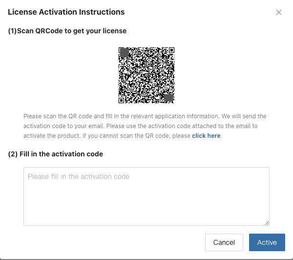  

Scan the QR code and fill in the application form. OnePro Cloud customer service will email user the activation code after reviewing the application. 

Fill in the activation code and click the [Activate] button. 

::: warning
Please make sure the email address provided on the application form is correct, otherwise activation code will not be received.  
:::

#### II. Activate a license by using the activation code

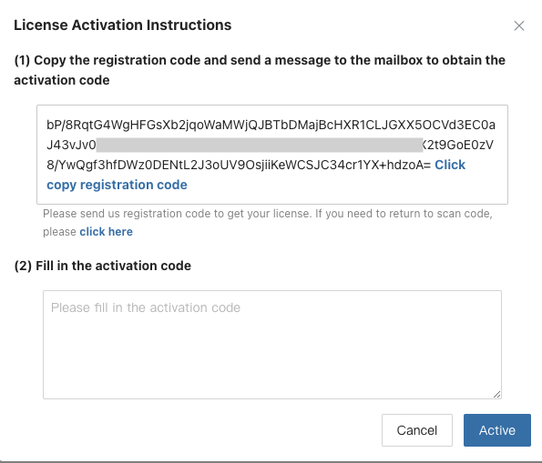 

Copy and email the registration code to OnePro Cloud and customer service will email user the activation code. 

Fill in the activation code and click the [Activate] button. 

::: tip
User can send the registration code to OnePro Cloud sales representative or _[enquiry@oneprocloud.com](mailto:enquiry@oneprocloud.com)_._
:::

## Verify Proxy Registration in HyperBDR

::: tip
After the Proxy Node installation is completed, it will automatically be added to HyperBDR, and you can view this Proxy Node machine in HyperBDR.
:::

::: tip
Already logged in to the HyperBDR console by default.
:::


### Check The Status Of The Proxy Node  

Click on the top menu bar 'Configuration,' 'Production Site,' 'SyncNode' to view the Proxy Node host. If you can see this host and status is 'online,' it indicates that it has been successfully registered with HyperBDR, and you can proceed with further configuration and usage.


## Add VMware Credentials

::: tip
Using the pre-prepared VMware account information, add VMware to the HyperBDR platform as a disaster recovery source-side production platform.
:::

::: tip
Already logged in to the HyperBDR console by default.
:::


### Add VMware To The HyperBDR

Click on the top menu bar 'Configuration,' 'Production Site,' 'VMware.' Click the 'Add' button, then on the popped-up page, click the 'Next' button. Follow the prompts to fill in the VMware information and click the 'Submit' button.

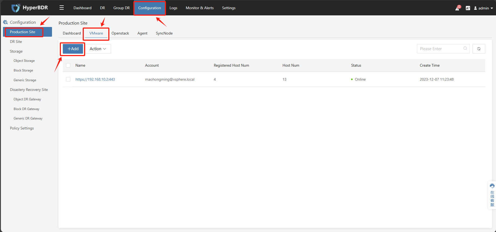

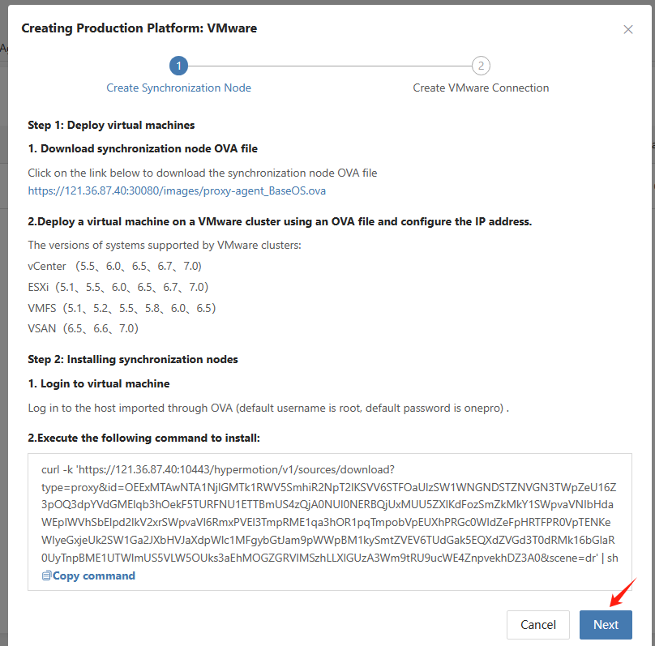

| Auth Url | https://\<vCenter IP/Domain Name\>:443 |
| --- | --- |
| user | \<vCenter user\> |
| password | \<vCenter password\> |
| SyncNode | \<Proxy Node IP\> |

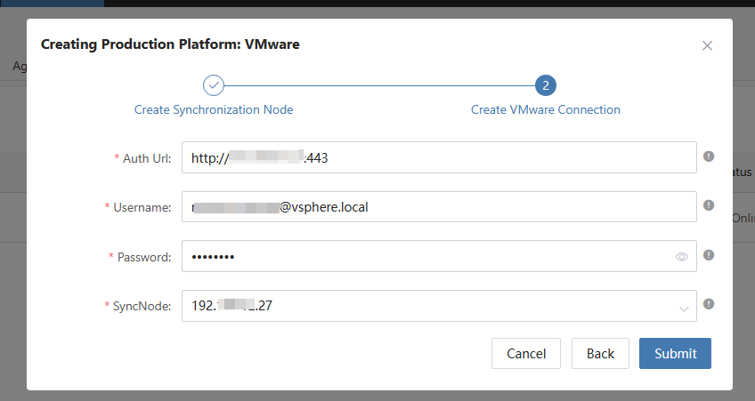

## Verify VMware Status in HyperBDR

::: tip
Already logged in to the HyperBDR console by default.
:::


### Check the status of the VMware Connection

Click on the top menu bar 'Configuration,' 'Production Site,' 'VMware' to view the status of the added source-side VMware account, as well as obtain information such as the number of hosts. You can also click on the VMware name to check the detailed information and host details. If everything is normal, you can proceed with the subsequent configuration operations.

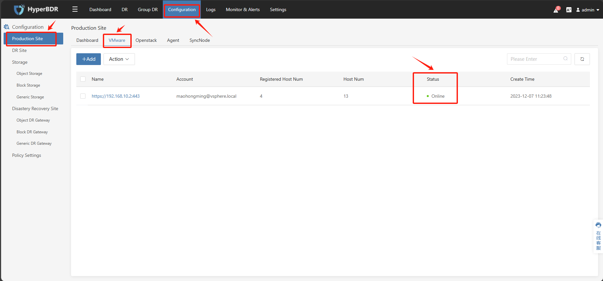

If the status is 'Online,' it indicates that the addition was successful.

## Add Object Storage

::: tip
Already logged in to the HyperBDR console by default.  
:::


### Configure Step

::: tip
Using the provided IAM account AK/SK information, configure and add Huawei Cloud Object Storage bucket in the HyperBDR console.
:::

- Step1: "Click on the top menu bar 'Configuration,' 'Storage,' 'Object Storage.' Click the 'Add' button.  

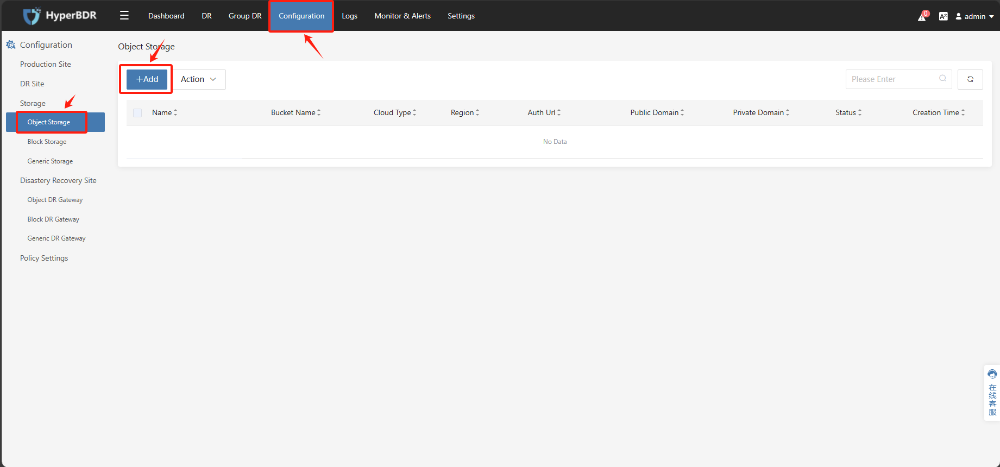

- Step2: Fill in or select the corresponding parameters according to the prompts, click 'Submit,' and wait for the completion.  

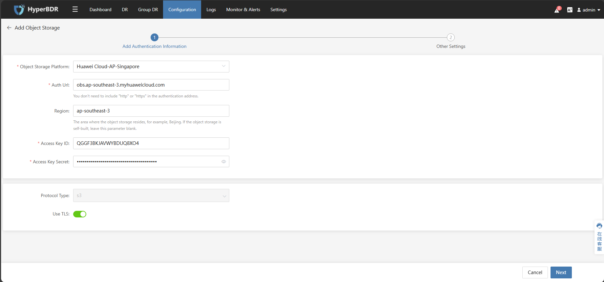

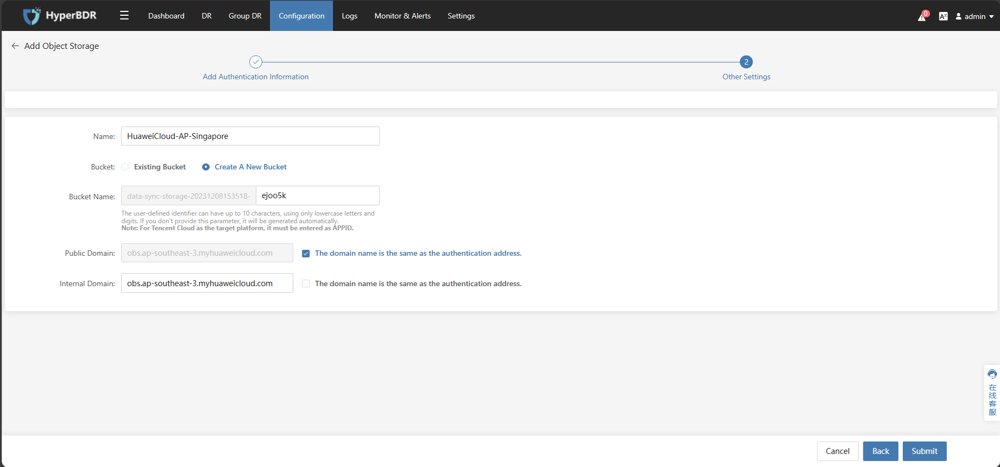

## Add DR Recovery Gateway

::: tip
Already logged in to the HyperBDR console by default.
:::


### Configure Step

::: tip
Using the provided IAM account AK/SK information, Configure and add Huawei Cloud Recovery Gateway in the HyperBDR console
:::

Click on the top menu bar "Configuration," "Disaster Recovery Site," "Object DR Gateway." Click the "Add" button, fill in or select the corresponding parameters as prompted, click "Submit," and wait for the completion.

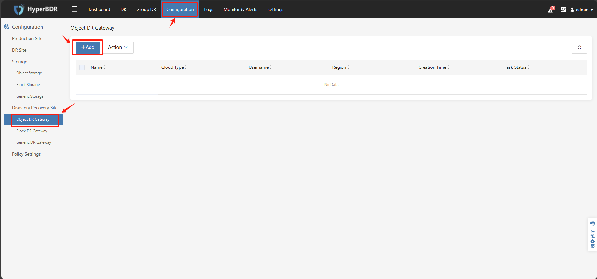

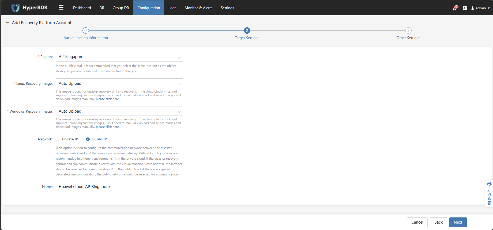

::: tip
Windows UEFI Fixes Image uses the private Windows image you uploaded.

Document link: [https://docs.oneprocloud.com/userguide/poc/huaweicloud-pre-settings.html#image-download-upload](https://docs.oneprocloud.com/userguide/poc/huaweicloud-pre-settings.html#image-download-upload)
:::

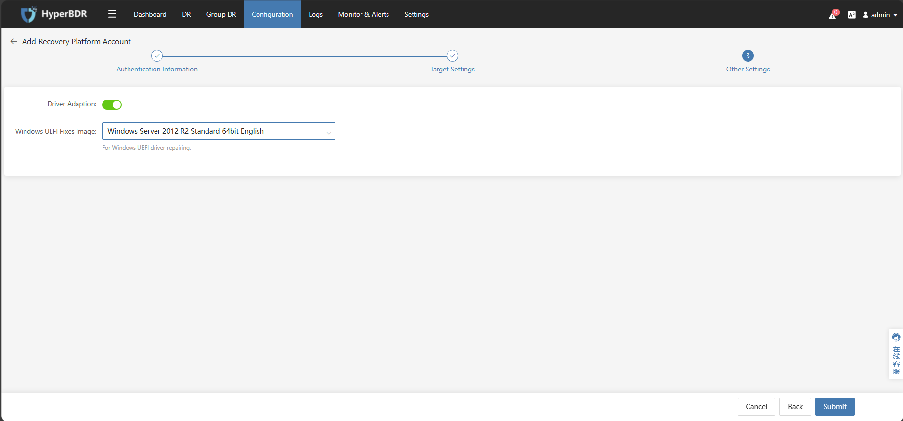

## Add VMware Hosts in HyperBDR

::: tip
Already logged in to the HyperBDR console by default.  
Already Add VMware Connection to  the HyperBDR by default.
:::


### Configure Step

Click on the top menu bar "DR," "Host DR," click the "Add Host" button, select "Agentless," "VMware," choose the previously added VMware account, filter and select the desired disaster recovery hosts, and finally click confirm. Once the selection is complete, click confirm to add the VMware disaster recovery hosts to the disaster recovery platform.  

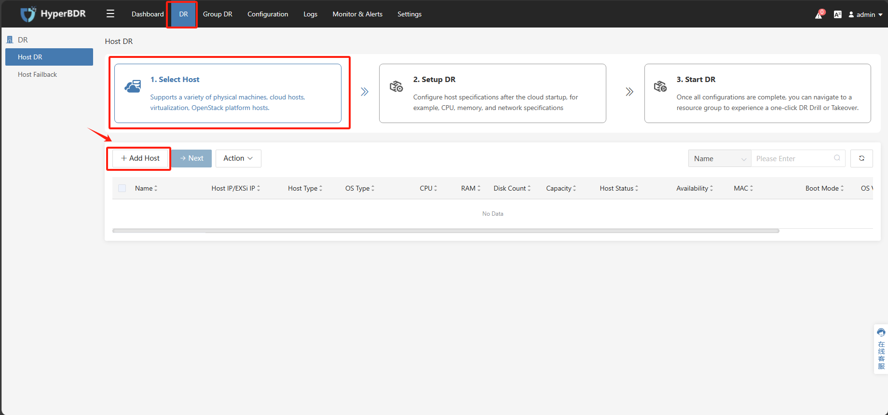

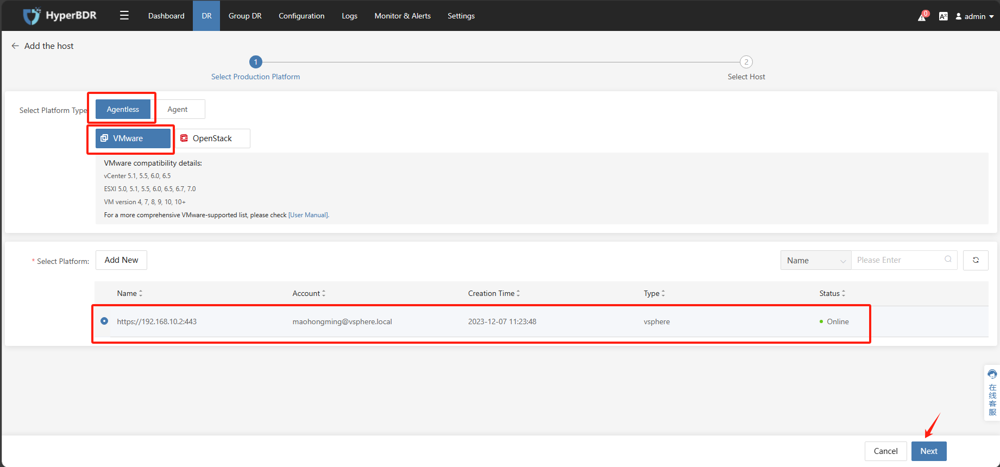


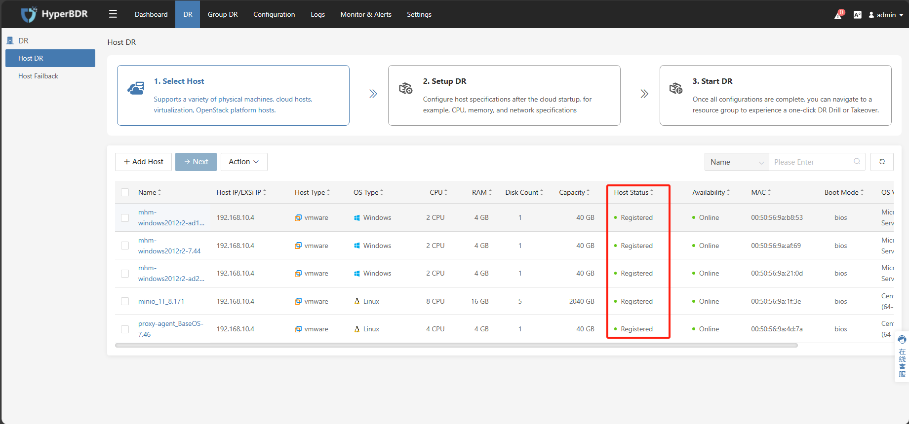

