# VMware Pre-Settings

[[toc]]

## VMware Environemnt Preparation

1. Export host information via vCenter: [VMware Quick Investigation](../presales/hyperbdr-vmware-investigation.md)
2. Fill in detail VM host information based on the export inf, which will be used for DR setup .

## VMware User Permission Requirements

### Why do we need the permissions?

The need for these permissions arises from HyperBDR's utilization of VMware CBT (Change Block Tracking) technology for incremental data synchronization. CBT is a technique employed in VMware to facilitate incremental backup and replication. It effectively tracks the blocks that have undergone changes on a virtual disk, enabling the transmission of only the data associated with these changes during the backup and replication processes.

### VMware User Permission

Prepare the VMware user authentication information for data synchronization and ensure that the user has the necessary permissions.

Provide VMware user with following permissions:

| Permission Type | Permissions                          |
| --------------- | ------------------------------------ |
| Host Profile    | View host configuration files        |
| Global          | Enable method                        |
|                 | Disable method                       |
|                 | License management                   |
| Content Library | Download files                       |
|                 | Update configuration settings        |
|                 | View configuration settings          |
|                 | Read storage                         |
| Scheduled Tasks | Create tasks                         |
| Data Storage    | Low-level file operations            |
|                 | Update virtual machine metadata      |
|                 | Update virtual machine files         |
|                 | Browse data storage                  |
| Virtual Machine | Interaction                          |
|                 | Backup operation on virtual machine  |
|                 | Defragment all disks                 |
|                 | Restore Fault Tolerance              |
|                 | Enable Fault Tolerance               |
|                 | Pause or Unpause                     |
|                 | Perform Guest Operations via VIX API |
|                 | Reset                                |
|                 | Guest Operations                     |
|                 | Modify guest operations              |
|                 | Query guest operations               |
|                 | Execute guest operation programs     |
|                 | Snapshot Management                  |
|                 | Create snapshot                      |
|                 | Remove snapshot                      |
|                 | Configuration Changes                |
|                 | Modify device settings               |
|                 | Toggle fork parent                   |
|                 | Toggle disk change tracking          |
|                 | Reload based on path                 |
|                 | Display connection settings          |
|                 | Modify Settings                      |
|                 | Modify resources                     |
|                 | Query Fault Tolerance compatibility  |
|                 | Query unowned files                  |
|                 | Retrieve disk lease                  |
|                 | Configure managedBy                  |
|                 | Reset guest information              |
|                 | Advanced configuration               |
|                 | Service Configuration                |
|                 | Modify service configuration         |
|                 | Query service configuration          |
|                 | Manage service configuration         |
|                 | Read service configuration           |
| Provisioning    | Allow virtual machine download       |
|                 | Allow read-only access to disks      |
|                 | Allow file access                    |
|                 | Allow disk access                    |
|                 | Customize guest                      |
|                 | Read customization specification     |

### vCenter Permission Open Settings Steps

#### Step 01: Log in to the vCenter Administrator Console

#### Step 02: Add Access Users

Click on **"Menu"**, **"Administration"**

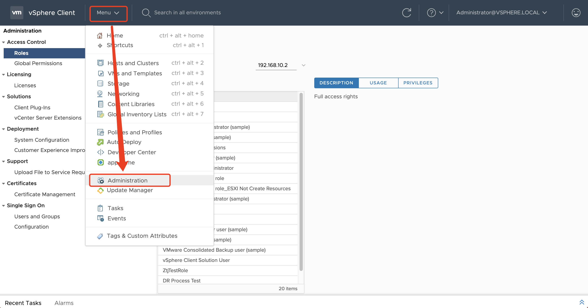

Click on the left-hand menu **"Users and Groups"**, select **"Users"** tab, choose the **"Domain"** associated with the correct login for vCenter, and click the **"Add"** button.

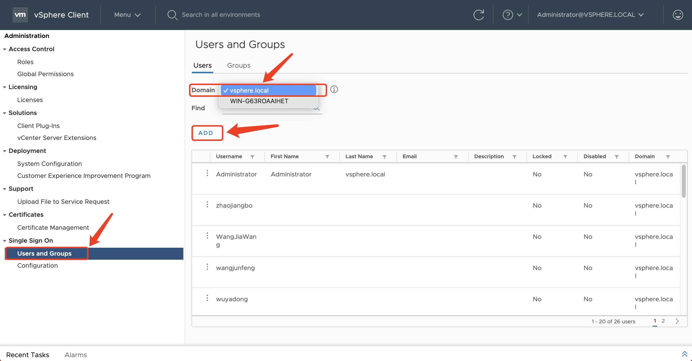

Follow the prompts to enter the Username, Password, Confirm Password, and any other optional information. Then, click the **"Add"** button.

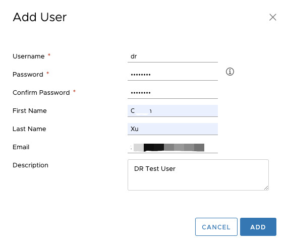

#### Step 03: Add Access Control Roles

On the left-hand menu, go to **"Access Control"**, **"Roles"**. Under **"Role Provider"**, select the vCenter address, and click the **"+"** button.

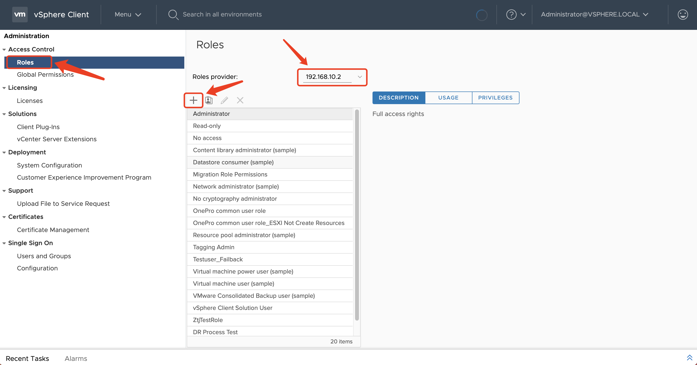

Refer to "[VMware User Permission](https://docs.oneprocloud.com/userguide/poc/vmware-pre-settings.html#vmware-user-permission)" and select the appropriate settings. Then, click the "NEXT" button.

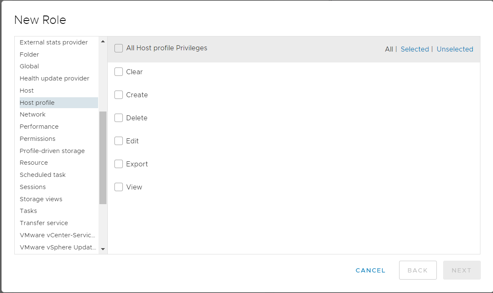

Set a new Role name and Description, then click the **"FINISH"** button.

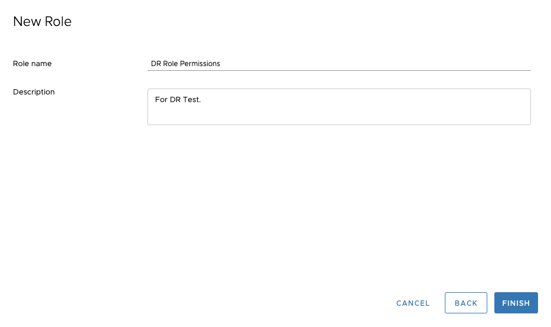

#### Step 04: Add Permissions to vCenter 

In **"Hosts and Clusters"**, find the top-level **"vCenter IP"** on the left-hand menu, select it, and click on the **"Permissions"** menu on the right. Then, click the **"+"** button.

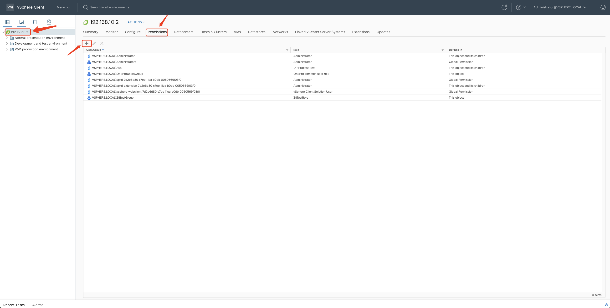

Follow the prompts to choose the domain for user authorization, keeping it consistent with the previous steps. Search for the **"dr"** user to be added. Select the **"DR Role Permissions"** for the role and check the box for "Propagate to Child". Then, click the "OK" button.

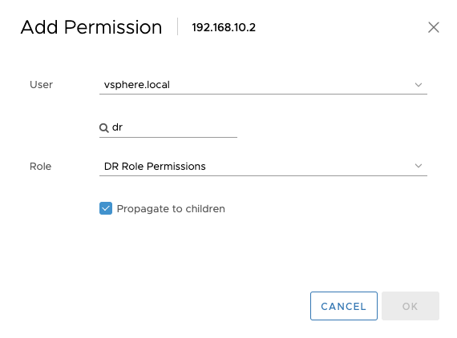

After the addition is complete, provide the vCenter access address, **"dr"** user, and login password to HyperBDR platform.

### Fill in HyperBDR

Then fill in the authentication information of this account to the HyperBDR DR Platform later, including:

- vCenter IP
- vCenter usename
- vCenter password

## Download The OVA Images

Download the template file for installing proxy synchronization (OVA)

- [proxy-agent_BaseOS.ova](https://hyperbdr-system-image-do-not-delete.obs.ap-southeast-3.myhuaweicloud.com/proxy-agent_BaseOS.ova)

## Import OVA Images and Create Proxy Virtual Machine in VMware

### Deploy VOF template

select the your Esxis or Datacenter Name, Right click, select the **"Deploy OVF Template.."**

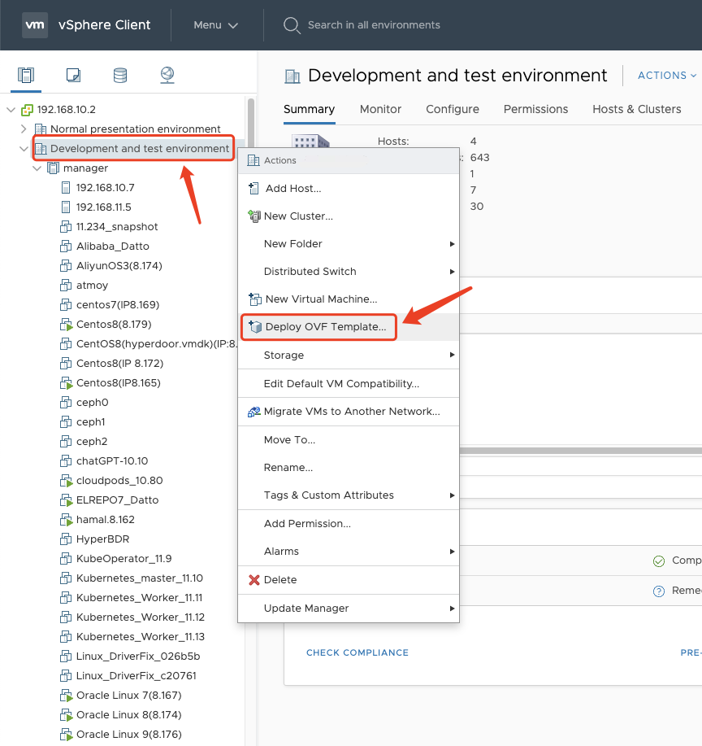

#### Step01: Select an OVF template

Click the **"Local file"** system, and click the **"select file"** button, select the ova template downloaded locally in advance, download OVA template name is **"proxy-agent_BaseOS.ova"**.

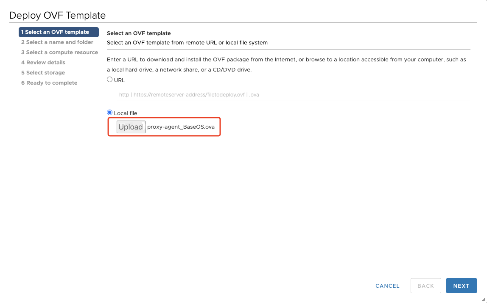

#### Step02: Select a name and folder

You can give this vm a name, like **"proxy-agent_BaseOS"**, then select a location for the virtual machine.

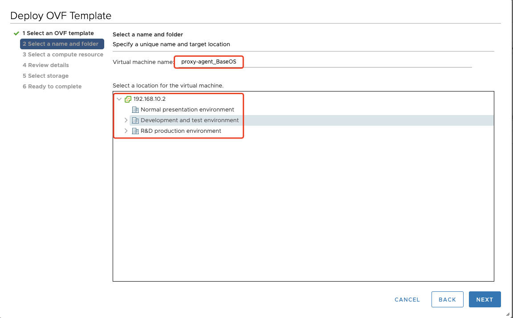

#### Step03: Select a compute resource

Select the destination compute resource for the created VM.

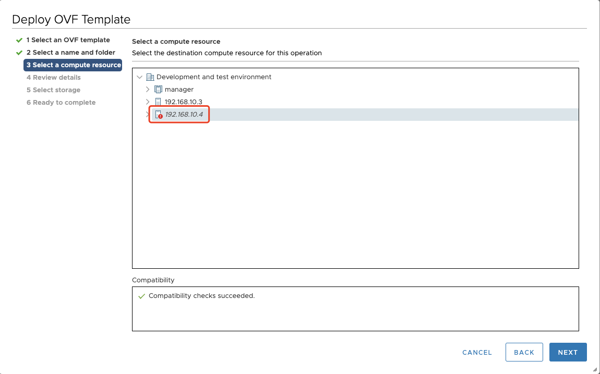

#### Step04: Review details

Verify the template details.

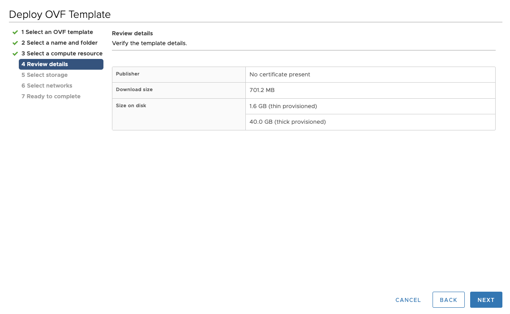

#### Step05: Select storage

Select the storage for the configuration and disk files.

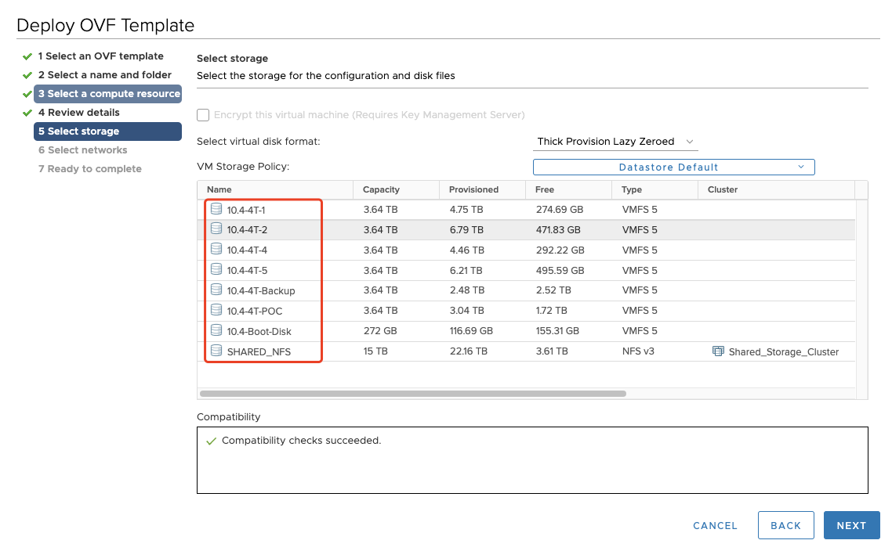

#### Step06: Select networks

Select a destination network for each source network.

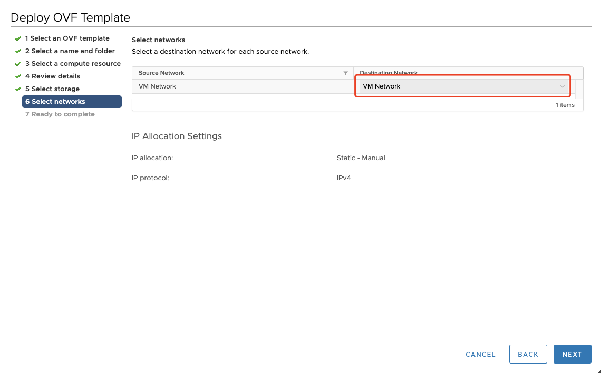

#### Step07: Ready to complete

Confirm the created information then click Finish to start creation.

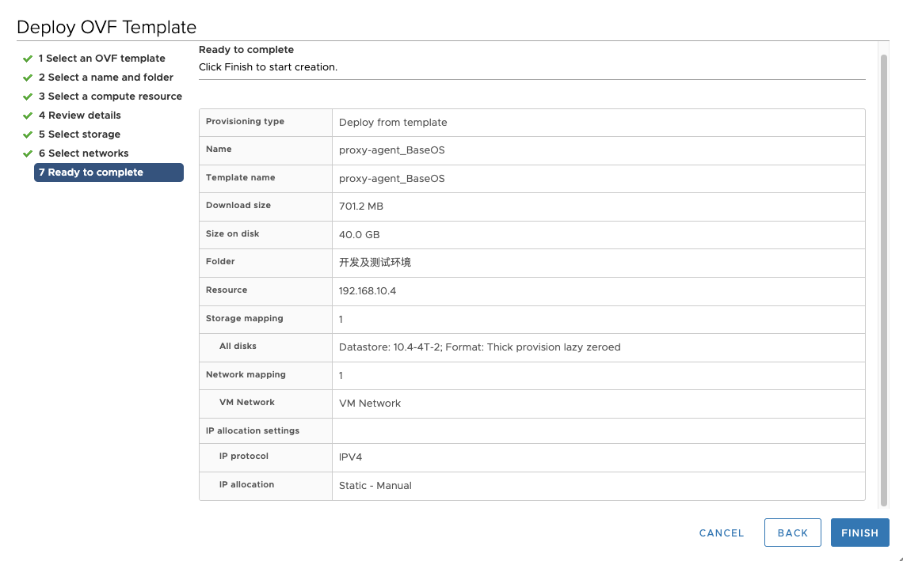

#### Review import OVF template tasks

- **"Import OVF package"** and **"Deploy OVF template"** task is progress.

- **"Import OVF package"** and **"Deploy OVF template"** task status completed.

### Modify the Proxy VM Flavors

- Click the VM name, then right click, select the **"Edit Settings..."**.

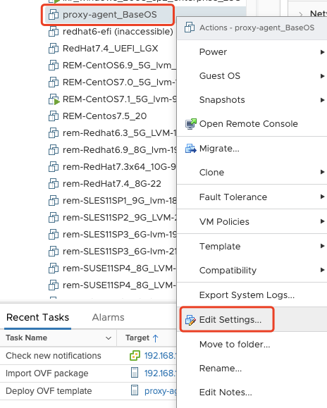

- Modify the CPU to 4 core, Memory to 8GB, Hard disk 1 size to 100GB.

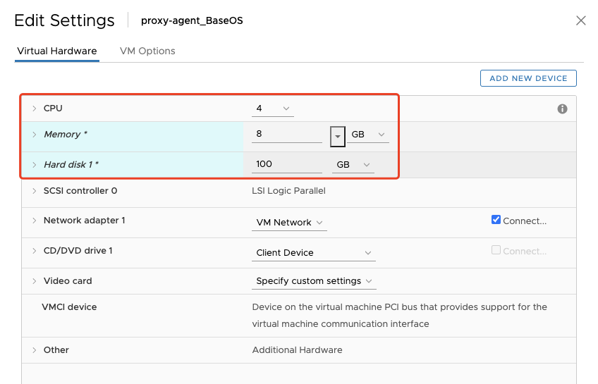

### Power On the Proxy VM

- Select the VM name, then right click, click the **"Power"**, **"Power On"**.

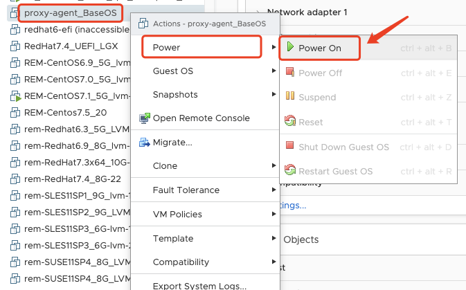

Next step, you can configration the proxy IP Address.
