# 华为云预设置

[[toc]]

## 为容灾目标端创建华为云子账号

创建一个华为云IAM账户，并赋予相应的权限，详细要求请参考以下文档。同时，为该IAM账户创建Access Key ID和Access Secret Key用于设置。

### 创建IAM账号

#### 华为云官方文档链接：

- [https://support.huaweicloud.com/intl/en-us/usermanual-iam/iam_02_0001.html](https://support.huaweicloud.com/intl/en-us/usermanual-iam/iam_02_0001.html)

### 授予IAM用户权限

#### 华为云官方文档链接：

- [https://support.huaweicloud.com/intl/en-us/usermanual-iam/iam_01_0652.html](https://support.huaweicloud.com/intl/en-us/usermanual-iam/iam_01_0652.html)

### 管理IAM用户访问密钥

#### 华为云官方文档链接：

- [https://support.huaweicloud.com/intl/en-us/usermanual-iam/iam_02_0003.html](https://support.huaweicloud.com/intl/en-us/usermanual-iam/iam_02_0003.html)

### 华为云IAM权限要求

::: tip
华为云在不同地区使用不同的API版本，包括v2和v3，并且每个地区对资源描述权限的定义略有不同。当您为HyperBDR创建权限时，需要提供对ecs、evs、obs、ims和network服务的完全访问权限。
:::

#### ecs/vpc/evs/ims

```
{
    "Version": "1.1",
    "Statement": [
        {
            "Effect": "Allow",
            "Action": [
                "ecs:*:*"
            ]
        },
        {
            "Effect": "Allow",
            "Action": [
                "evs:*:*"
            ]
        },
        {
            "Effect": "Allow",
            "Action": [
                "vpc:*:*"
            ]
        },
        {
            "Effect": "Allow",
            "Action": [
                "IMS:*:*"
            ]
        }
    ]
}
```

#### obs

```
{
    "Version": "1.1",
    "Statement": [
        {
            "Effect": "Allow",
            "Action": [
                "OBS:*:*"
            ]
        }
    ]
}
```

## 配置 VPC & 子网

根据华为云文档创建VPC网络和子网。说明：根据以下灾难恢复网络场景建立您的网络。

1. 内部 VPN 访问:

如果通过内部 VPN 访问，请创建一个灾难恢复(VPC)网络，并将HyperBDR ECS实例放置在此网络中。

2. 灾难恢复 VPC:

为HyperBDR灾难恢复和备份创建专用的VPC网络和子网，通过VPN与本地IDC相互连接。

3. 业务 VPC:

用于灾难接管和演练的业务VPC网络和子网。

## 创建 HyperBDR 安全组

::: tip
HyperBDR 安全组名称: SG-HyperBDR
:::

### 创建安全组规则

> 注意：对于源IP范围，我们建议使用安全范围来替代0.0.0.0/0。
> 例如，如果您的外部IP地址是110.242.68.66，源可以配置为110.242.68.66/32。

| No. | Action | Type | Protocol & Port | Source | Description |
| --- | --- | --- | --- | --- | --- |
| 1 | 允许 | IPv4 | TCP:22 | 0.0.0.0/0 | 默认允许Linux SSH端口 |
| 2 | 允许 | IPv4 | TCP:10443 | 0.0.0.0/0 | 允许 HyperBDR web 控制台 |
| 3 | 允许 | IPv4 | TCP:30443 | 0.0.0.0/0 | 允许 HyperBDR 运维管理平台 Web 控制台端口 |
| 4 | 允许 | IPv4 | TCP:30080 | 0.0.0.0/0 | 允许 HyperBDR HTTPS 服务端口 |

## 创建ECS实例用来安装 HyperBDR

### 登录华为云主控台

### 基于配置信息创建华为云ECS实例

> 华为云文档 ：[https://support.huaweicloud.com/intl/en-us/qs-ecs/ecs_02_0009.html](https://support.huaweicloud.com/intl/en-us/qs-ecs/ecs_02_0009.html)  
> HyperBDR服务器的资源配置如下:

| 配置项               | 参数                                                      |
| :------------------ | :-------------------------------------------------------------- |
| 区域                | <你的区域\>                                                      |
| 计费模式            | 包年/包月                                                        |
| 可用区              | 可用区1                                                          |
| 规格                | s6.2xlarge.2                                                    |
| 镜像                | CentOS 7.9 64bit(40 GiB)(d580586a-1761-4f06-bb11-5f358ee29e40)  |
| 系统盘              | 高IO 200GB                                                      |
| 网络                | <VPC-HyperBDR-172.16.0.0\>                                      |
| 子网                | <Subnet-HyperBDR-172.16.0.0\> (Automatically assign IP address) |
| 安全组              | SG-HyperBDR                                                     |
| 弹性公网ip          | 现在购买                                                         |
| 弹性公网ip线路       | 全动态 BGP                                                      |
| 公网带宽             | 按流量计费                                                      |
| 带宽大小             | 100Mbps                                                        |
| 实例名称             | HyperBDR-Prod                                                  |
| 登录凭证             | 密码                                                           |
| 用户名               | root                                                            |
| 密码                 | ec1@OneProCloud#!                                               |

## 镜像下载 & 上传

### 镜像下载

::: tip
海外华为云暂时没有Windows镜像。Windows镜像主要用于以UEFI Windows为源主机进行灾难恢复，而Linux镜像则以块存储模式使用，并作为云同步网关创建的基础镜像。 
:::

::: tip
通过提供的镜像链接将Windows/Linux镜像下载到本地计算机。 
:::

### 镜像信息

#### Linux 镜像

* 版本：CentOS 8.4 64bit
* 大小： 1.22 GB
* 下载链接：[https://hyperbdr-system-image-do-not-delete.obs.ap-southeast-3.myhuaweicloud.com/CentOS-8-GenericCloud-8.4.2105-20210603.0.x86_64.qcow2](https://hyperbdr-system-image-do-not-delete.obs.ap-southeast-3.myhuaweicloud.com/CentOS-8-GenericCloud-8.4.2105-20210603.0.x86_64.qcow2) 
* 镜像的MD5值: fe9f21a75a80d12159030fff76e1c8a5

#### Windows 镜像

* 版本：Windows Server 2016 Datacenter 64bit English
* 大小：12.11 GB
* 下载链接：[https://hyperbdr-system-image-do-not-delete.obs.ap-southeast-3.myhuaweicloud.com/Windows_Server_2016_Datacenter_64bit_English_40G.qcow2](https://hyperbdr-system-image-do-not-delete.obs.ap-southeast-3.myhuaweicloud.com/Windows_Server_2016_Datacenter_64bit_English_40G.qcow2) 
* 镜像的MD5值: 519444d4b0343e15fa014c50d906a832

### 上传镜像到华为云对象存储

::: tip
华为云官方文档链接:
[https://support.huaweicloud.com/intl/en-us/usermanual-ims/ims_01_0205.html](https://support.huaweicloud.com/intl/en-us/usermanual-ims/ims_01_0205.html) 
:::

### 导入镜像

::: tip
华为云官方文档链接:
[https://support.huaweicloud.com/intl/en-us/usermanual-ims/ims_01_0206.html](https://support.huaweicloud.com/intl/en-us/usermanual-ims/ims_01_0206.html)
[https://support.huaweicloud.com/intl/en-us/usermanual-ims/ims_01_0211.html](https://support.huaweicloud.com/intl/en-us/usermanual-ims/ims_01_0211.html)
:::

#### 步骤一: 访问IMS控制台

- 登录管理控制台。
- 在“计算”下，点击“镜像服务IMS”。IMS控制台将显示。将外部镜像文件注册为私有镜像。
  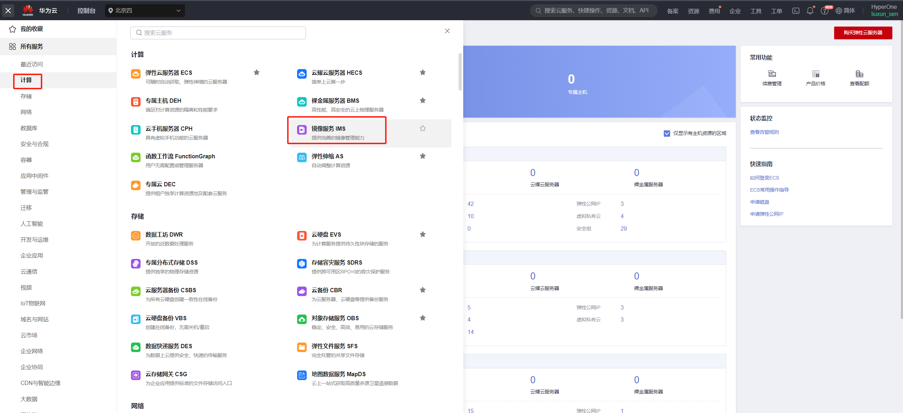

#### 步骤2: 将外部镜像文件注册为私有镜像

- 点击右上角的“创建私有镜像”
  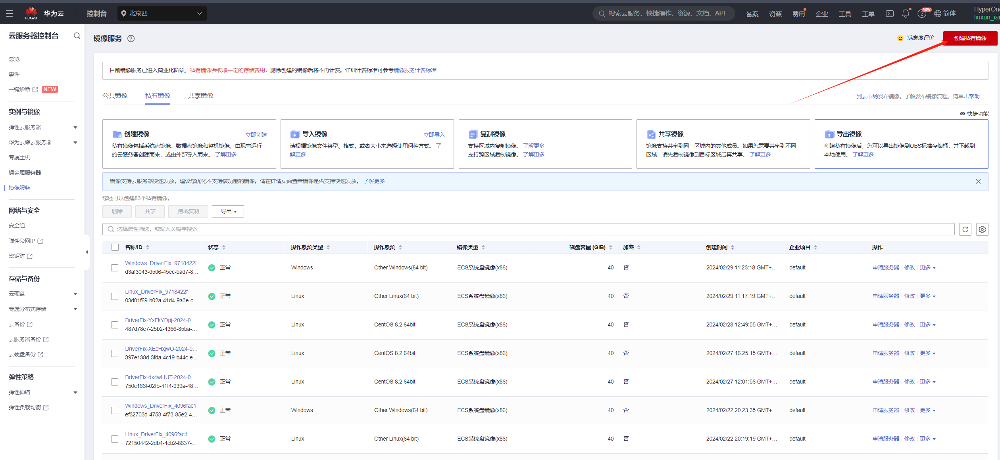

::: warning 
1.名称必须是以下之一，并且不能包含额外的字符。  
2.由于源主机上Windows的各种版本，选择操作系统的通用选项。  
3.Linux镜像主要用于创建HyperDoor。当前版本的推荐版本是CentOS 8+。 
:::
支持的 windows 镜像名称

> Windows Server 2012 R2 Standard 64bit  
> Windows Server 2012 R2 Datacenter 64bit  
> Windows Server 2016 Standard 64bit  
> Windows Server 2016 Standard 64bit English  
> Windows Server 2016 Datacenter 64bit  
> Windows Server 2016 Datacenter 64bit English  
> Windows Server 2019 Datacenter 64bit  
> Windows Server 2019 Datacenter 64bit English

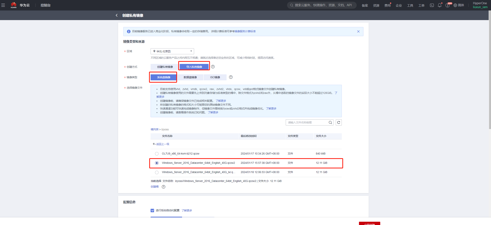

::: warning
系统磁盘的大小必须为40G。
:::

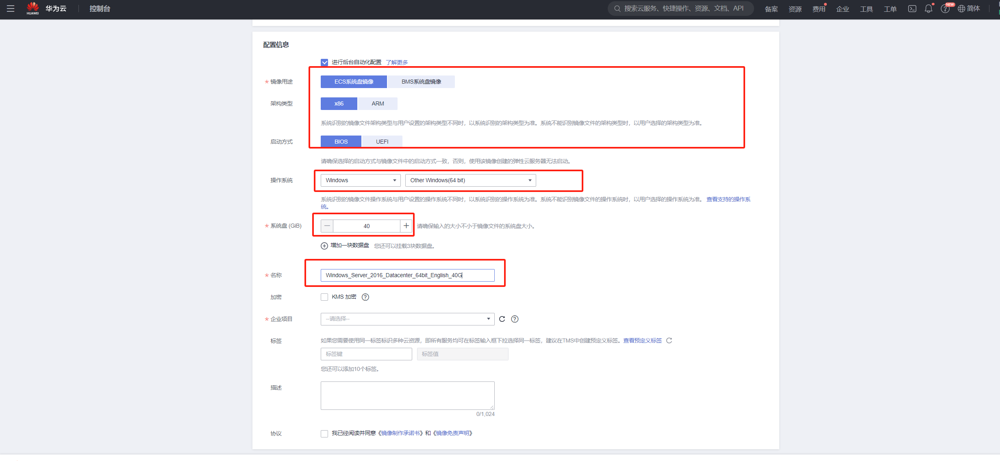

支持的 Linux 镜像名称

> CentOS 8.4 64bit  
> CentOS 8.3 64bit  
> CentOS 8.2 64bit  
> CentOS 8.1 64bit  
> CentOS 8.5 64bit

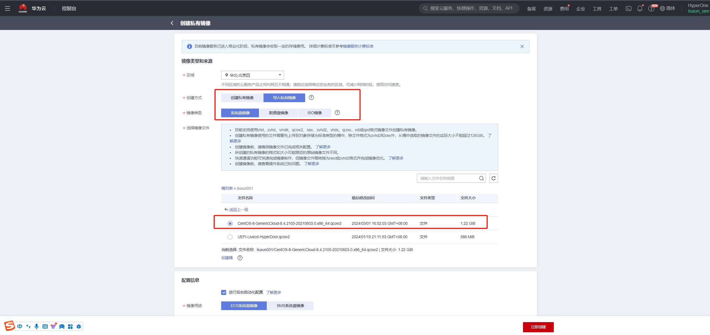

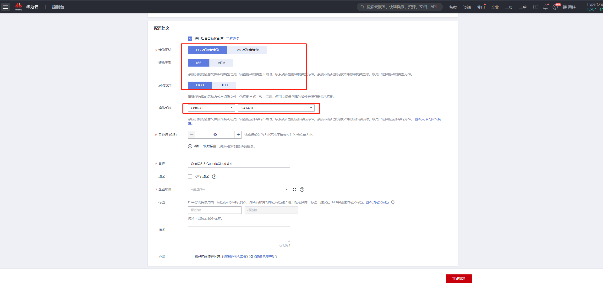

#### 步骤3: 确认并提交

- 勾选“我已阅读并同意”，选择“创建镜像承诺书”和“华为镜像免责声明”。然后点击“立即创建”。

- 返回到私有镜像页面。当镜像的状态变为正常时，表示成功注册。

## VPN 设置

> 注意：如果您的灾难恢复环境通过华为云连接到生产站点的内部网络，您需要购买华为云VPN服务，并配置华为云连接到本地网络。

> 配置VPN。详细信息请参阅华为云官方文档。 
> 文档链接: [https://support.huaweicloud.com/intl/en-us/qs-vpn/vpn_03_0001.html](https://support.huaweicloud.com/intl/en-us/qs-vpn/vpn_03_0001.html)

## 创建华为VPC终端节点

> 如果您的灾难恢复环境通过华为云VPN与生产站点的内部网络相互连接，并且在灾难期间生产站点需要通过VPN访问华为云HyperBDR和OBS服务，那么您需要购买并配置华为云中的VPC终端服务。

> 您需要购买两个VPC终端服务，一个用于OBS，另一个用于DNS。

> 华为云的官方定义：如果您希望通过VPN或Cloud Connect使用内部网络方法从本地数据中心访问OBS服务，您可以通过连接终端端点以访问终端端点服务来实现这一目标。  
> 文档链接：[https://support.huaweicloud.com/intl/en-us/qs-vpcep/vpcep_02_0301.html](https://support.huaweicloud.com/intl/en-us/qs-vpcep/vpcep_02_0301.html)

### 为终端节点配置DNS接口类型

| 项目 | 配置 |
| --- | --- |
| 区域 | 选择要激活的区域 |
| 计费模式 | 按需计费 |
| 服务类别 | 选择默认的'云服务'，选择 com.myhuaweicloud.<region\>.dns，并将类型设置为接口 |
| 虚拟私有云 | 选择与本地IDC VPN互联的VPC |
| 子网 | 选择用于VPN互连的子网 |

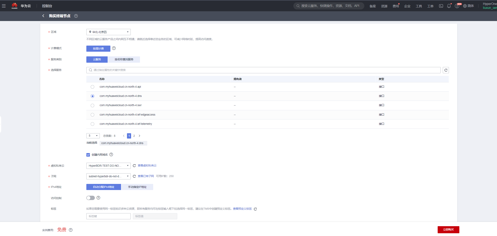

### 选择OBS网关类型的终端端点

| Project | Configuration |
| ---        | --- |
| 区域       | 选择要激活的区域 |
| 计费模式   | 按需计费 |
| 服务类别   | 选择默认的'云服务'，选择 com.myhuaweicloud.<region\>.obs，并将类型设置为网关 |
| 虚拟私有云 | 选择与本地IDC VPN互联的VPC |
| 路由表     | 默认 |
| 策略       | 默认 |

::: warning 
注意：在“服务类别”部分，可能无法直接找到默认云服务类型对应的OBS服务。在这种情况下，您需要使用“按名称查找服务”进行搜索。您必须输入特定OBS服务的完整名称。请与华为云确认，因为华为云侧目标OBS服务终端点在v1和v2版本之间可能存在差异。此外，每个地区的名称和v1/v2版本之间以及对象存储桶的资源池之间的关联需要澄清。如果您购买了v1 OBS终端节点但您的对象存储桶位于v2集群中，必须相应地进行调整。请提前与华为云确认对象存储桶集群的具体版本和OBS终端节点。

示例：v2版本OBS终端节点名称：sa-brazil-1.com.myhuaweicloud.v4.obsv2.lz002 
:::

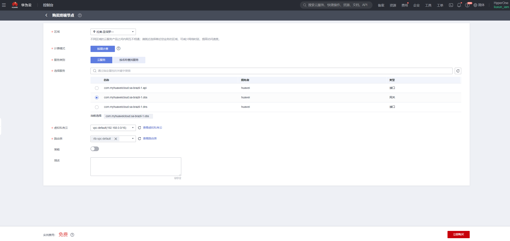

### 配置VPN本地端OBS网关

在VPN连接点添加本地（华为云）OBS服务的内部子网范围。所有内部华为云OBS服务的子网地址为100.125.0.0/16。  
  


## 创建华为VPC对等连接

::: tip

根据业务需求，选择不同的VPC对等连接配置：  
- 如果多个业务VPC之间不需要相互访问，只需根据 [容灾恢复 VPC 通过对等连接与多个业务VPC连接](https://docs.oneprocloud.com/userguide/poc/huaweicloud-pre-settings.html#disaster-recovery-vpc-connected-via-peering-with-multiple-business-vpc) 配置对等连接。
- 如果需要多个业务VPC之间相互访问的需求，那么您需要根据 [与多个业务VPC进行灾难恢复VPC对等连接，以及多个业务VPC之间的对等连接](https://docs.oneprocloud.com/userguide/poc/huaweicloud-pre-settings.html#disaster-recovery-vpc-peering-with-multiple-business-vpcs-as-well-as-peering-connections-between-multiple-business-vpc) 进行配置。
:::

### 通过与多个业务VPC建立对等连接的灾难恢复VPC

在华为云灾难恢复中，灾难恢复主机需要恢复到计划的生产业务VPC。因此，需要在华为云中配置跨VPC点对点连接，将灾难恢复VPC与业务VPC进行配置，并添加点对点连接路由。主要用于灾难恢复，HyperBDR所在的灾难恢复VPC可以通过内部网络访问业务VPC，以进行虚拟机的数据恢复。

> 华为云文档链接:  
> [https://support.huaweicloud.com/intl/en-us/usermanual-vpc/en-us_topic_0046809840.html#section1](https://support.huaweicloud.com/intl/en-us/usermanual-vpc/en-us_topic_0046809840.html#section1)

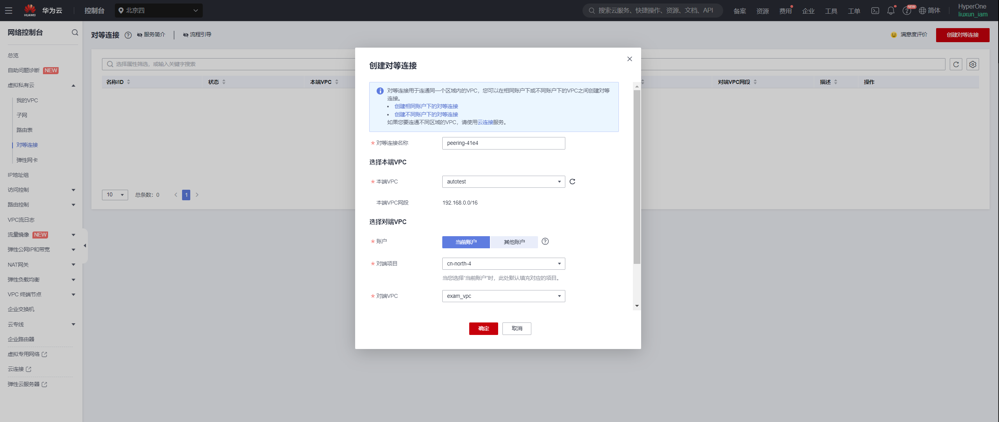

### 与多个业务VPC进行灾难恢复VPC的对等连接，以及多个业务VPC之间的对等连接

当客户的所有灾难恢复主机需要放置在华为云规划的不同业务VPC中，并且在业务中存在跨VPC访问的需求时，就需要在业务VPC之间配置点对点连接，以确保在后续业务恢复后正常进行跨VPC业务交互。

> 华为云文档链接:  
> [https://support.huaweicloud.com/intl/en-us/usermanual-vpc/en-us_topic_0046809840.html#section0](https://support.huaweicloud.com/intl/en-us/usermanual-vpc/en-us_topic_0046809840.html#section0)

## 测试VPC之间的网络访问

::: tip
[创建华为VPC对等连接](https://docs.oneprocloud.com/userguide/poc/huaweicloud-pre-settings.html#create-huawei-vpc-peering) 配置已成功完成，并且路由条目已正确添加。
:::

### 测试灾难恢复VPC和业务VPC之间的网络连通性

- 步骤1: 登录到华为云并创建一个ECS测试云服务器  
在华为云上创建一个ECS测试云服务器（使用CentOS 7.6操作系统）。在配置网络时，选择业务VPC和子网。确保这台新创建的ECS测试虚拟机的安全组具有允许端口22的入站访问策略。

- 步骤2: 从灾难恢复VPC到业务VPC进行网络测试访问

登录华为云控制台，访问HyperBDR ECS云服务器，使用内部网络IP连接到业务VPC内的ECS主机。


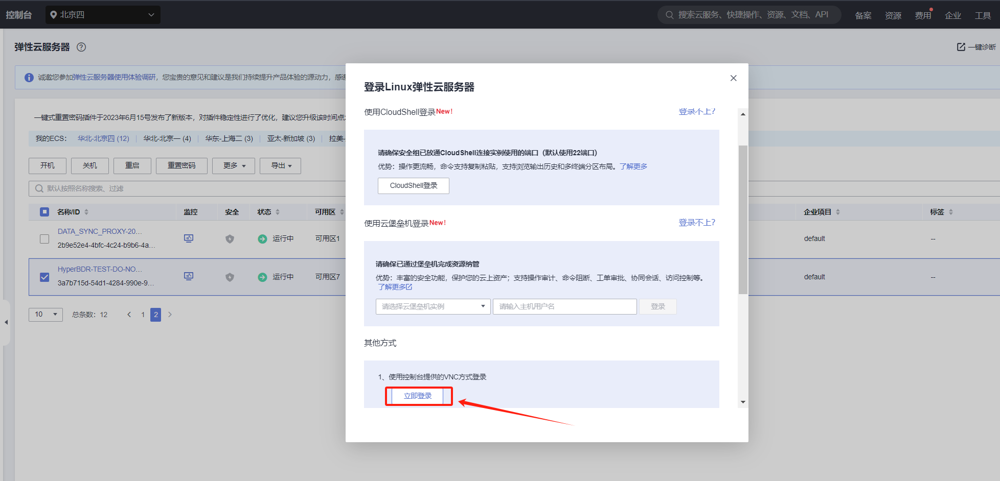

执行命令:

```sh
ssh root@<The intranet IP address of the test ECS> 22
```

测试结果:  
如果您能够成功访问并输入密码，表示正常访问。

### 测试业务VPC之间的网络连通性

- 步骤1: 创建一个新的ECS测试云服务器，使用CentOS 7.6操作系统。在配置网络时，选择不同的业务VPC和子网。确保这台新创建的ECS测试虚拟机的安全组具有允许端口22的入站访问策略。

- 步骤2: 通过控制台登录到不同的测试云服务器，并使用以下命令进行双向命令测试。

执行命令:

```sh
ssh root@<The intranet IP of the test ECS> 22
```

测试结果:  
如果您能够成功访问并输入密码，表示正常访问。

## 华为云平台账户配额检查

在灾难恢复过程中，确保云账户具有足够的资源配额以支持数据同步和灾难恢复非常重要。为防止因配额不足而导致灾难恢复的潜在失败，有必要在启动灾难恢复之前进行资源配额检查。

如果华为云账户中的剩余配额不足，就有必要清理账户中的不必要资源，或者申请扩展华为云资源配额。

### 源主机资源清单

需要收集等待灾难恢复的主机系统的计算和存储资源信息，并将详细信息输入到一个表格中。
| 资源类型 | 大小 |
| --- | --- |
| 源端主机的总数量  |  |
| 源端主机的总CPU数量 |  |
| 源端主机的总内存大小 |  |
| 源端主机的总磁盘数量 |  |
| 源端主机磁盘的总容量 |  |

### 华为云账户资源配额检查

#### 登录华为云


#### 查看资源配额

访问CDN控制台，选择“资源” > “我的配额”。系统将跳转到“配额”页面。


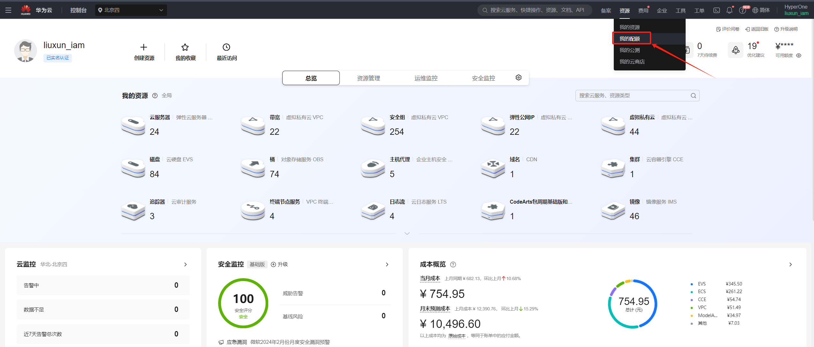

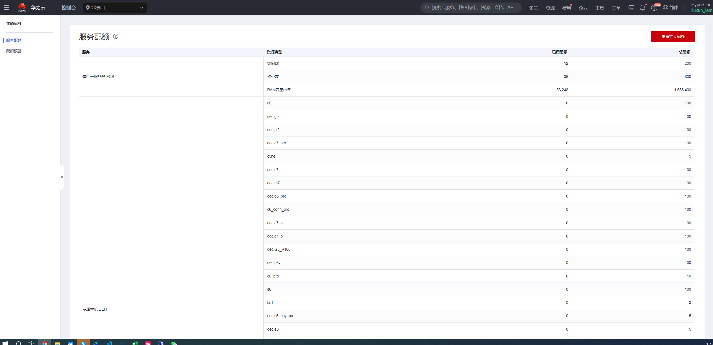


#### 整理您的华为云账户资源配额并计算剩余配额

访问CDN控制台，选择“资源” > “我的配额”。系统将跳转到“配额”页面。


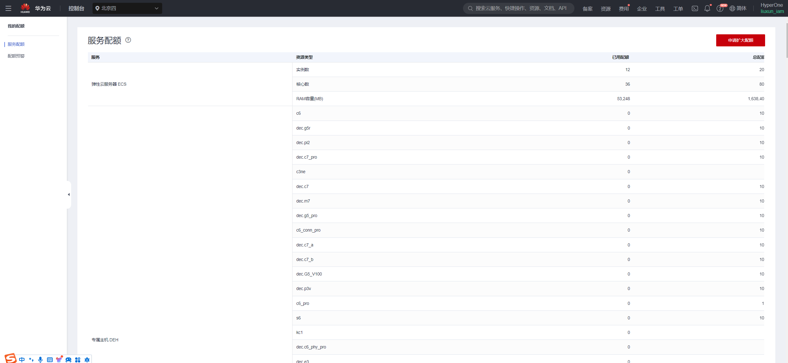


| 服务 | 资源类型 | 使用配额 | 总配额 | 剩余配额 |
| --- | --- | --- | --- | --- |
| 弹性云服务器 | ECS实例 |  |  |  |
| 弹性云服务器 | CPU |  |  |  |
| 弹性云服务器 | 内存 |  |  |  |
| 镜像管理服务 | 镜像 |  |  |  |
| 弹性卷服务 | 磁盘 |  |  |  |
| 弹性卷服务 | 磁盘容量 |  |  |  |
| 虚拟私用云 | 弹性IP地址 |  |  |  |

#### 将剩余配额与源主机的资源进行比较

根据您的清单，将源主机的资源水平与华为云账户中的剩余资源配额进行比较，以评估是否满足灾难恢复的要求。

**1. 如果您正在使用对象存储恢复模式进行灾难恢复，请参考以下标准。**

> **弹性云服务器: ECSs** 剩余配额 ≥ 源主机的总数  
> **弹性云服务器: vCPUs** 剩余配额 ≥ 源主机的总CPU数  
> **弹性云服务器: Memory (MB)** 剩余配额 ≥ 源主机的总内存（MB）  
> **弹性卷服务: Disk** 剩余配额 ≥ 源主机的总磁盘数  
> **弹性卷服务: Disk capacity(GB)** 剩余配额 ≥ 源主机的总磁盘容量（GB） 
> **镜像管理服务: Images**  剩余配额 ≥ 2  
> **虚拟专有云: 弹性IP地址** 剩余配额：满足将灾难恢复主机恢复到华为云平台所需的公网IP数量即可。

**2. 如果您正在使用块存储恢复模式进行灾难恢复，请参考以下标准。**

> **弹性云服务器: ECSs** 剩余配额 ≥ 源主机的总数 + HyperGate实例的数量  
> **弹性云服务器: vCPUs** 剩余配额 ≥ 源主机的总CPU数 + 2 * HyperGate实例的数量  
> **弹性云服务器: Memory (MB)** 剩余配额 ≥ 源主机的总内存（MB） + 2048（MB） * HyperGate实例的数量  
> **弹性卷服务: Disk** 剩余配额 ≥ 2 * 源主机的总磁盘数 + HyperGate实例的数量  
> **弹性卷服务: Disk capacity(GB)** 剩余配额 ≥ 2 * 源主机的总磁盘容量（GB） + 40（GB） * HyperGate实例的数量  
> **镜像管理服务: Images**  剩余配额 ≥ 2  
> **虚拟专有云: 弹性IP地址s** 剩余配额：数量应满足将灾难恢复主机恢复到华为云平台所需的公网IP地址总数，包括源主机的公网IP数量和HyperGate实例的数量。

如果发现华为云账户中的剩余资源配额不足，就有必要清理账户中的不必要资源，或者向华为云申请扩展资源配额。

### 增加华为云账户中的配额。

如果发现华为云账户中的剩余资源配额不足，并且账户中没有可清理的资源，您可以尝试提交一张华为云工单，请求扩展资源配额。 

在“配额”页面上，点击“增加”，并填写华为云工单。

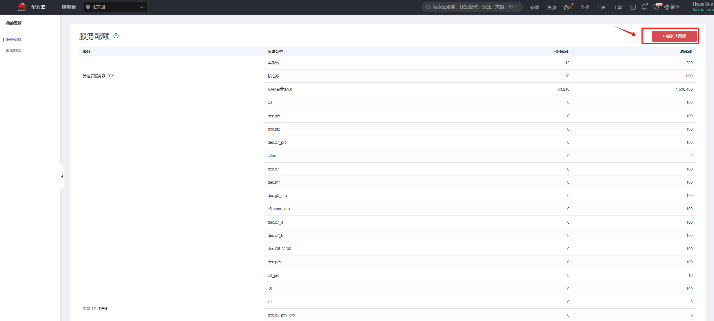

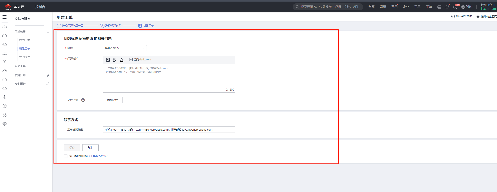

在填写完表单后，勾选同意框，并点击“提交”。等待并监视华为云工单的响应，获取有关增加配额的信息。

