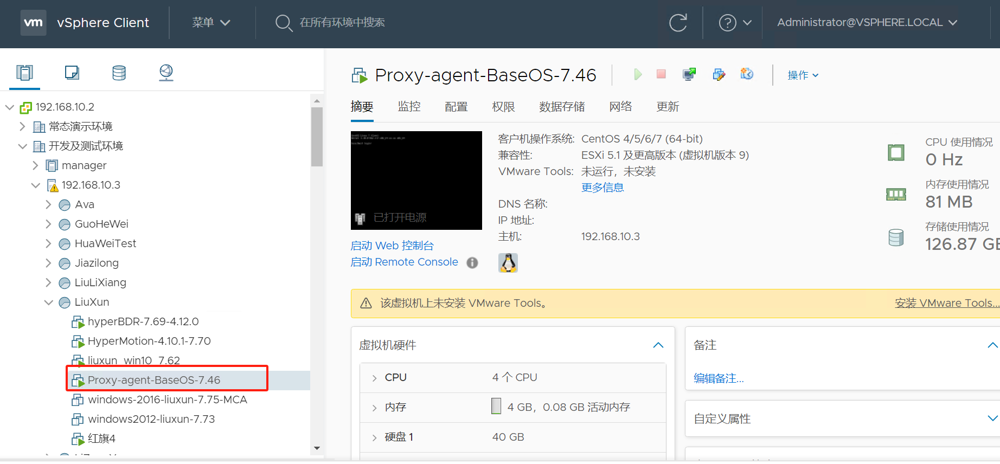
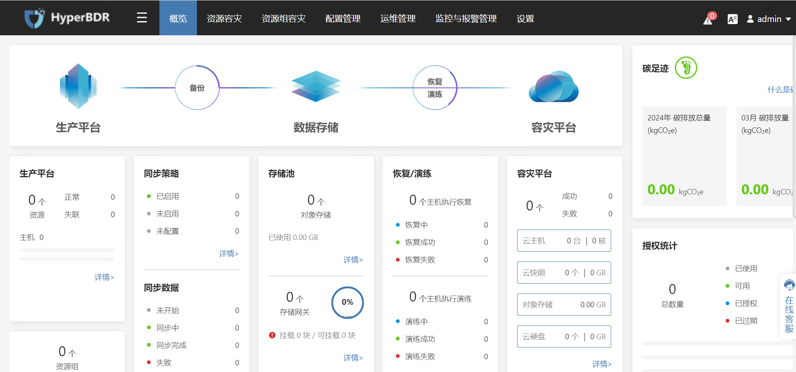
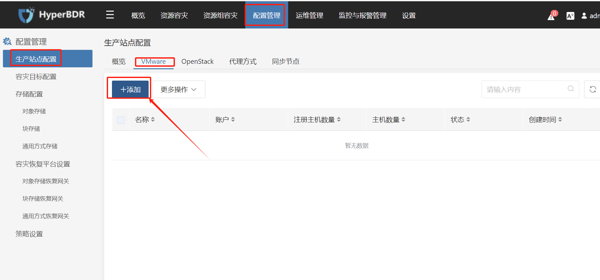
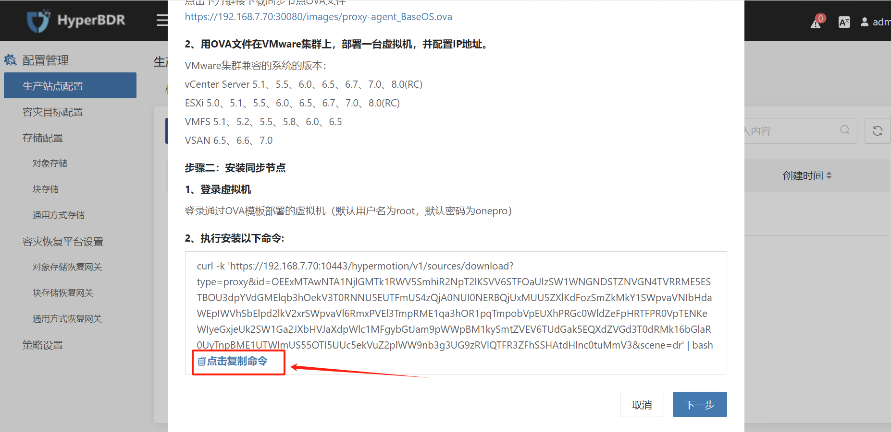
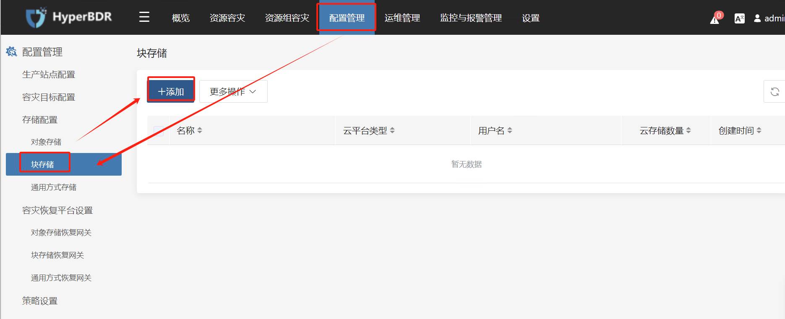
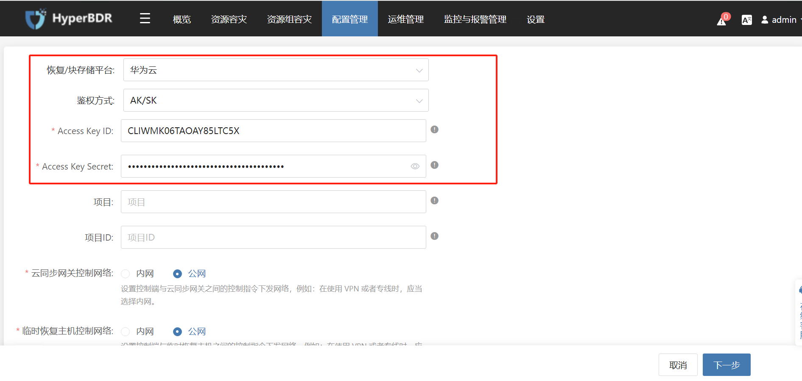
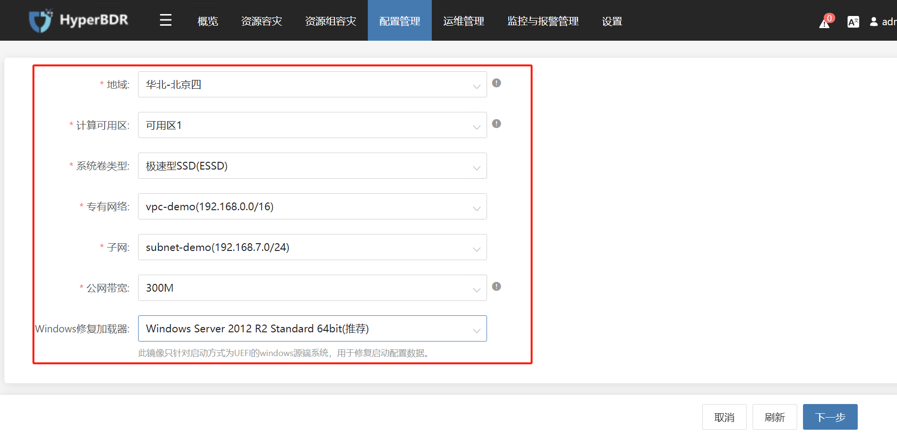
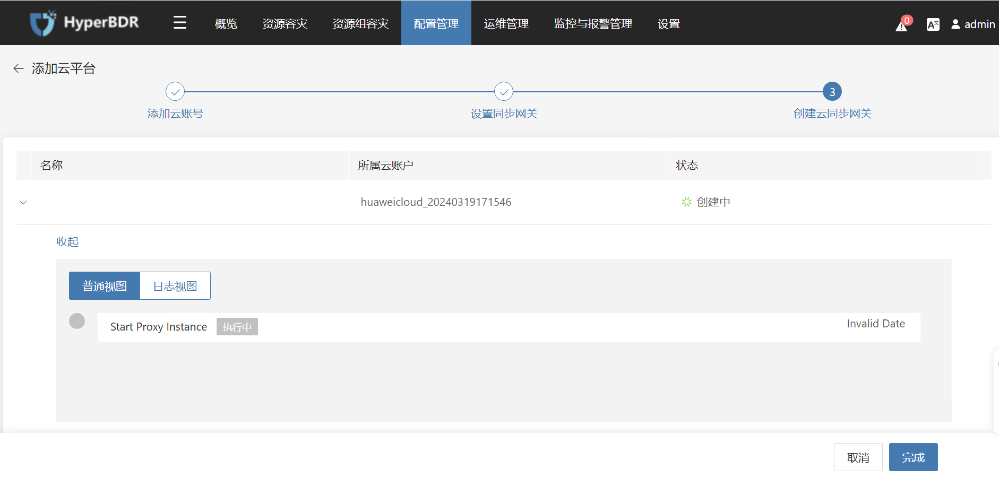
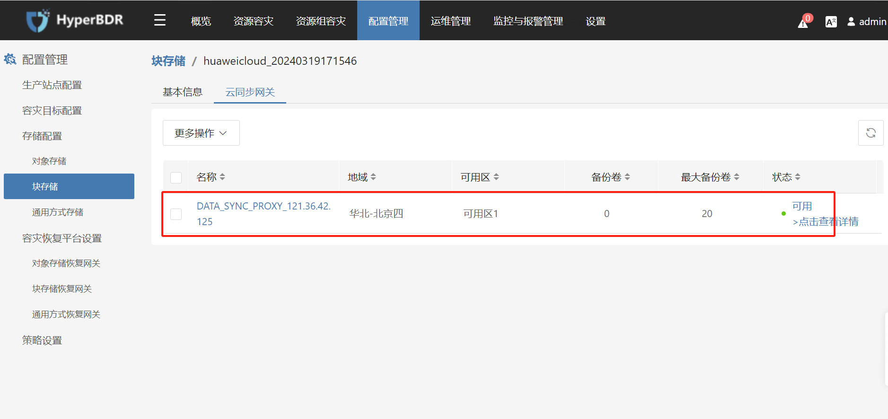

# 同步节点Proxy部署与配置

[[toc]]

## 配置同步代理IP地址

### 登录同步代理虚拟机

::: tip
Proxy ova的默认用户名和密码:
* 用户名: root
* 密码: onepro
:::

使用vCenter Web Console登录Proxy VM并进行以下配置。
  
  

### Modify network interface configuration file

注意：在运行此命令之前，请确保替换以下变量：

* ipaddr: 分配IPV4地址
* netmask: 子网掩码
* gateway: 网关
* dns1: 主DNS
* dns2: 备DNS

```
cat <<EOF >> /etc/sysconfig/network-scripts/ifcfg-ens160
TYPE=Ethernet

BOOTPROTO=static
DEFROUTE=yes
NAME=ens160
DEVICE=ens160
ONBOOT=yes
IPADDR=<ipaddress>
PREFIX=<netmask>
GATEWAY=<gateway>
DNS1=<dns1>
DNS2=<dns2>
EOF
```

### 重启网络服务

```
systemctl restart network
```

### 测试网络

尝试ping VMware vCenter IP或ESXi IP，检查是否能够获得正确的响应。

```
ping <vcenter ip or esxi ip>
```

## 配置NTP服务器

### 下载并上传到Proxy

下载这些软件包并上传到Proxy，在 /root/ntp-packages/ 目录下保存

* [ntp-4.2.6p5-28.el7.centos.x86_64.rpm](https://vault.centos.org/7.5.1804/os/x86_64/Packages/ntp-4.2.6p5-28.el7.centos.x86_64.rpm)
* [autogen-libopts-5.18-5.el7.x86_64.rpm](https://vault.centos.org/7.5.1804/os/x86_64/Packages/autogen-libopts-5.18-5.el7.x86_64.rpm)
* [ntpdate-4.2.6p5-28.el7.centos.x86_64.rpm](https://vault.centos.org/7.5.1804/os/x86_64/Packages/ntpdate-4.2.6p5-28.el7.centos.x86_64.rpm)

在Proxy终端上，您可以使用以下命令下载这些软件包：

```sh
mkdir /root/ntp-packages && cd /root/ntp-packages  
curl -O https://vault.centos.org/7.5.1804/os/x86_64/Packages/ntp-4.2.6p5-28.el7.centos.x86_64.rpm
curl -O https://vault.centos.org/7.5.1804/os/x86_64/Packages/autogen-libopts-5.18-5.el7.x86_64.rpm  
curl -O https://vault.centos.org/7.5.1804/os/x86_64/Packages/ntpdate-4.2.6p5-28.el7.centos.x86_64.rpm  
```

### 安装

```bash
cd /root/ntp-packages/
yum install -y *.rpm
```

### NTP 配置

要编辑 /etc/ntp.conf 文件，可以使用vi编辑器。

- 在文件中找到以下行:

```bash
#server 0.centos.pool.ntp.org iburst
#server 1.centos.pool.ntp.org iburst
#server 2.centos.pool.ntp.org iburst
#server 3.centos.pool.ntp.org iburst
```
- 取消注释并在文件中添加以下内容。

```bash
server ntp.server.ip.address
```

**<ntp.server.ip.address>** 是你的ntp服务器的IP地址

### 启动服务

```bash
systemctl enable ntpd && systemctl start ntpd
```

## 启用Proxy的访问策略

在防火墙中打开网络访问策略，以便将Proxy节点与vCenter和由vCenter管理的所有ESXi主机同步。

1. Proxy节点需要在443端口上对vCenter具有正常的访问权限。
2. Proxy节点需要在902端口上对由vCenter管理的所有ESXi主机具有正常的访问权限。

::: tip
Proxy同步节点访问vCenter API接口进行身份验证，并通过调用灾难恢复生产站VM所在的ESXi主机来检索数据。因此，需要为由vCenter管理的所有ESXi主机开启网络访问策略。
:::


## 测试Proxy的访问策略

测试Proxy是否能够连接到vCenter的443端口和由vCenter管理的ESXi的902端口。

### 测试vCenter/ESXi的连接性

注意：如果有多个要保护的vCenter或ESXi，请重复这些步骤。

```
ssh -v -p 443 <vCenter/ESXi IP/Domain>
```

成功响应:

```
OpenSSH_7.4p1, OpenSSL 1.0.2k-fips  26 Jan 2017
debug1: Reading configuration data /etc/ssh/ssh_config
debug1: /etc/ssh/ssh_config line 58: Applying options for *
debug1: Connecting to <vCenter/ESXi IP/Domain> [<vCenter/ESXi IP/Domain>] port 443.
debug1: Connection established.
```
## 测试Proxy到对象存储的网络连接

::: tip
确保您已经登录到Proxy虚拟机
:::

### 互联网

确保在进行测试之前，您的Proxy可以访问互联网。

#### 公共DNS连接测试

```
ping -c 4 -t 2 8.8.8.8
```

成功响应:

```
ping -c 4 -t 2 8.8.8.8
PING 8.8.8.8 (8.8.8.8): 56 data bytes
64 bytes from 8.8.8.8: icmp_seq=0 ttl=111 time=43.362 ms
64 bytes from 8.8.8.8: icmp_seq=1 ttl=111 time=49.807 ms

--- 8.8.8.8 ping statistics ---
2 packets transmitted, 2 packets received, 0.0% packet loss
round-trip min/avg/max/stddev = 43.362/46.585/49.807/3.222 ms
```

#### 华为对象存储桶连接性

```
curl https://obs.ap-southeast-3.myhuaweicloud.com
```

成功响应：

```
<?xml version="1.0" encoding="UTF-8" standalone="yes"?><Error><Code>AccessDenied</Code><Message>Anonymous access is forbidden for this operation</Message><RequestId>0000018C1F508F2F9012234EA17641CE</RequestId><HostId>Z9v+cC1sRnaWw6x0vi8pxxYA0YVnKxbYHUPAFpnxkX8sLV44u5b02Z+ailn2wCnR</HostId></Error>#
```

注意：此命令主要用于测试华为云对象存储桶的可访问性。目前，测试的OBS域是华为云新加坡地区的。如果您需要在其他地区进行测试，请参考华为云官方文档查找相应的Endpoint域地址。

相关链接: [https://developer.huaweicloud.com/intl/en-us/endpoint?OBS](https://developer.huaweicloud.com/intl/en-us/endpoint?OBS)

### VPN

#### 检查对象存储服务终端端点
确保对象存储服务终端端点返回内部 IP 地址。

```sh
ping obs.ap-southeast-3.myhuaweicloud.com
```

成功响应:

```
PING obs.lz01.ap-southeast-3.myhuaweicloud.com (100.125.36.29) 56(84) bytes of data.
```

::: tip
华为云对象存储服务的内部 IP 范围为 100.125.xx。如果没有 ICMP 响应，被视为正常。
:::

#### 华为对象存储桶连接性测试

```sh
curl https://obs.ap-southeast-3.myhuaweicloud.com
```

成功响应:

```
<?xml version="1.0" encoding="UTF-8" standalone="yes"?><Error><Code>AccessDenied</Code><Message>Anonymous access is forbidden for this operation</Message><RequestId>0000018C1F508F2F9012234EA17641CE</RequestId><HostId>Z9v+cC1sRnaWw6x0vi8pxxYA0YVnKxbYHUPAFpnxkX8sLV44u5b02Z+ailn2wCnR</HostId></Error>#
```

::: tip
该命令主要用于测试华为云对象存储桶的可访问性。目前，测试的OBS域名是为华为云新加坡区域。如果您需要在不同的区域进行测试，请参考华为云官方文档找到相应的终端域名地址。
:::

参考链接: [https://developer.huaweicloud.com/intl/en-us/endpoint?OBS](https://developer.huaweicloud.com/intl/en-us/endpoint?OBS)

## 测试从代理服务器到HyperBDR的网络连接

::: tip
此步骤需要在HyperBDR安装完成后进行测试。
:::

::: tip
Proxy ova的默认用户名和密码：

* 用户名: root
* 密码: onepro

如果您不知道如何在Windows系统上使用SSH，请参考以下链接：

[How do I connect to SSH on Windows?](../faq.md)
:::

### 选项 1: 公网访问

测试从生产站点到华为云HyperBDR的网络连接

- 步骤1: 登录到代理节点

- 步骤2: 测试访问 HyperBDR 的端口 10443 和端口 30080

执行命令：
```sh
ssh -v -p 10443 <HyperBDR Public IP>
```

测试结果：如果输入结果包含 "[debug1: Connection established.]" 信息，则表示网络连接正常。

```
OpenSSH_7.4p1, OpenSSL 1.0.2k-fips 26 Jan 2017
debug1: Reading configuration data /etc/ssh/ssh_config
debug1: /etc/ssh/ssh_config line 58: Applying options for *
debug1: Connecting to <HyperBDR Public IP> [<HyperBDR Public IP>] port 10443.
debug1: Connection established.
```
执行命令：
```sh
ssh -v -p 30080 <HyperBDR Public IP>
```

测试结果：如果输入结果包含 "[debug1: Connection established.]" 信息，则表示网络连接正常。

```
OpenSSH_7.4p1, OpenSSL 1.0.2k-fips 26 Jan 2017
debug1: Reading configuration data /etc/ssh/ssh_config
debug1: /etc/ssh/ssh_config line 58: Applying options for *
debug1: Connecting to <HyperBDR Public IP> [<HyperBDR Public IP>] port 30080.
debug1: Connection established.
```

### 选项 2: 内部 VPN 访问

测试从生产站点到华为云 HyperBDR 的网络连通性

- 步骤1: 登录到 Proxy 节点 

- 步骤2: 测试对 HyperBDR 端口 10443 和端口 30080 的访问  

执行命令:  
```sh
ssh -v -p 10443 <HyperBDR Internal IP>
```
测试结果：如果输入的结果包括信息 "[debug1: Connection established.]"，则表示网络连接正常。

```
OpenSSH_7.4p1, OpenSSL 1.0.2k-fips  26 Jan 2017
debug1: Reading configuration data /etc/ssh/ssh_config
debug1: /etc/ssh/ssh_config line 58: Applying options for *
debug1: Connecting to <HyperBDR Internal IP> [<HyperBDR Internal IP>] port 10443.
debug1: Connection established.
```

执行命令：

```sh
ssh -v -p 30080 <HyperBDR Internal IP>
```

测试结果：如果输入结果包含信息 "[debug1: Connection established.]"，则表示网络连接正常。

```
OpenSSH_7.4p1, OpenSSL 1.0.2k-fips  26 Jan 2017
debug1: Reading configuration data /etc/ssh/ssh_config
debug1: /etc/ssh/ssh_config line 58: Applying options for *
debug1: Connecting to <HyperBDR Internal IP> [<HyperBDR Internal IP>] port 30080.
debug1: Connection established.
```

## 设置Proxy DNS

::: tip
该步骤仅在通过 VPN 连接到云平台时使用。
:::

::: tip
Proxy ova 的默认用户名和密码：

* 用户名: root
* 密码: onepro

如果您不知道如何在 Windows 系统上使用 SSH，请参考以下链接：

[怎么在windows上使用ssh工具?](../faq.md)
:::

### 配置DNS域名

::: tip
\<华为OBS终端节点服务的IP地址\> 在创建VPC端点服务后，是OBS终端节点服务的IP地址。   
:::

  

```sh
cat <<EOF >> /etc/resolv.conf
nameserver <Huawei OBS Endpoint Service IPaddress>
EOF
```
## 安装同步代理

::: tip
Proxy应在HyperBDR安装过程完成后安装。
:::

::: tip
Proxy ova 的默认用户名和密码：

* 用户名: root
* 密码: onepro

如果您不知道如何在 Windows 系统上使用 SSH，请参考以下链接：

[怎么在windows上使用ssh工具?](../faq.md)
:::

### 登录HyperBDR主控台

 

 

### 获取安装命令

点击顶部菜单栏 **"配置"**，**"生产站点"**，**"VMware"**，然后点击 **"添加"** 按钮。 

 

在弹出的页面中，在 **"步骤2：安装同步节点"** 部分，在 **"2. 执行以下命令进行安装"** 下点击 **"复制命令"** 以获取Proxy节点的安装命令。

 

### 登录进入到同步节点

 

### 在Proxy节点上执行安装命令

将复制的安装命令粘贴到命令行中并执行。等待命令成功执行，这表示Proxy同步节点程序正常运行。 


##  添加和配置云存储网关

::: tip
默认情况下已登录到HyperBDR控制台。
:::


### 操作步骤

::: tip
云存储网关是一台自动创建的云实例，需要与业务VPC所在的区域相同。
:::

**步骤 1.** 点击顶部菜单中的“配置管理”，在左侧选择“存储配置”，然后选择“块存储”，点击“添加”按钮。



**步骤 2.** 按照以下信息填写以添加云平台。 

> 此步骤将在身份验证后自动在华为云认证租户下创建块存储恢复网关（云存储网关）

选择在“恢复平台”中选择华为云。

在添加目标灾难恢复平台时，请填写如下图所示的华为云认证信息：

- Access Key ID: 华为云账号 Access Key ID  
- Access Key Secret: 华为云账号 Access Key Secret  
- 项目: 可选项, 可以留空  
- 项目 ID: 可选项, 可以留空 
- 跳过驱动修复: 可选项

确认填写的信息后，点击“下一步”按钮。



选择相关信息，创建认证租户下的云同步网关实例，然后点击“下一步”按钮。



在名称和状态显示正常后，等待“创建”过程完成，然后点击“完成”按钮。



检查"块存储" - "云同步网关"页面，状态应为"可用"。



