# HyperBDR部署与配置

[[toc]]

## 下载 HyperBDR 安装包

### 安装包信息

#### 安装包
 
通过浏览器访问[https://install.oneprocloud.com/get_hyperbdr_latest](https://install.oneprocloud.com/get_hyperbdr_latest)获取安装包下载链接 

#### MD5校验文件

通过浏览器访问[https://install.oneprocloud.com/get_hyperbdr_latest](https://install.oneprocloud.com/get_hyperbdr_latest)获取安装包下载链接，在链接后增加`.md5`后缀来访问获取 MD5 检验文件

::: tip
登录到HyperBDR主机后端并执行命令。  
:::


### 下载安装包和MD5校验文件

#### 在Shell中设置URL

```sh
# 获取最新的 HyperBDR 软件包 URL
HYPERBDR_PACKAGE=$(curl -s -k https://install.oneprocloud.com/hyperbdr/latest)
echo "HYPERBDR_PACKAGE: ${HYPERBDR_PACKAGE}"

# 获取相应的 MD5 文件 URL
HYPERBDR_PACKAGE_MD5="${HYPERBDR_PACKAGE}.md5"
echo "HYPERBDR_PACKAGE_MD5: ${HYPERBDR_PACKAGE_MD5}"

# 使用字符串操作提取包名称
HYPERBDR_PACKAGE_NAME="${HYPERBDR_PACKAGE##*/}"
echo "HYPERBDR_PACKAGE_NAME: ${HYPERBDR_PACKAGE_NAME}"

# 提取 MD5 文件名
HYPERBDR_PACKAGE_MD5_NAME="${HYPERBDR_PACKAGE_NAME}.md5"
echo "HYPERBDR_PACKAGE_MD5_NAME: ${HYPERBDR_PACKAGE_MD5_NAME}"
```
#### 下载文件

```sh
curl -k -O "$HYPERBDR_PACKAGE"
curl -k -O "$HYPERBDR_PACKAGE_MD5"
```

### 安装包一致性检查

- 步骤1: 生成已下载安装包的MD5值  

```sh
md5sum "$HYPERBDR_PACKAGE_NAME"
```
- 步骤2: 检查MD5校验文件中记录的MD5值

```sh
cat "$HYPERBDR_PACKAGE_MD5_NAME"
```

- Step3: 比较MD5值 
 
如果步骤1和步骤2中获取的MD5值相同，则表示安装包未损坏。如果MD5值不同，您可以尝试重新下载文件进行比较，或者联系我们寻求帮助。

## 安装 HyperBDR

> 完成HyperBDR安装包的下载后，您可以继续进行安装。  
> 默认已登录到华为云HyperBDR ECS实例的后端。

::: tip
安装所使用的操作系统必须是 Ubuntu 20.04 版本。
:::

### 解压HyperBDR安装包

- 执行以下命令解压安装包  

```sh
tar -zxvf "$HYPERBDR_PACKAGE_NAME" -C /mnt/  
```
### 运行安装脚本

#### 启用HyperBDR平台的公共访问

- 执行命令 

```sh
bash /mnt/installer/install.sh -i <HyperBDR EIP>
```

#### 通过内部VPN访问HyperBDR平台

- 执行命令  

```sh
bash /mnt/installer/install.sh
```
::: warning
默认情况下，安装脚本使用第一个网络接口卡的地址作为平台服务地址。 
:::

如果安装成功，您将看到提示的登录信息。  

```
[2023-03-30 23:08:36] [INFO] --------------------------------------------------
[2023-03-30 23:08:36] [INFO] Congratulations! The installation of HyperBDR is complete.
[2023-03-30 23:08:36] [INFO]
[2023-03-30 23:08:36] [INFO] DR        : https://192.168.12.81:10443
[2023-03-30 23:08:36] [INFO] Migration : https://192.168.12.81:20443
[2023-03-30 23:08:36] [INFO] Admin     : https://192.168.12.81:30443
[2023-03-30 23:08:36] [INFO]
[2023-03-30 23:08:36] [INFO] The default username and password : admin / P@ssw0rd
[2023-03-30 23:08:36] [INFO]
[2023-03-30 23:08:36] [INFO] If you have any questions or need assistance, please refer
[2023-03-30 23:08:36] [INFO] to the user manual or contact our support team.
[2023-03-30 23:08:36] [INFO]
[2023-03-30 23:08:36] [INFO] Enjoy using our product!
[2023-03-30 23:08:36] [INFO] --------------------------------------------------
```
访问HyperBDR控制台URL：https://\<HyperBDR IP\>:10443

## 申请HyperBDR授权

::: tip
默认已登录到HyperBDR控制台。
:::

### 激活授权

转到[设置]->[授权管理]，然后点击[+添加]按钮： 

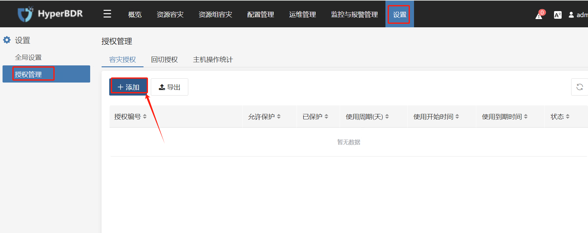

激活许可证有两种方法： 

#### I. 通过使用二维码激活授权

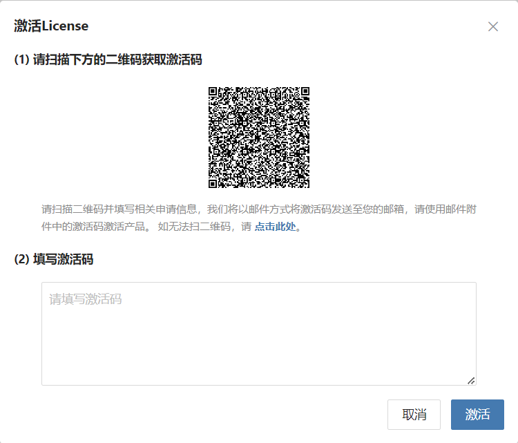  

扫描QR码并填写申请表。OnePro Cloud客户服务在审核申请后将通过电子邮件发送激活码给用户。 

填写激活码并点击[激活]按钮。 

::: warning
请确保申请表上提供的电子邮件地址是正确的，否则将无法收到激活码。  
:::

#### II. 通过使用激活码激活授权

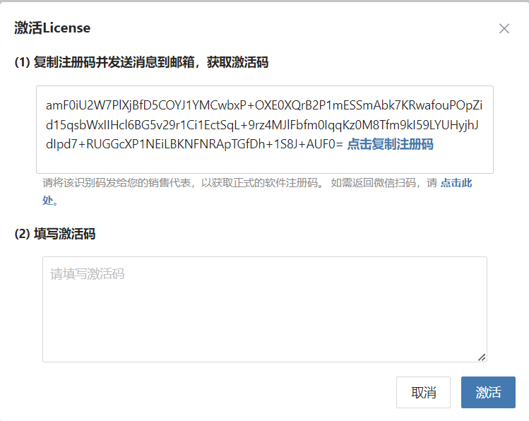 

复制并将注册码发送给OnePro Cloud，客户服务将通过电子邮件发送激活码给用户。 

填写激活码并点击[激活]按钮。

::: tip
用户可以将注册码发送给OnePro Cloud销售代表或者 _[enquiry@oneprocloud.com](mailto:enquiry@oneprocloud.com)_._
:::

## 在HyperBDR中验证代理注册

::: tip
代理节点安装完成后，它将自动添加到HyperBDR，并且您可以在HyperBDR中查看此代理节点机器。
:::

::: tip
默认已登录到HyperBDR控制台。
:::


### 检查代理节点的状态  

点击顶部菜单栏的 '配置管理'、'生产站点配置'、'同步节点' 来查看代理节点主机。如果您能看到这个主机，并且状态为 '正常'，则表示它已成功注册到HyperBDR，您可以继续进行进一步的配置和使用。


## 添加VMware链接

::: tip
使用预先准备好的VMware账户信息，将VMware添加到HyperBDR平台作为灾难恢复源端生产平台。
:::

::: tip
默认已登录到HyperBDR控制台。
:::


### 添加VMware到 HyperBDR

点击顶部菜单栏的 '配置管理'、'生产站点配置'、'VMware'。点击 '+添加' 按钮，然后在弹出的页面上点击 '下一步' 按钮。按照提示填写VMware信息，然后点击 'Submit' 按钮。

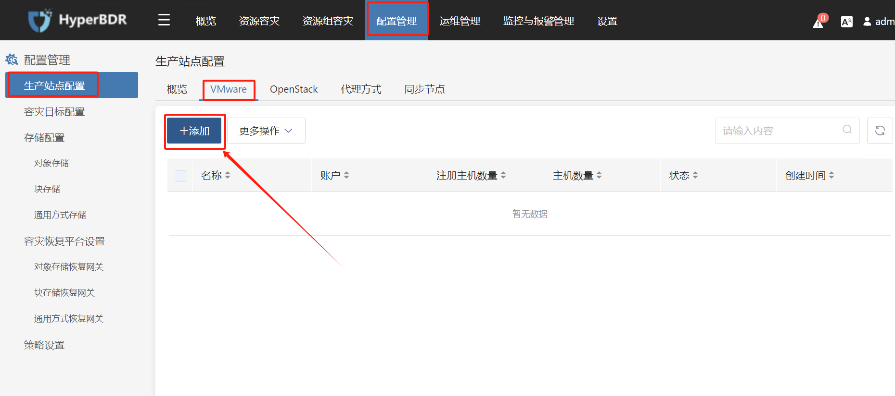

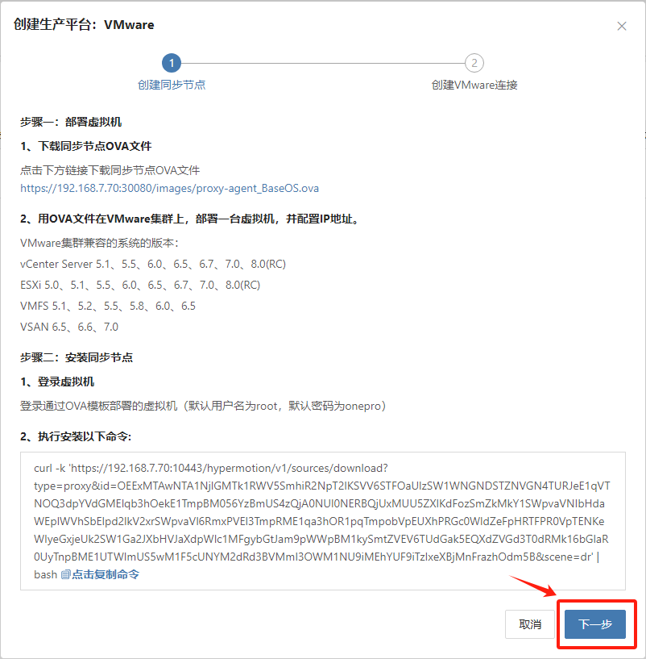

| 鉴权地址 | https://\<vCenter IP/Domain Name\>:443 |
| --- | --- |
| 用户名 | \<vCenter\>用户名 |
| 密码 | \<vCenter\>密码 |
| 同步节点 | \<同步节点 IP\> |

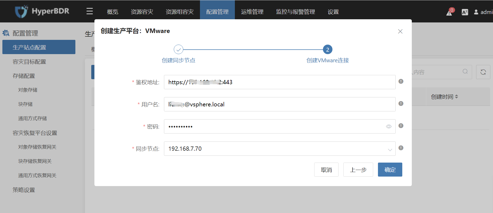

## 在HyperBDR中验证VMware的状态

::: tip
默认已登录到HyperBDR控制台
:::


### 检查VMware连接的状态

点击顶部菜单栏 '配置管理'、'生产站点配置'、'VMware'，查看添加的源端VMware账户的状态，以及获取诸如主机数量之类的信息。您还可以点击VMware的名称来查看详细信息和主机详情。如果一切正常，可以继续进行后续的配置操作。

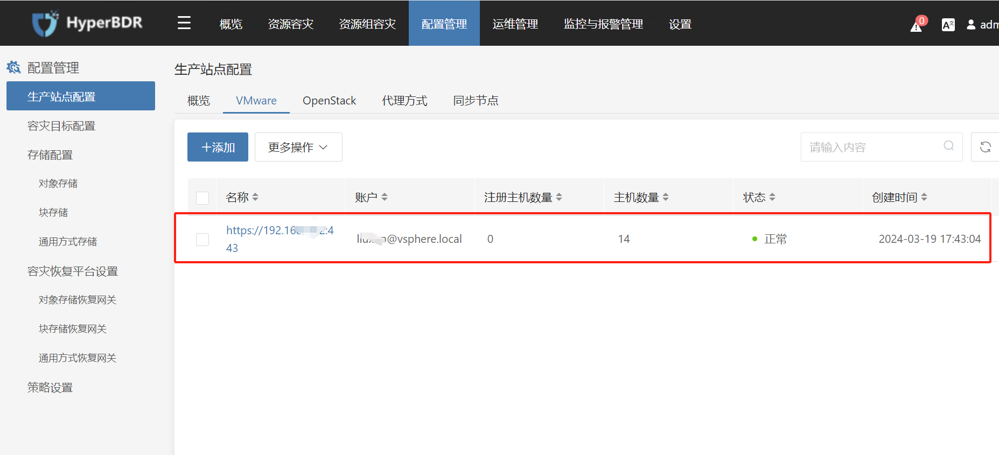

如果状态为 '正常'，表示添加成功。

## 添加对象存储

::: tip
默认已登录到HyperBDR控制台。  
:::


### 配置步骤

::: tip
使用提供的IAM账号的AK/SK信息，在HyperBDR控制台中配置并添加华为云对象存储桶。
:::

- 步骤1: 点击顶部菜单栏 '配置管理'、'对象存储'。点击 '+添加' 按钮。  

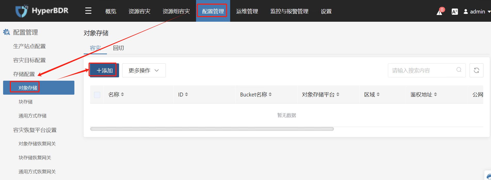

- 步骤2: 根据提示填写或选择相应的参数，点击 '确定'，然后等待完成。  

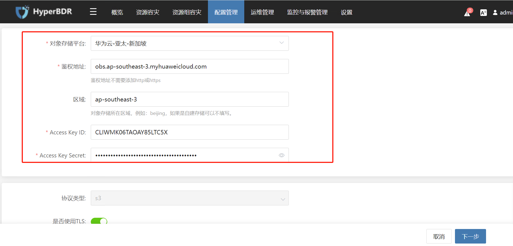

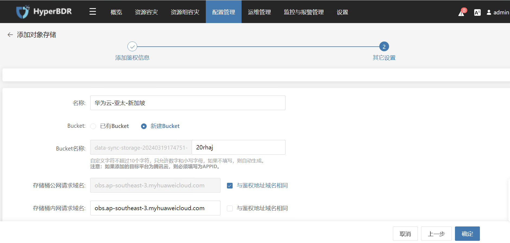

## 添加DR恢复网关

::: tip
默认已登录到HyperBDR控制台。
:::


### 配置步骤

::: tip
使用提供的IAM账号的AK/SK信息，在HyperBDR控制台中配置并添加华为云恢复网关
:::

点击顶部菜单栏 "配置管理"， "对象存储恢复网关"，点击 "+添加" 按钮，根据提示填写或选择相应的参数，点击 "确定"，然后等待完成。

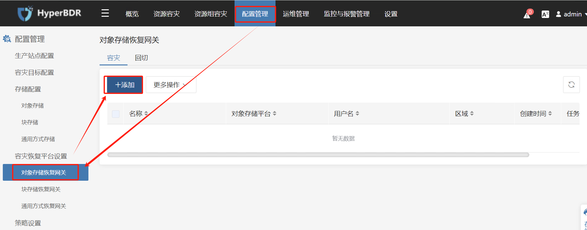

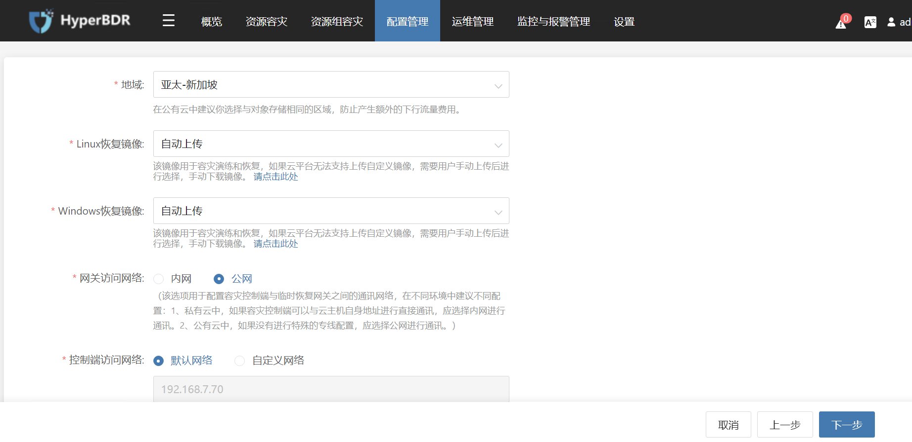

::: tip
Windows UEFI 修复镜像使用您上传的私有 Windows 镜像。

文档链接: [https://docs.oneprocloud.com/userguide/poc/huaweicloud-pre-settings.html#image-download-upload](https://docs.oneprocloud.com/userguide/poc/huaweicloud-pre-settings.html#image-download-upload)
:::

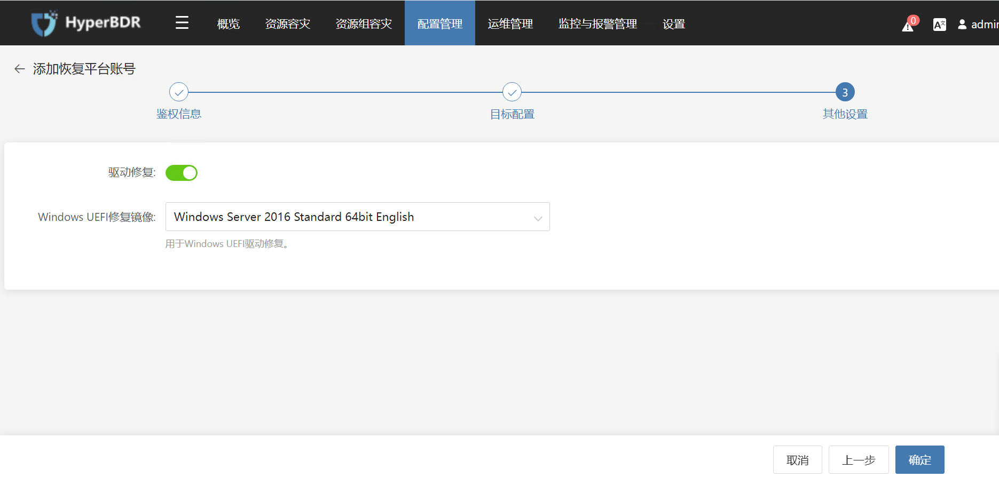

## 在HyperBDR中添加VMware主机

::: tip
默认已登录到HyperBDR控制台。  
默认已在HyperBDR中添加了VMware连接。
:::


### 配置步骤

点击顶部菜单栏 "资源容灾"，"主机容灾"，点击 "添加主机" 按钮，选择 "无代理模式" "VMware" ，选择之前添加的VMware账户，过滤并选择所需的灾难恢复主机，最后点击确认。一旦选择完成，点击确认将VMware灾难恢复主机添加到灾难恢复平台。  

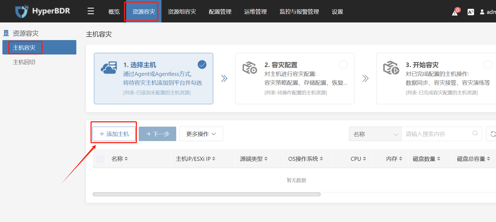

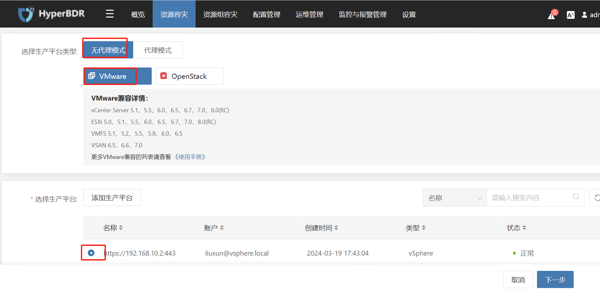

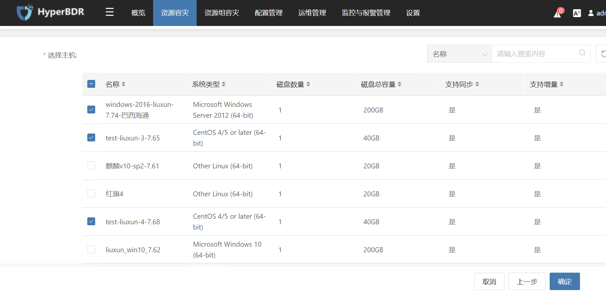

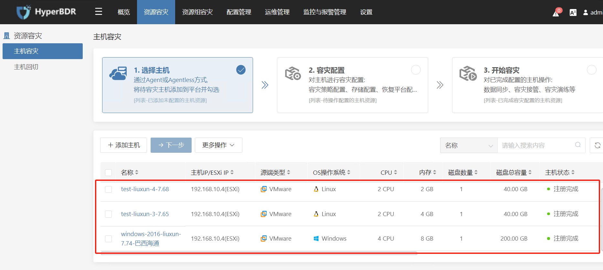


## 绑定/解绑源端同步代理到 VMware 生产站点

::: tip
Agentless 模式下每个源端同步代理默认支持最多 50 块磁盘同时同步，当需要同步的源VMware虚拟机磁盘总数大于50块时，需要扩容 Agentless 源端同步代理。
:::

### 配置步骤
::: tip
默认已登录到HyperBDR控制台。  
默认已在HyperBDR中添加了VMware连接。
:::

1. 点击顶部菜单栏 **配置管理** > **生产站点配置** > **源端同步代理**。
> 已安装的源端同步代理将显示在此页面。
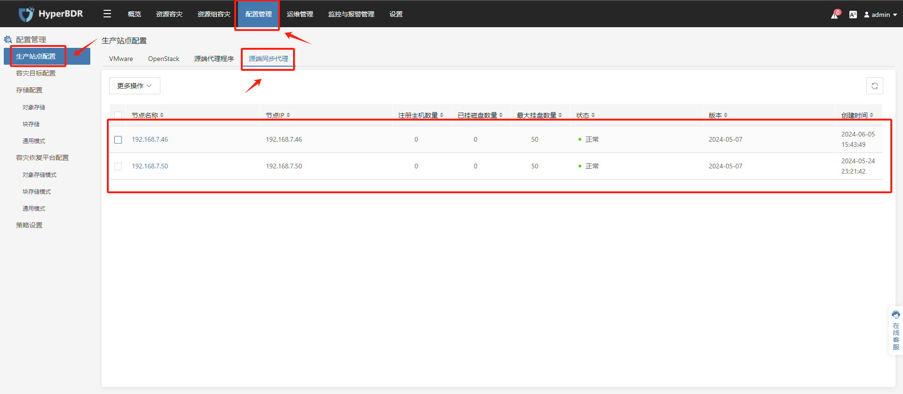
2. 选择已安装的同步代理，点击 **更多操作** > **绑定**。
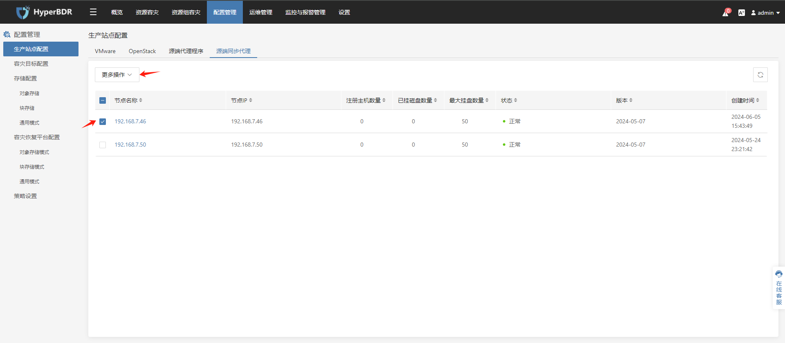

3. 选择所需的源端链接将新的源端同步代理绑定到生产 VMware 站点，确认后单击 **确定**。
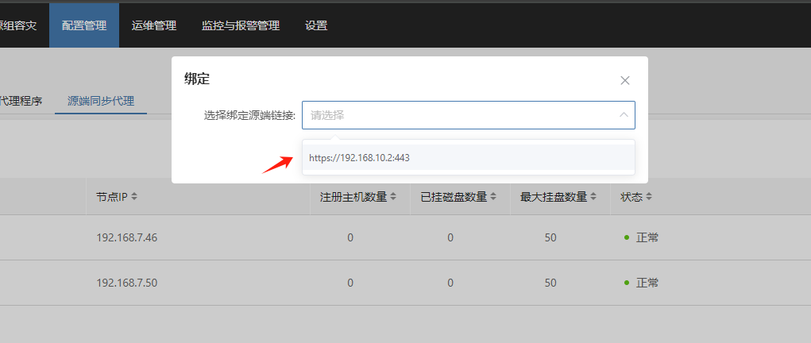
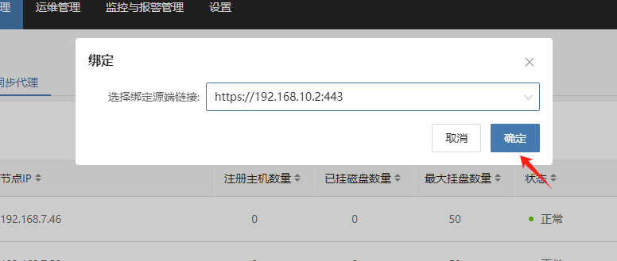
4. 查看与生产 VMware 站点绑定的源端同步代理。
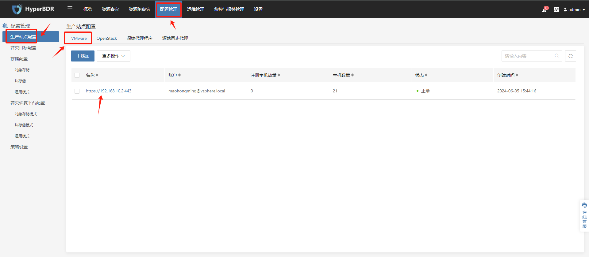
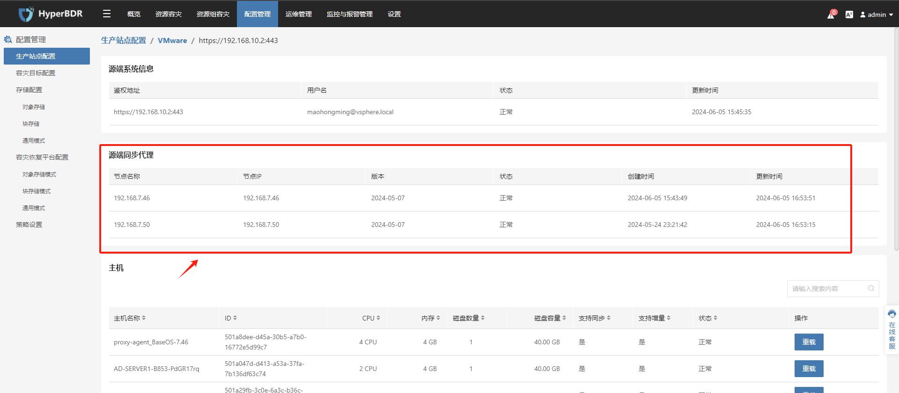
5. 解绑源端同步节点。
::: tip
只能对没有注册主机的源端同步节点进行解绑操作。
:::

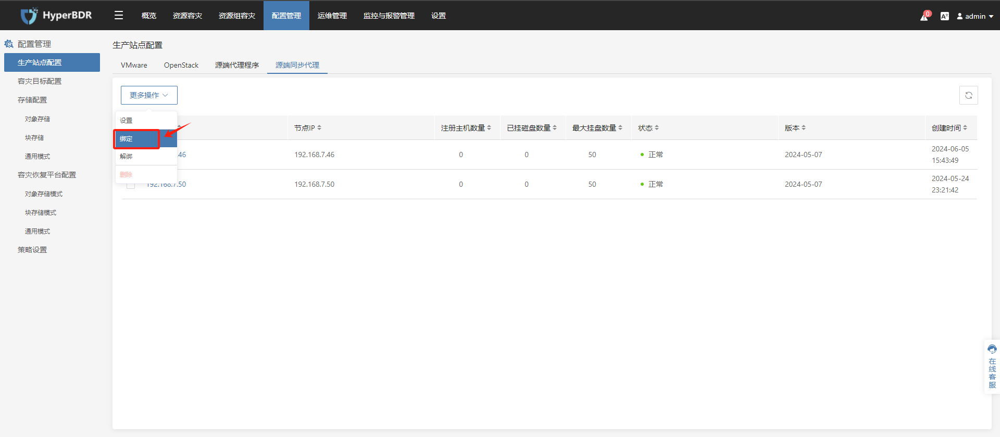
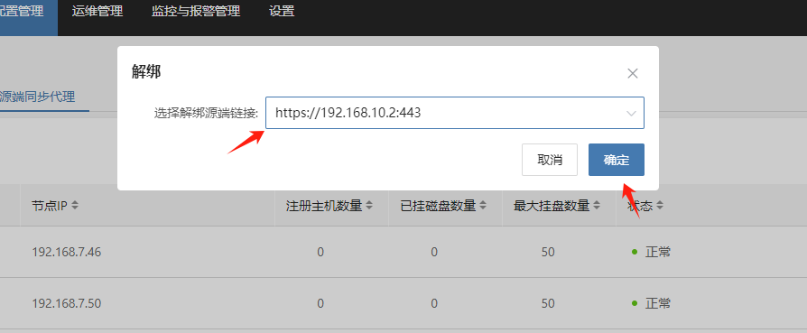
