# VMware源端无代理预设置

[[toc]]

## VMware环境准备

1. 通过vCenter导出主机信息：[VMware快速调查](../presales/hyperbdr-vmware-investigation.md)
2. 根据导出的信息填写虚拟机主机的详细信息，用于容灾设置。

## VMware用户权限要求

### 为什么我们需要这些权限？

HyperBDR利用VMware的CBT技术实现增量数据同步。CBT (Change Block Tracking)是VMware中用于增量备份和复制的一种技术。它跟踪虚拟磁盘上发生更改的块，在备份和复制过程中只允许传输与这些更改相关的数据。

### VMware用户权限

准备用于数据同步的VMware用户认证信息，并确保该用户具有相应的权限。

为VMware用户提供以下权限:

| 权限类型         | 权限                                 |
| --------------- | ------------------------------------ |
| 主机配置文件     | 查看主机配置文件                       |
| 全局             | 启用方法                              |
|                 | 禁用方法                              |
|                 | 许可证                                |
| 内容库           | 下载文件                              |
|                 | 更新配置设置                           |
|                 | 查看配置设置                           |
|                 | 读取存储                               |
| 已调度任务       | 创建任务                               |
| 数据存储         | 低级别文件操作                          |
|                 | 更新虚拟机元数据                        |
|                 | 更新虚拟机文件                          |
|                 | 浏览数据存储                            |
| 虚拟机           | 交互                                   |
|                 |   备份虚拟机上的操作                     |
|                 |   对所有磁盘执行碎片整理                 |
|                 |   恢复 Fault Tolerance                  |
|                 |   打开 Fault Tolerance                  |
|                 |   暂停或取消暂停                         |
|                 |   通过 VIX API 执行客户机操作系统管理     |
|                 |   重置                                  |
|                 |   客户机操作                             |
|                 |   客户机操作修改                         |
|                 |   客户机操作查询                         |
|                 |   客户机操作程序执行                      |
|                 |   快照管理                               |
|                 |   创建快照                               |
|                 |   移除快照                               |
|                 |   更改配置                               |
|                 |   修改设备设置                           |
|                 |   切换派生父项                            |
|                 |   切换磁盘更改跟踪                        |
|                 |   基于路径重新加载                        |
|                 |   显示连接设置                            |
|                 |   更改设置                               |
|                 |   更改资源                               |
|                 |   查询 Fault Tolerance 兼容性            |
|                 |   查询无所有者的文件                      |
|                 |   获取磁盘租约                           |
|                 |   配置托管主体                           |
|                 |   重置客户机信息                         |
|                 |   高级配置                               |
|                 |   服务配置                               |
|                 |   修改服务配置                           |
|                 |   查询服务配置                           |
|                 |   管理服务配置                           |
|                 |   读取服务配置                           |
| 置备            |   允许下载虚拟机                          |
|                 |   允许对磁盘进行只读访问                  |
|                 |   允许访问文件                           |
|                 |   允许访问磁盘                           |
|                 |   自定义客户机                           |
|                 |   读取自定义规范                         |

### vCenter权限开放设置

#### 步骤01：登录vCenter Administrator 控制台

#### 步骤02：添加接入用户

点击 **"菜单"**, **"系统管理"**

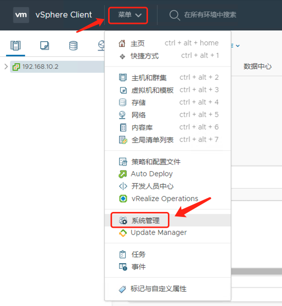

点击左侧 **"用户和组"**, 选择 **"用户"** 标签， 选择正确登录vCenter的 **"Domain"**, 点击 **"添加"** 按钮。

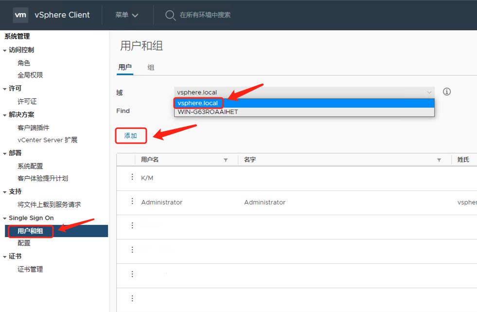

按照提示，输入 用户名、密码、确认密码、其他可以选填，并点击 **"添加"** 按钮。

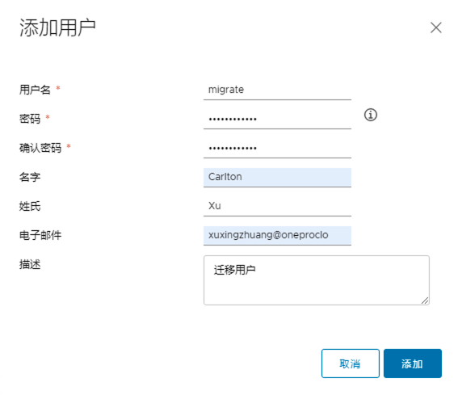

#### 步骤03：添加访问控制角色

左侧菜单栏， **"访问控制"**， **"角色"**，**"角色提供程序"**，选择vCenter地址，点击 **"+"** 按钮。

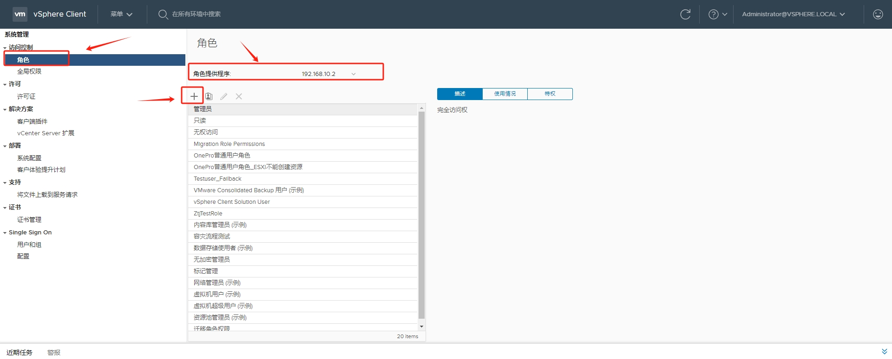

参考 "[VMware用户权限](https://docs.oneprocloud.com/userguide/poc/vmware-pre-settings.html#vmware-user-permission)" 清单进行勾选设置，并点击 "NEXT" 按钮。

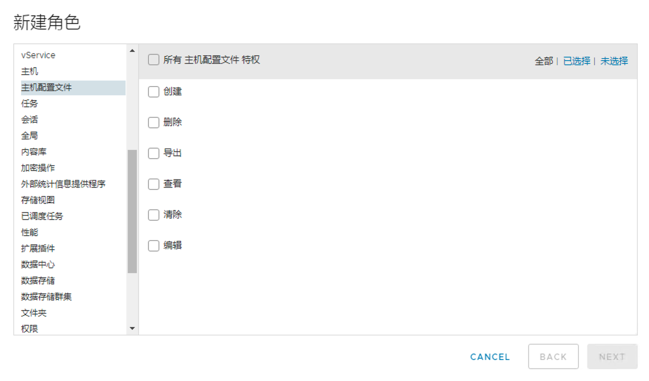

设置新建 角色名称 及 描述 信息，并点击 **"FINISH"** 按钮。

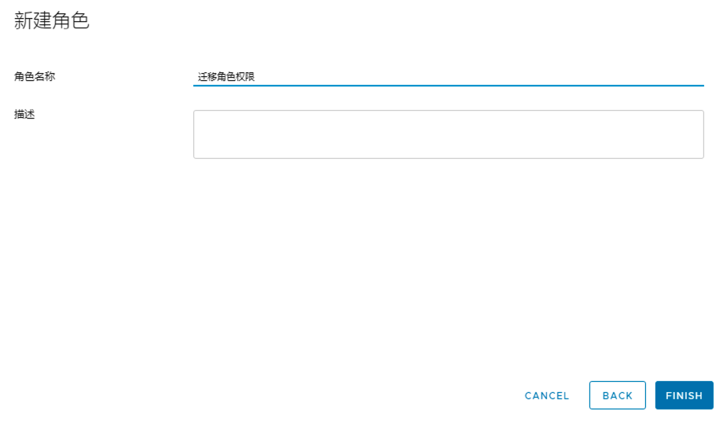

#### 步骤04：添加权限到vCenter 

在 **"主机和集群"**，左侧菜单找到最顶层 **"vCenter IP"** 选中, 并点击右侧 **"权限"** 菜单。点击 **"+"** 按钮。

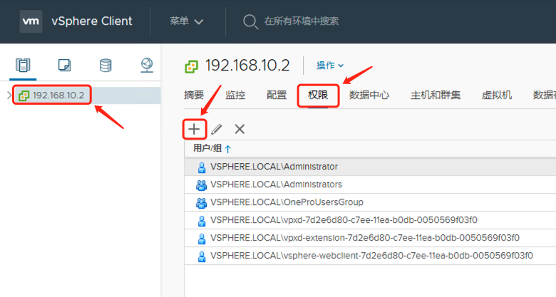

按照提示，选择用户授权的域，这里和前边保持一致，搜索需要添加的 **"migrate"** 用户，角色选择 **"迁移角色权限"** 并勾选 **"传播到子对象"** 。 并点击 **"OK"** 按钮。

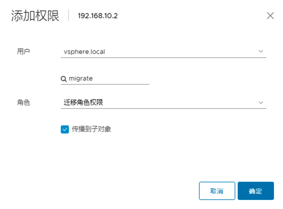

添加完成之后，将 **"vCenter地址"**， **"migrate用户"**，和 **"登录密码"** 提供给迁移平台。

### HyperBDR填写

随后填写该帐户在HyperBDR容灾平台的认证信息，包括:

- vCenter 地址
- vCenter 用户名
- vCenter 密码

## 下载 OVA 镜像

下载OVA安装模板文件

- [proxy-agent_BaseOS.ova](https://hyperbdr-system-image-do-not-delete.obs.ap-southeast-3.myhuaweicloud.com/proxy-agent_BaseOS.ova)

## 在VMware中导入OVA镜像并创建proxy虚拟机

### 部署VOF模板

选择您的ESXi或数据中心名称，右键单击，选择 **"部署OVF模板.."**

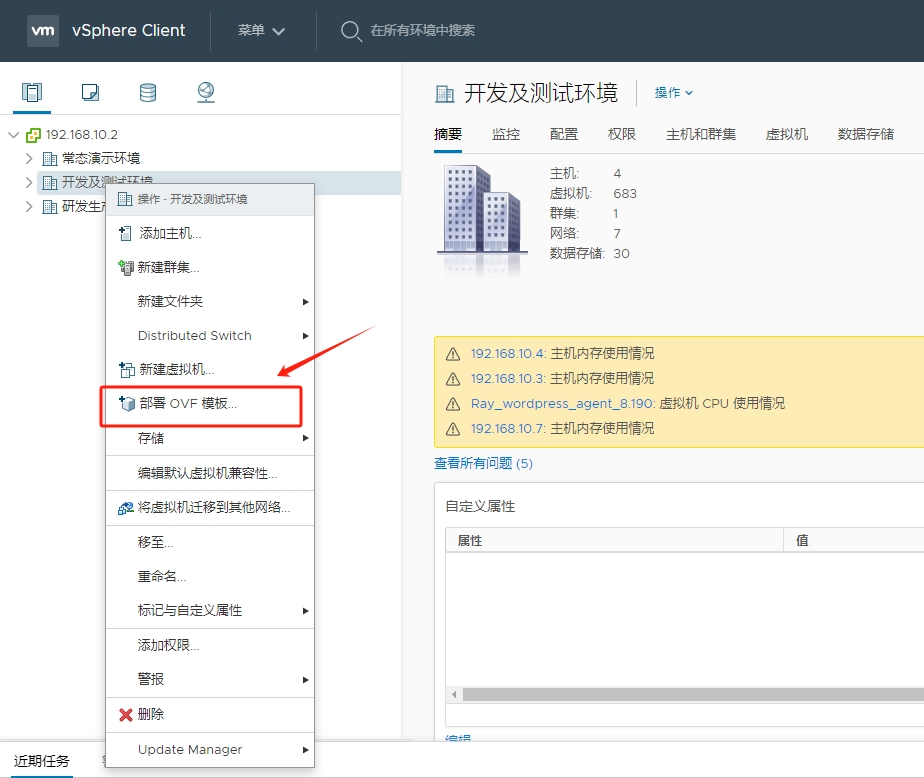

#### 步骤01：选择OVF模板

点击 **"本地文件"**， **"选择文件"** 按钮，选择提前在本地下载的ova模板，下载的ova模板名称为 **"proxy-agent_BaseOS.ova"**。

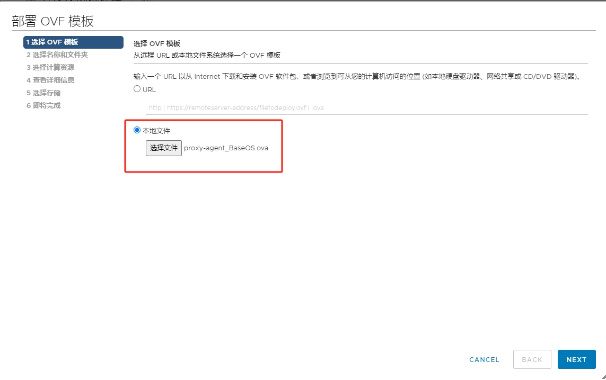

#### 步骤02：填写虚拟机名称，选择可用集群

你可以填写虚机名字, 比如 **"proxy-agent_BaseOS"**，然后为虚拟机选择一个可用集群。

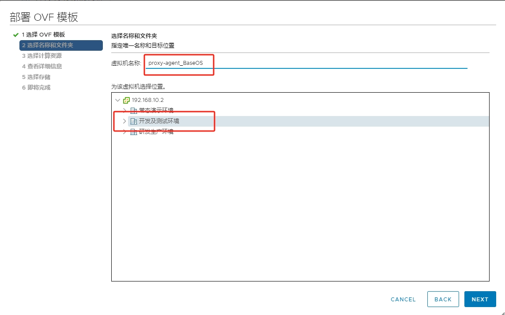

#### 步骤03：选择计算资源

为创建的虚拟机选择目标计算资源。

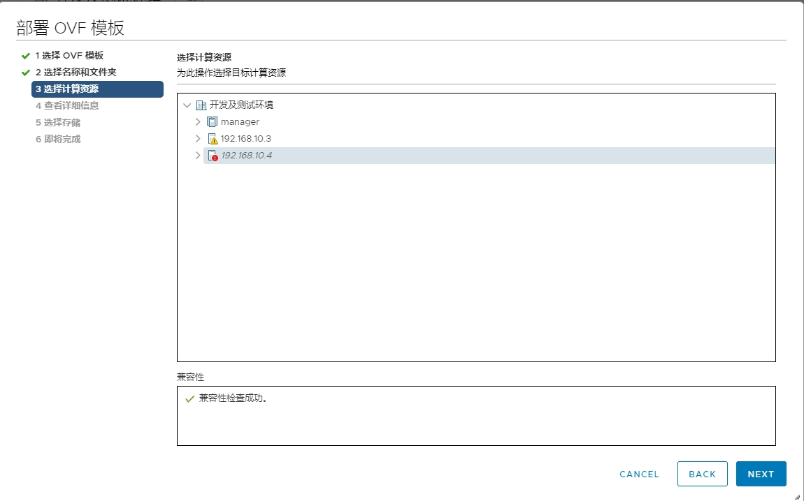

#### 步骤04：检查信息

验证模板的详细信息。

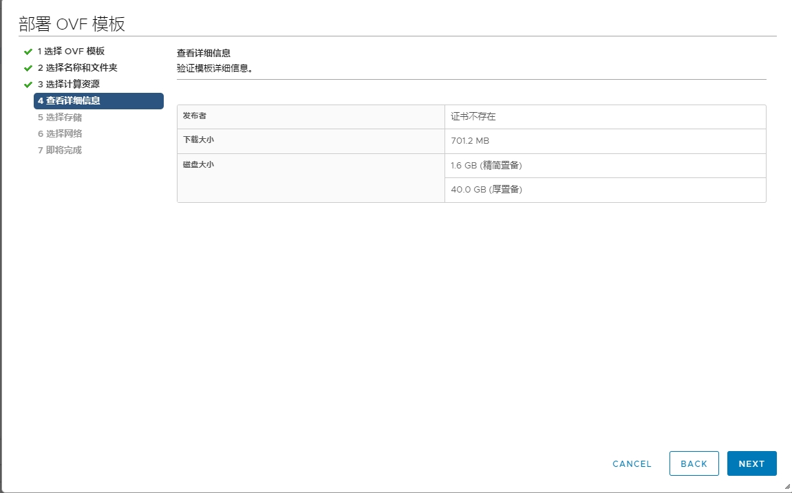

#### 步骤05：选择存储

为配置文件和磁盘文件选择存储。

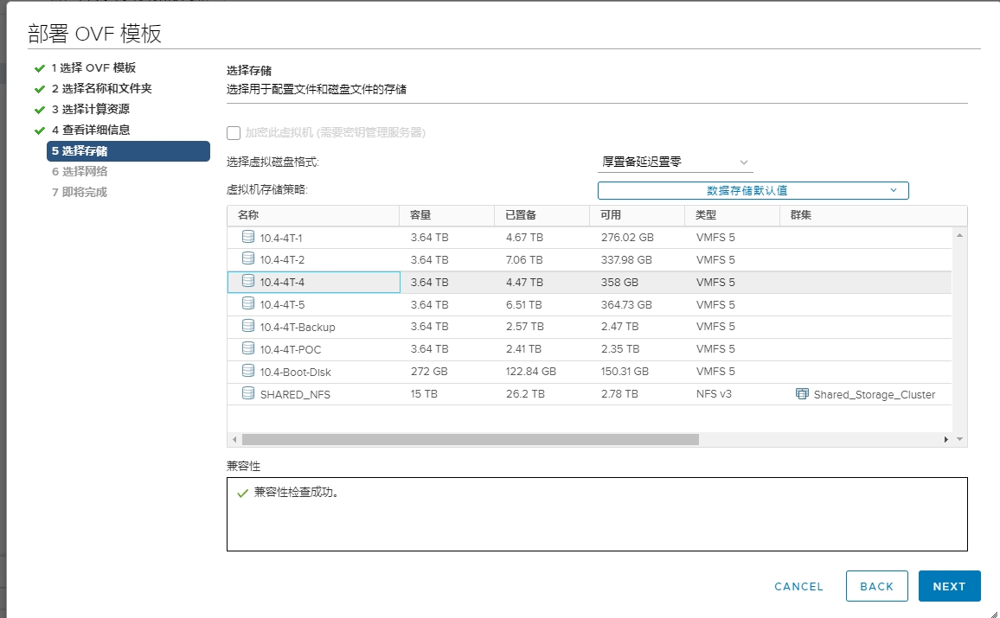

#### 步骤06：选择网络

为每个源网络选择目标网络。

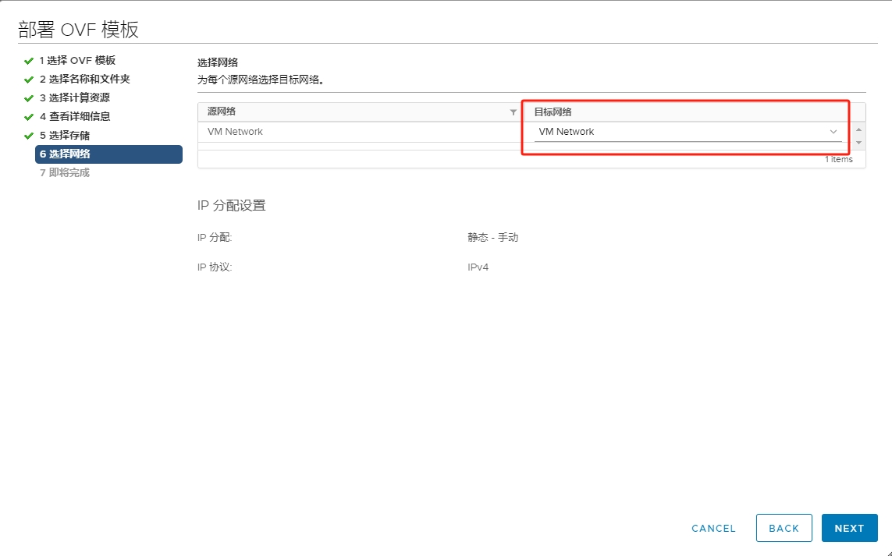

#### 步骤07：准备完成

确认创建的信息，然后单击完成开始创建。

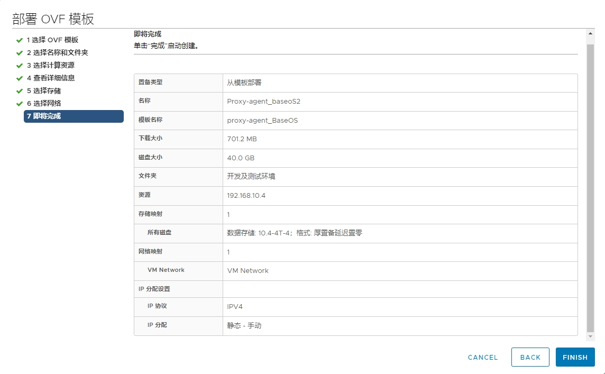

#### 检查导入OVF模板任务

- **"导入OVF软件包"** 和 **"部署OVF模板"** 任务状态进行中。

- **"导入OVF软件包"** 和 **"部署OVF模板"** 任务状态完成。

### 修改Proxy虚拟机规格

- 单击虚拟机名称，然后右键单击，选择 **"编辑设置..."**.

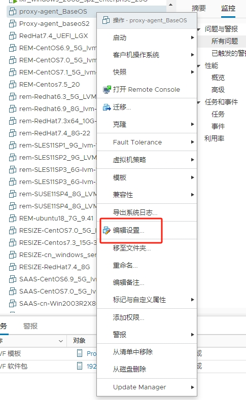

- 修改CPU为4核，内存为8GB，硬盘1大小为100GB。

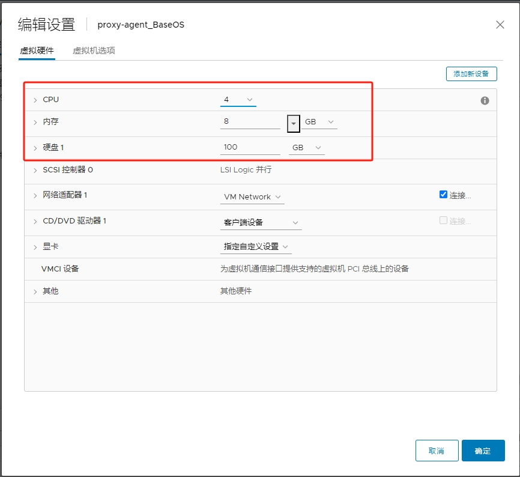

### Proxy虚机启动

- 选择虚拟机名称，然后右键单击 **"启动"**, **"打开电源"**.

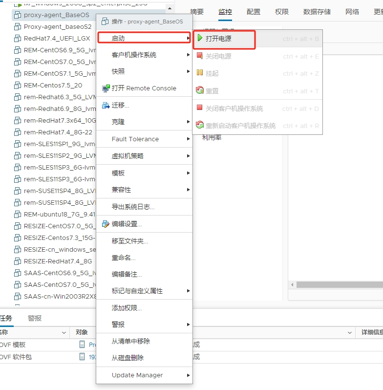

下一步，可以配置Proxy IP地址。