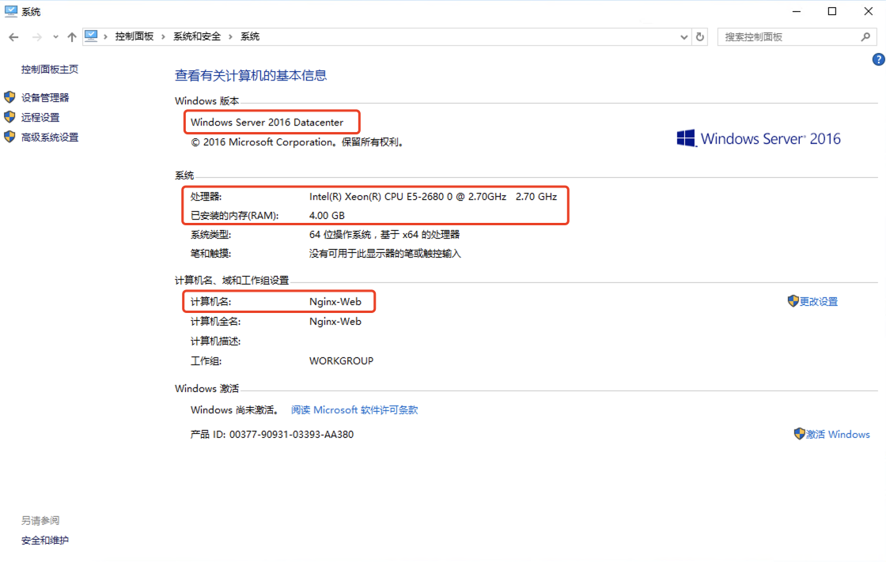
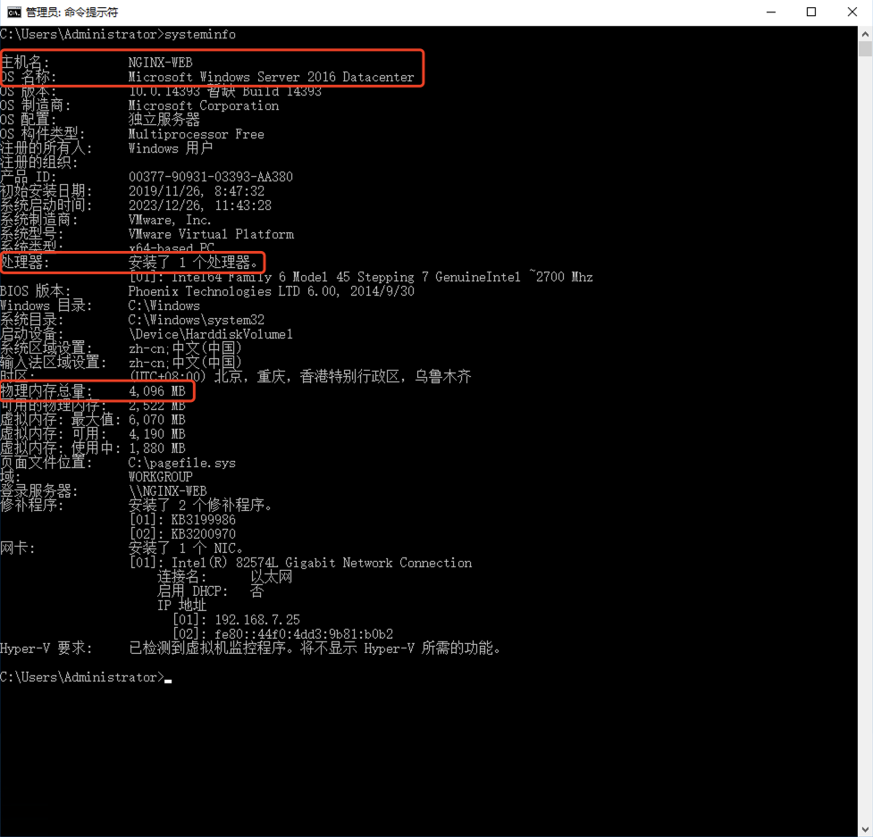
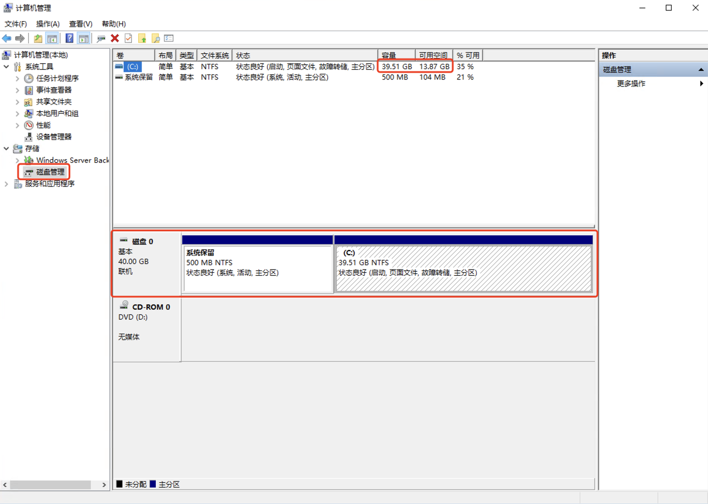
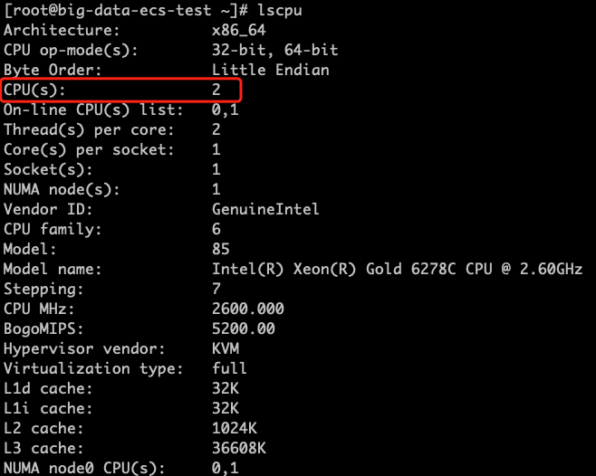

# 源端Agent主机快速调研

## 调研步骤

### Windows Server 2016

该文档描述了如何在Windows主机上获取主机信息，包括主机名、操作系统版本、CPU、内存和磁盘信息。在本节中，以Windows Server 2016为参考。你可以自行查询其他操作系统版本。

#### 获取主机名、操作系统版本、CPU、内存等（控制面板）

打开控制面板，选择“系统和安全”，然后选择“系统”以获取相关信息。



#### 获取主机名、操作系统版本、CPU、内存等（命令行）

登录到Windows服务器，按下快捷键“Win + R”打开CMD窗口，运行以下命令：

```powershell

systeminfo

```

输出结果如下所示；你可以检查主机名、操作系统版本、CPU和内存信息。

> **主机名：** NGINX-WEB
>
> **操作系统名称：** Microsoft Windows Server 2016 Datacenter
> 
> **处理器：** 安装了 1 个处理器。
> 
> **物理内存总量：** 4096MB



#### 获取磁盘信息。

打开“控制面板”，进入“系统和安全”，选择“管理工具”，点击“计算机管理”，然后点击“磁盘管理”。

1. **获取磁盘数量。**

如下图所示，磁盘 0 代表第一个磁盘。如果有多个存储设备，它们将依次标记为 磁盘 1、磁盘 x 等，每个磁盘代表一个独立的存储单元。只需记录总数即可。


2. **获取每个磁盘的实际使用情况。**

如下图所示，右上角显示了所有磁盘的分配和使用信息。'C' 表示具有相应容量和可用空间的分区。你可以通过从总容量中减去可用空间来计算当前 'C' 分区的实际使用情况。单个磁盘可能有多个分区，因此在图中的 磁盘 0 的右下角相应位置进行检查，以确定每个分区所属的磁盘。这样，你可以分别计算每个磁盘的实际使用情况。

> 磁盘 0 上有一个 C 分区，总容量为 39.51GB，可用空间为 28.14GB，磁盘 0 上当前的实际使用空间为 11.37GB。
> 如果有其他磁盘，则同样的计算方法适用于确定每个磁盘上的实际使用空间。



### CentOS 7（Linux）

本文主要介绍如何在Linux机器上获取相关主机信息，包括主机名、操作系统版本、内核版本、CPU、内存、磁盘等详细信息。本示例中收集Linux主机信息的步骤基于CentOS 7；对于其他操作系统版本，请参阅其相应的文档。

#### 1. 获取主机名。

要在Linux系统上获取主机名，可以使用 **hostname** 命令。打开终端并运行以下命令：

```bash

hostname

```

输出结果如下所示，其中显示了主机名。


#### 2. Retrieve the operating system version

运行以下命令来查看操作系统的版本。

```bash

cat /etc/redhat-release

```

输出结果如下所示，其中显示了操作系统的版本。


#### 3. Retrieve the kernel version

运行以下命令来查看内核版本。

```bash
uname -r
```

输出结果如下所示，其中显示了内核版本。

```
4.1.12-61.1.28.el6uek.x86_64
```

#### 4. 获取CPU信息

运行以下命令查看CPU信息。

```bash

lscpu

```

在输出中，找到“CPU(s)”值，它表示CPU核心的数量。



#### 5. 检索内存信息

运行以下命令查看内存信息。

```bash

free -h

```

查找"Total"列，显示总物理内存。


#### 6. 检索磁盘信息

1. **检查磁盘数量和总容量。**

运行以下命令获取磁盘数量及其总容量。

```bash

lsblk

```

输出内容如下：查找NAME列中的内容，“sd/vd”开头的磁盘表示磁盘数量，SIZE列表示磁盘的总容量。


2. **获取磁盘实际使用量**

运行以下命令获取实际磁盘使用情况。

```bash

df -Th

```

根据输出检查磁盘的使用空间。

> 注意：在“Mounted on”列中，“/”表示根分区。检查“Used”列以获取根分区的实际使用情况。如果有其他挂载的分区，您还需要获取它们的信息。


根据以上操作步骤，获取相应的系统信息，用于后续的灾难恢复测试。在执行任何命令时，请确保您具有足够的权限。此外，在收集信息后，将收集到的详细信息填写到相应的灾难恢复主机研究表中。